# Лабораторная работа №1 - Свой Docker

## Часть 0 - Сервис

Для выполнения лабораторной работы используется HTTP-сервис на Java 21 с использованием Spring Boot.

Сервис предоставляет следующие эндпоинты:

- `GET /health` - проверка работоспособности приложения;
- `GET /eat?mb=N` - выделение и удержание N МБ оперативной памяти;
- `GET /burn` - создание нагрузки на одно ядро CPU;
- `GET /changeTime` - попытка изменения системного времени для проверки capabilities и seccomp;
- `POST /system/execute` - выполнение системной команды внутри среды приложения.

Сервис работает на порту `8080`.

## Часть 1 - Запуск напрямую

На первом этапе сервис запускается напрямую на хостовой системе как обычный Linux-процесс, без контейнерной изоляции и ограничений ресурсов.

Проект был собран с помощью Maven:

```bash
mvn clean package -DskipTests
```

После сборки сервис был запущен командой:

```bash
./bin/startup.sh
```

### Проверка работоспособности

В браузере был открыт адрес:

```text
http://127.0.0.1:8080/health
```

Сервис успешно ответил:

```text
Приложение работает
```

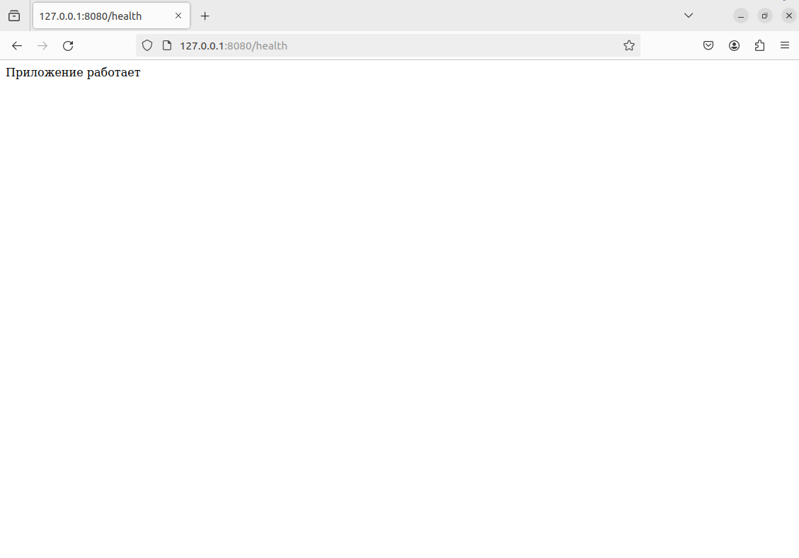

### Процесс на хостовой системе

Процесс приложения был найден командой:

```bash
pgrep -af 'lab1-1.0.0.jar'
```

Для просмотра PID, пользователя и команды запуска использовалась команда:

```bash
ps -o pid,user,cmd -p $(pgrep -f 'lab1-1.0.0.jar' | head -n1)
```

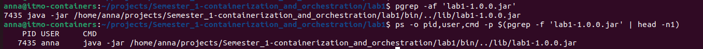

На данном этапе приложение является обычным процессом Linux. Оно видно среди остальных процессов хостовой системы, имеет обычный PID и запускается от имени пользователя хоста. Изоляция с помощью namespaces и ограничения ресурсов с помощью cgroups ещё не применяются.

## Часть 2 - Изоляция с помощью namespaces

Namespaces позволяют изолировать различные части окружения процесса. Процесс внутри namespace может видеть другое представление процессов, сети, hostname, пользователей и других ресурсов, хотя физически он продолжает выполняться на том же Linux-ядре.

### 2.1. PID namespace

PID namespace изолирует пространство идентификаторов процессов.

Один и тот же процесс может иметь:

- один PID с точки зрения хостовой системы;
- другой PID внутри созданного PID namespace.

Для создания отдельного PID namespace была выполнена команда:

```bash
sudo unshare --pid --fork --mount-proc bash
```

Параметры команды:

- `sudo` - команда выполняется с повышенными привилегиями;
- `unshare` - создаёт новые namespaces для запускаемого процесса;
- `--pid` - создаёт новый PID namespace;
- `--fork` - запускает дочерний процесс внутри нового namespace;
- `--mount-proc` - монтирует отдельный `/proc`, соответствующий новому PID namespace;
- `bash` - запускает оболочку Bash внутри созданного namespace.

Без `--mount-proc` команда `ps` могла бы продолжить читать старый `/proc` хоста и показывать процессы всей системы, поэтому для корректной демонстрации PID namespace используется отдельный `/proc`.

После входа в новый namespace был проверен PID текущей оболочки:

```bash
echo $$
```

Результат:

```text
1
```

Текущий `bash` внутри namespace получил PID `1`.

PID 1 является первым процессом в данном PID namespace. Для процессов внутри этого namespace он играет ту же роль, которую init-процесс играет в обычной Linux-системе.

Затем был просмотрен список доступных процессов:

```bash
ps -ef
```

Результат:

```text
UID    PID    PPID    CMD
root     1       0    bash
root     8       1    ps -ef
```

Внутри namespace видны только процессы, принадлежащие этому PID namespace. Процессы основной Ubuntu в данном списке отсутствуют.

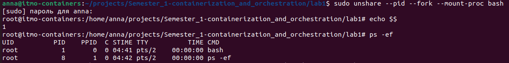

Для сравнения тот же процесс был найден снаружи namespace, в обычном терминале хостовой системы:

```bash
ps -o pid,ppid,user,cmd -p 12975
```

В данном запуске Bash, который внутри namespace имел PID `1`, на хосте имел PID `12975`.

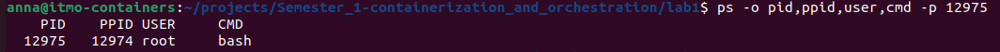

Таким образом, PID процесса не является абсолютным значением для всей системы. Его значение зависит от PID namespace, из которого процесс наблюдается.

Также благодаря отдельному `/proc` процессы внутри namespace не видят полный список процессов хостовой системы.

### 2.2. UTS namespace

UTS namespace изолирует hostname и domain name системы.

Сначала был проверен hostname хостовой системы:

```bash
hostname
```

Результат:

```text
itmo-containers
```

После этого был создан отдельный UTS namespace:

```bash
sudo unshare --uts bash
```

Сразу после создания namespace hostname внутри него совпадал с hostname хоста:

```bash
hostname
```

Результат:

```text
itmo-containers
```

Затем hostname был изменён только внутри созданного namespace:

```bash
hostname lab1-container
```

После изменения:

```bash
hostname
```

Результат:

```text
lab1-container
```

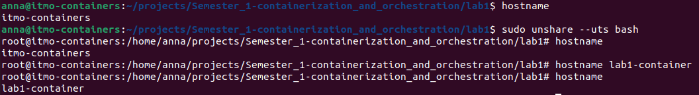

В отдельном терминале на хостовой системе hostname остался прежним:

```bash
hostname
```

Результат:

```text
itmo-containers
```

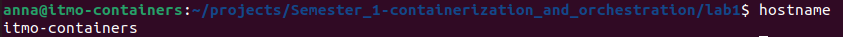

Таким образом, изменение hostname внутри UTS namespace не влияет на hostname основной системы. Процессы в разных UTS namespaces могут видеть разные имена хоста, хотя работают на одном Linux-ядре.

### 2.3. Network namespace

Network namespace изолирует сетевой стек процесса: сетевые интерфейсы, IP-адреса и таблицу маршрутизации.

Сначала на хостовой системе был просмотрен список сетевых интерфейсов:

```bash
ip addr
```

На хосте присутствовал интерфейс `enp0s3` с IP-адресом `10.0.2.15`.

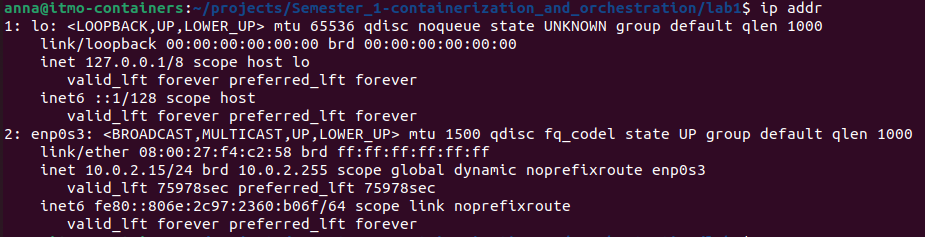

После этого был создан отдельный network namespace:

```bash
sudo unshare --net bash
```

Внутри него снова был выполнен:

```bash
ip addr
```

В новом namespace присутствовал только loopback-интерфейс `lo`, находившийся в состоянии `DOWN`.

Таблица маршрутизации была проверена командой:

```bash
ip route
```

Она оказалась пустой.

Дополнительно была проверена доступность внешней сети:

```bash
ping -c 1 8.8.8.8
```

Результат:

```text
Сеть недоступна
```

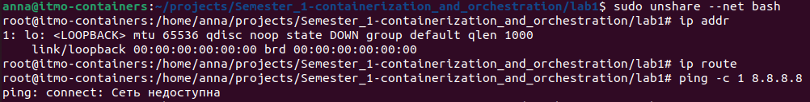

Таким образом, новый network namespace получил отдельный сетевой стек и не унаследовал сетевой интерфейс и маршруты хостовой системы.

### 2.4. User namespace

User namespace изолирует идентификаторы пользователей и групп (`UID` и `GID`).

Благодаря этому процесс может иметь UID `0` и считаться `root` внутри namespace, оставаясь при этом непривилегированным пользователем на хостовой системе.

Сначала были проверены пользователь и его идентификаторы на хосте:

```bash
whoami
id
```

Результат:

```text
anna
uid=1000(anna) gid=1000(anna) ...
```

Таким образом, на хостовой системе процесс выполняется от имени обычного пользователя `anna` с UID `1000`.

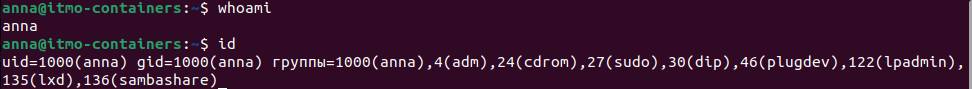

После этого был создан новый user namespace:

```bash
unshare --user --map-root-user bash
```

Параметры команды:

- `--user` - создаёт отдельный user namespace;
- `--map-root-user` - отображает текущего пользователя хоста в пользователя с UID `0` внутри namespace;
- `bash` - запускает оболочку внутри созданного namespace.

Внутри namespace снова были выполнены:

```bash
whoami
id
```

Результат:

```text
root
uid=0(root) gid=0(root) ...
```

Таким образом, внутри user namespace текущий пользователь имеет UID `0` и воспринимается как `root`.

Для просмотра отображения UID была выполнена команда:

```bash
cat /proc/self/uid_map
```

Результат:

```text
         0       1000          1
```

Значения означают:

- `0` - UID внутри namespace;
- `1000` - соответствующий UID на хостовой системе;
- `1` - количество отображаемых UID.

Следовательно, UID `0` (`root`) внутри namespace соответствует UID `1000` (`anna`) на хосте.

Дополнительно была предпринята попытка прочитать файл `/etc/shadow`:

```bash
cat /etc/shadow
```

Результат:

```text
cat: /etc/shadow: Отказано в доступе
```

Несмотря на то, что внутри namespace пользователь отображается как `root`, он не получает полномочия настоящего root-пользователя хостовой системы.

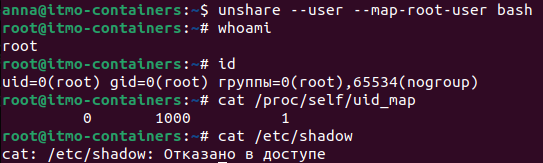

Таким образом, user namespace позволяет изолировать пространство UID и GID. Процесс может обладать UID `0` внутри namespace, при этом снаружи оставаться обычным непривилегированным пользователем.

### 2.5. Mount namespace

Mount namespace изолирует таблицу монтирования файловых систем.

Это позволяет процессам внутри namespace иметь собственный набор точек монтирования, не изменяя представление файловых систем для процессов хостовой системы.

Для создания отдельного mount namespace была выполнена команда:

```bash
sudo unshare --mount --propagation private bash
```

Параметры команды:

- `--mount` - создаёт отдельный mount namespace;
- `--propagation private` - делает изменения монтирований приватными для созданного namespace;
- `bash` - запускает оболочку внутри нового namespace.

Внутри namespace была создана директория:

```bash
mkdir -p /tmp/lab1-mount
```

После этого в неё была примонтирована временная файловая система `tmpfs` размером 10 МБ:

```bash
mount -t tmpfs -o size=10M tmpfs /tmp/lab1-mount
```

Наличие монтирования было проверено командой:

```bash
mount | grep lab1-mount
```

Результат показал, что внутри namespace в `/tmp/lab1-mount` действительно примонтирован `tmpfs`.

Затем внутри примонтированной файловой системы был создан файл:

```bash
echo "inside mount namespace" > /tmp/lab1-mount/inside.txt
```

Проверка содержимого:

```bash
ls -la /tmp/lab1-mount
```

показала файл `inside.txt`.

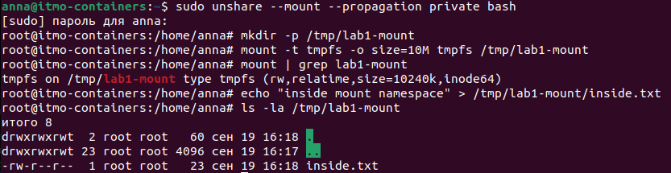

После этого на хостовой системе была выполнена проверка:

```bash
mount | grep lab1-mount
```

Команда не вывела результатов, то есть монтирование `tmpfs`, созданное внутри namespace, на хосте отсутствует.

Также была проверена директория:

```bash
ls -la /tmp/lab1-mount
```

На хосте каталог существует, однако файл `inside.txt` отсутствует.

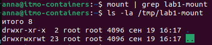

Сам каталог `/tmp/lab1-mount` виден на хосте, поскольку создание директории является обычной операцией с общей файловой системой. Однако монтирование `tmpfs` поверх этой директории существует только внутри отдельного mount namespace.

Таким образом, mount namespace изолирует точки монтирования: процессы внутри namespace могут видеть другое представление файловых систем, не изменяя таблицу монтирований хостовой системы.

### 2.6. IPC namespace

IPC namespace изолирует механизмы межпроцессного взаимодействия, в том числе System V shared memory, очереди сообщений и семафоры.

Для создания отдельного IPC namespace была выполнена команда:

```bash
sudo unshare --ipc bash
```

После этого внутри namespace был создан сегмент разделяемой памяти размером 1024 байта:

```bash
ipcmk -M 1024
```

Результат:

```text
ID разделяемой памяти: 0
```

Список сегментов shared memory внутри namespace был просмотрен командой:

```bash
ipcs -m
```

Внутри namespace отображался созданный сегмент с `shmid = 0` и размером `1024` байта.

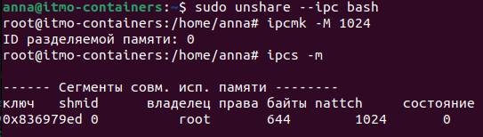

После этого на хостовой системе была выполнена та же команда:

```bash
ipcs -m
```

На хосте присутствовали собственные IPC-объекты различных процессов, однако сегмент `shmid = 0` размером 1024 байта, созданный внутри IPC namespace, отсутствовал.

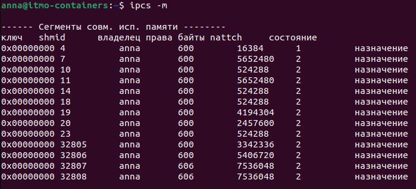

Таким образом, IPC namespace предоставляет процессам отдельное пространство IPC-объектов. Объекты shared memory, созданные внутри namespace, не становятся видимыми процессам хостовой системы.

### 2.7. Запуск сервиса со всеми namespaces

После отдельной проверки каждого типа namespace сервис был запущен в окружении, объединяющем `user`, `pid`, `mount`, `net`, `uts` и `ipc` namespaces.

Для создания окружения использовалась команда:

```bash
unshare \
  --user --map-root-user \
  --pid --fork \
  --mount --mount-proc \
  --net \
  --uts \
  --ipc \
  bash
```

Внутри созданного окружения были выполнены проверки:

```bash
echo $$
ps -ef
hostname
hostname lab1-container
ip addr
ip link set lo up
whoami
id
cat /proc/self/uid_map
```

Результаты показали:

- текущий процесс внутри PID namespace имеет PID `1`;
- процессы хостовой системы внутри namespace не отображаются;
- hostname внутри namespace изменён на `lab1-container`;
- сетевой интерфейс хоста `enp0s3` отсутствует, доступен только отдельный loopback-интерфейс;
- пользователь внутри namespace отображается как `root` с UID `0`;
- UID `0` внутри namespace отображается в UID `1000` пользователя `anna` на хостовой системе.

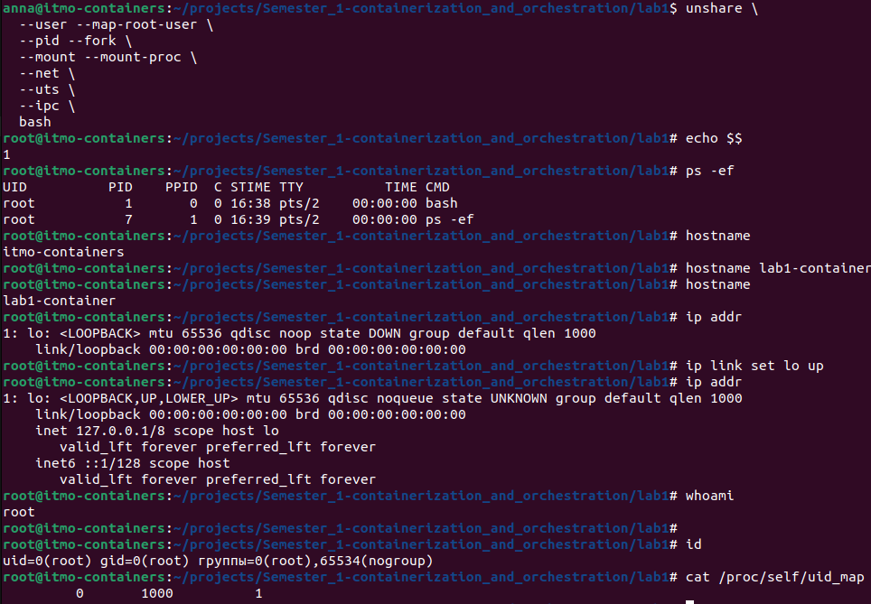

После настройки окружения текущая оболочка была заменена процессом Java-сервиса:

```bash
exec ./bin/startup.sh
```

Использование `exec` позволяет заменить текущий процесс Bash на процесс Java без создания дополнительного дочернего процесса. Поэтому сервис наследует PID `1` внутри созданного PID namespace.

Снаружи namespace сервис был найден командой:

```bash
pgrep -af 'lab1-1.0.0.jar'
```

На хостовой системе процесс имел обычный PID `7668` и выполнялся от имени пользователя `anna` с UID `1000`.

Соответствие PID внутри и снаружи namespace было проверено командой:

```bash
grep NSpid /proc/$PID/status
```

Результат:

```text
NSpid:  7668  1
```

Первое значение является PID процесса на хостовой системе, второе - PID этого же процесса внутри созданного PID namespace.

Hostname процесса был проверен через его UTS namespace:

```bash
sudo nsenter -t "$PID" -u hostname
```

Результат:

```text
lab1-container
```

При этом hostname хостовой системы остался прежним:

```text
itmo-containers
```

Работоспособность сервиса внутри его network namespace была проверена командой:

```bash
sudo nsenter -t "$PID" -n curl http://127.0.0.1:8080/health
```

Ответ:

```text
Приложение работает
```

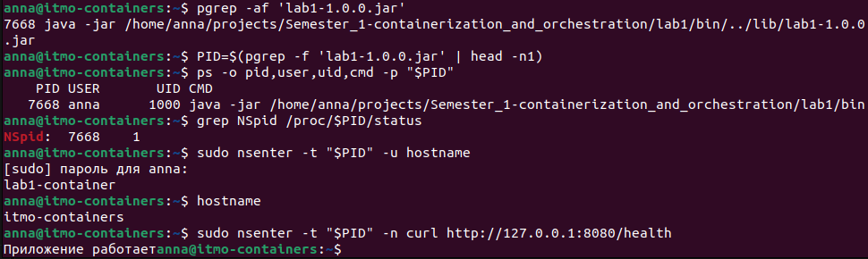

Таким образом, один процесс приложения одновременно работает в отдельных PID, mount, network, UTS, IPC и user namespaces. Внутри окружения сервис видит себя как PID `1` и root-пользователя, имеет собственный hostname и изолированную сеть, тогда как на хостовой системе тот же процесс остаётся обычным непривилегированным процессом пользователя `anna`.

## Часть 3 - Ограничение ресурсов с помощью cgroups v2

Cgroups позволяют ограничивать количество ресурсов, доступных процессам. В данной части были проверены ограничения оперативной памяти, CPU и количества процессов.

### 3.1. Ограничение памяти

Для проверки ограничения оперативной памяти была создана отдельная cgroup:

```bash
sudo mkdir /sys/fs/cgroup/lab1-memory
```

Для неё был установлен максимальный объём памяти 300 МБ:

```bash
echo $((300 * 1024 * 1024)) | sudo tee /sys/fs/cgroup/lab1-memory/memory.max
```

Полученное значение:

```text
314572800
```

Также для cgroup был запрещён swap:

```bash
echo 0 | sudo tee /sys/fs/cgroup/lab1-memory/memory.swap.max
```

Чтобы сервис с самого запуска учитывался внутри созданной cgroup, он был запущен непосредственно в `lab1-memory`.

Для эксперимента JVM был явно задан максимальный размер heap 512 МБ:

```text
-Xmx512m
```

Это необходимо, поскольку JVM учитывает ограничения cgroups и при обычном запуске автоматически уменьшает максимально доступный heap. Без явного увеличения heap исключение `OutOfMemoryError` внутри JVM могло возникнуть раньше, чем процесс достиг бы ограничения `memory.max`.

После запуска было проверено, что процесс находится в необходимой cgroup:

```bash
cat /proc/$PID/cgroup
```

Результат:

```text
0::/lab1-memory
```

Текущее потребление памяти процессом:

```bash
cat /sys/fs/cgroup/lab1-memory/memory.current
```

Результат:

```text
120721408
```

Максимально разрешённая память:

```bash
cat /sys/fs/cgroup/lab1-memory/memory.max
```

Результат:

```text
314572800
```

Также был проверен максимальный размер Java heap:

```bash
jcmd "$PID" VM.flags | grep -o 'MaxHeapSize=[0-9]*'
```

Результат:

```text
MaxHeapSize=536870912
```

Таким образом, JVM могла использовать heap до 512 МБ, тогда как cgroup ограничивала весь процесс 300 МБ памяти.

Перед созданием нагрузки были проверены события cgroup:

```bash
cat /sys/fs/cgroup/lab1-memory/memory.events
```


До превышения лимита:

```text
max 0
oom 0
oom_kill 0
```

После этого сервису был отправлен запрос на выделение и удержание дополнительных 250 МБ памяти:

```bash
curl 'http://127.0.0.1:8080/eat?mb=250'
```

С учётом уже использовавшейся процессом памяти суммарное потребление превысило установленный лимит 300 МБ.

Соединение было разорвано:

```text
curl: (52) Empty reply from server
```

После запроса процесс Java больше не отображался в списке процессов:

```bash
pgrep -af '^java .*lab1-1\.0\.0\.jar$'
```

Повторная проверка `memory.events` показала:

```text
max 23
oom 1
oom_kill 1
```

Значение `oom = 1` означает, что cgroup столкнулась с нехваткой доступной памяти, а `oom_kill = 1` подтверждает, что процесс был завершён OOM killer ядра Linux вследствие превышения ограничения `memory.max`.

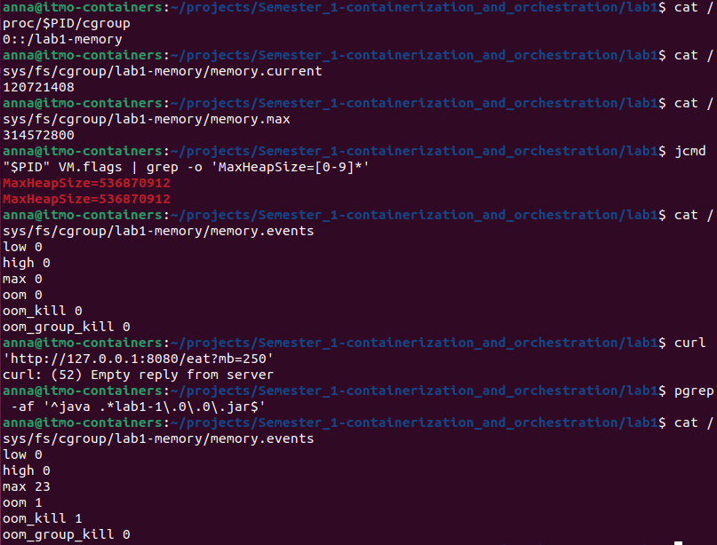

Таким образом, cgroups v2 позволяют задать жёсткий предел потребления оперативной памяти процессом. При попытке превысить установленный `memory.max` ядро Linux завершает процесс с помощью OOM killer.

### 3.2. Ограничение CPU

Для проверки ограничения процессорного времени сервис был запущен в отдельной cgroup с ограничением CPU.

Чтобы корректно создать cgroup в системе, управляемой `systemd`, использовалась transient-служба:

```bash
sudo systemd-run \
  --unit=lab1-cpu \
  --property=User=anna \
  --property=CPUQuota=50% \
  --working-directory=/home/anna/projects/Semester_1-containerization_and_orchestration/lab1 \
  /home/anna/projects/Semester_1-containerization_and_orchestration/lab1/bin/startup.sh
```

Параметр:

```text
CPUQuota=50%
```

ограничивает сервис примерно половиной одного логического CPU.

После запуска был определён путь к cgroup сервиса:

```bash
CG=$(sudo systemctl show -p ControlGroup --value lab1-cpu.service)
echo "$CG"
```

Результат:

```text
/system.slice/lab1-cpu.service
```

Затем было проверено значение `cpu.max`:

```bash
cat "/sys/fs/cgroup$CG/cpu.max"
```

Результат:

```text
50000 100000
```

Первое значение задаёт процессорную квоту, второе - период в микросекундах.

Таким образом, за каждые `100000` мкс процессам cgroup разрешено использовать CPU в течение `50000` мкс, что соответствует примерно 50% одного логического процессора.

Перед созданием нагрузки была просмотрена статистика cgroup:

```bash
cat "/sys/fs/cgroup$CG/cpu.stat"
```

До нагрузки часть статистики имела вид:

```text
nr_periods 224
nr_throttled 113
throttled_usec 18685281
```

После этого был вызван эндпоинт `/burn`, который создаёт постоянную нагрузку на CPU:

```bash
curl http://127.0.0.1:8080/burn >/dev/null 2>&1 &
```

После 10 секунд работы:

```bash
sleep 10
cat "/sys/fs/cgroup$CG/cpu.stat"
```

были получены следующие значения:

```text
nr_periods 509
nr_throttled 248
throttled_usec 32090725
```

Количество событий throttling увеличилось:

```text
nr_throttled: 113 → 248
```

Также увеличилось суммарное время, в течение которого cgroup была ограничена процессорной квотой:

```text
throttled_usec: 18685281 → 32090725
```

Это подтверждает, что процесс пытался использовать больше CPU, чем разрешено установленным значением `cpu.max`, после чего ядро Linux временно приостанавливало выполнение процессов cgroup.

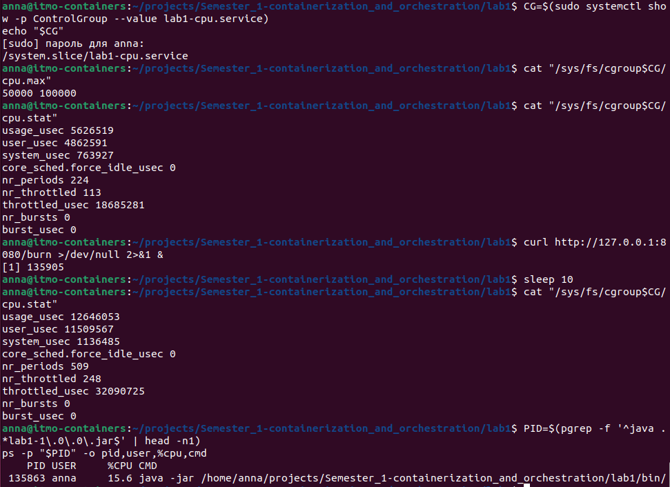

Таким образом, cgroups v2 позволяют ограничить доступное процессорное время. При превышении установленной квоты процесс не завершается, а его выполнение периодически приостанавливается механизмом CPU throttling.

### 3.3. Ограничение количества процессов

Для проверки ограничения количества процессов была создана отдельная cgroup с помощью transient-службы `systemd`.

Тест был запущен командой:

```bash
sudo systemd-run \
  --unit=lab1-pids-test \
  --property=User=anna \
  --property=TasksMax=20 \
  --working-directory=/tmp \
  /usr/bin/stress-ng --fork 100 --timeout 120s
```

Параметр:

```text
TasksMax=20
```

устанавливает ограничение на максимальное количество задач внутри cgroup.

Для создания нагрузки использовался:

```text
stress-ng --fork 100
```

который пытается одновременно создавать большое количество дочерних процессов.

После запуска был определён путь cgroup:

```bash
CG=$(sudo systemctl show -p ControlGroup --value lab1-pids-test.service)
```

Значение ограничения было проверено командой:

```bash
cat "/sys/fs/cgroup$CG/pids.max"
```

Результат:

```text
20
```

Текущее количество задач:

```bash
cat "/sys/fs/cgroup$CG/pids.current"
```

Результат:

```text
20
```

Таким образом, количество процессов достигло установленного предела, но не превысило его.

Дополнительно была просмотрена статистика:

```bash
cat "/sys/fs/cgroup$CG/pids.events"
```

Результат:

```text
max 1399516
```

Положительное значение счётчика `max` означает, что процессы многократно пытались создать новые задачи после достижения `pids.max`, однако ядро Linux отклоняло эти попытки.

Статус службы также показывал:

```text
Tasks: 20 (limit: 20)
```

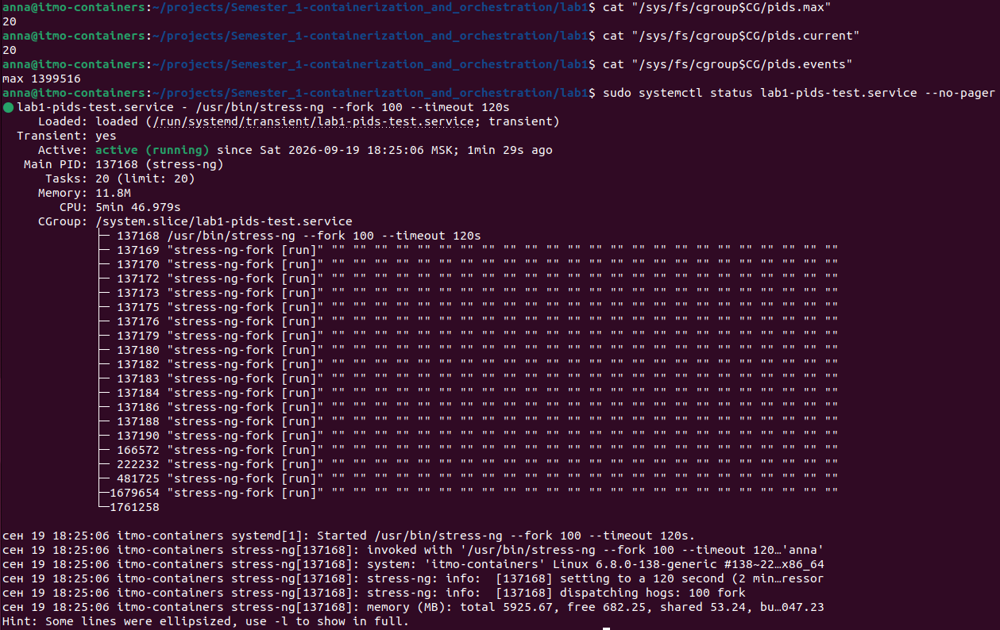

Таким образом, контроллер `pids` в cgroups v2 позволяет ограничить количество процессов и потоков внутри группы. После достижения значения `pids.max` дальнейшие попытки создания процессов блокируются ядром.

## Часть 4 - Права

### Сброс лишних `Capabilities`
Для демонстрации сброса лишних capabilities воспользуемся функцией `GET /changeTime`, которая меняет системное время на `19-09-2026 12:00:00`.

1. Запустим приложение и проверим, что смена системного времени проходит: `sudo java -jar lib/lab1-1.0.0.jar --server.port=9191`
2. Попробуем сменить системное время: `GET curl 'http://localhost:9191/changeTime'`
<details>
<summary>Результат</summary>

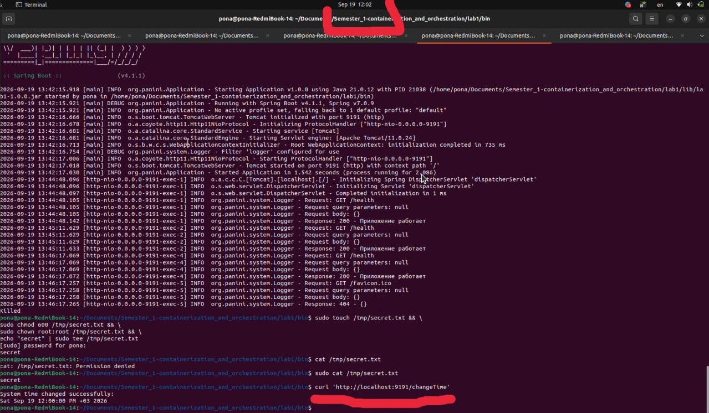
</details>

2. Сбросим соответствующий `capability` и перезапустим приложение: `sudo capsh --drop=cap_sys_time -- -c 'exec java -jar lib/lab1-1.0.0.jar --server.port=9191'`
3. Попробуем сменить системное время: `GET curl 'http://localhost:9191/changeTime'`
<details>
<summary>Результат</summary>

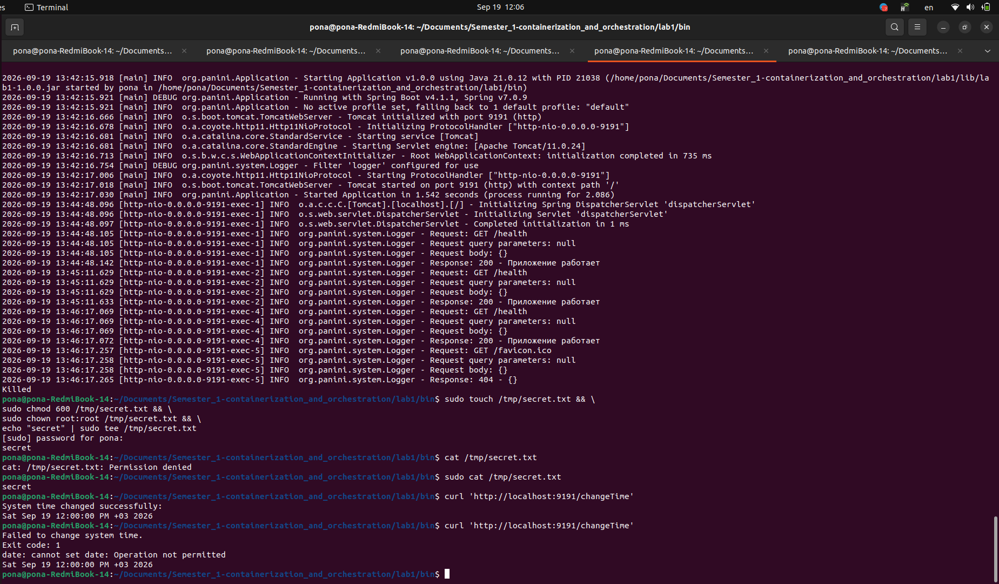
</details>

### Добавление `seccomp`-профилей
Для демонстрации добавления `seccomp`-профилей воспользуемся той же функцией, что и в предыдущем пункте по смене системного времени `GET /changeTime`:

1. Запустим приложение с `seccomp`-профилем: `systemd-run   --user   --unit=lab1-seccomp   -p SystemCallFilter='~clock_settime'   -p SystemCallErrorNumber=EPERM   /bin/bash "$(realpath ./startup.sh)`
<details>
<summary>Результат</summary>

</details>

4. Попробуем открыть `TCP` соединение
<details>
<summary>Результат</summary>

```bash
pona@pona-RedmiBook-14:~/Documents/Semester_1-containerization_and_orchestration/lab1$ curl 'http://localhost:9191/changeTime'
Failed to change system time.
Exit code: 1
date: cannot set date: Operation not permitted
Sat Sep 19 12:00:00 PM +03 2026
```
</details>

`Capabilities` - это набор прав, доступных `root`-пользователю. В эксперименте по смене системного времени представлено, что при запуске приложения из под `root` пользователя, дочерний процесс (запущенное приложение) наследовало его `capabilities` и могло изменять системное время устройства. При удалении `capability` CAP_SYS_TIME приложение как и прежде запускается под `root` пользователем, но с меньшим диапазоном прав, вследствие чего попытка изменить системное время повторно завершилось с ошибкой.

`Seccomp`-профили ограничивают набор доступных процессу **системных вызовов**. Во втором эксперименте запуск приложения производится под `root` пользователем, с правами по смене времени `CAP_SYS_TIME`, но с запретом на системный вызов `clock_settime`, из-за чего смена времени для данного процесса запрещена.

Таким образом, `Capability` - определяют **права** процесса, в то время как `seccomp`-профили определяют набор **запрещенных** системных вызовов. Запрет на выполнение системного вызова **сильнее** `capability`.