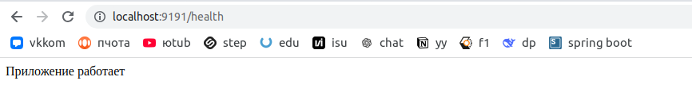
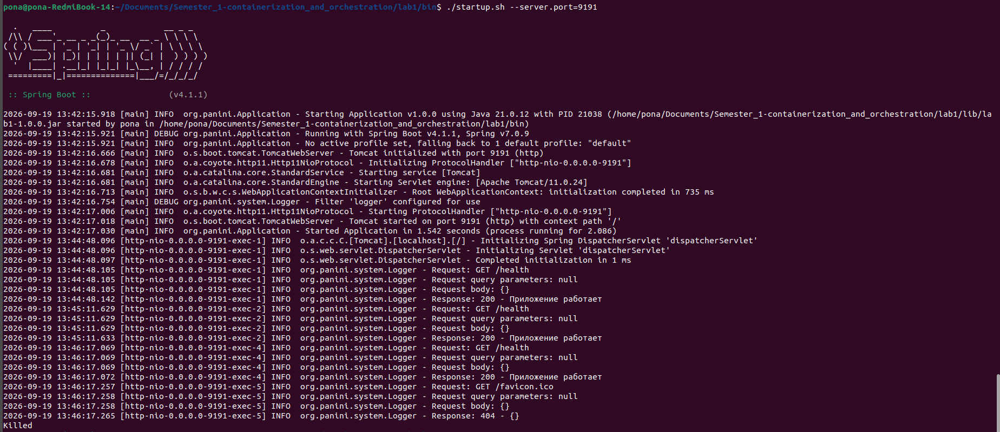
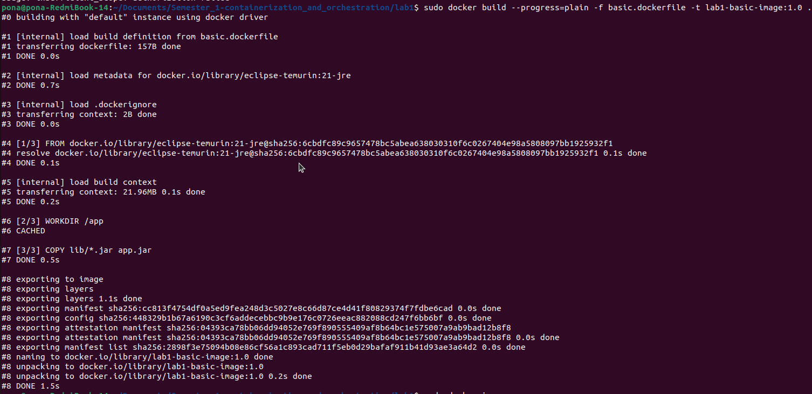
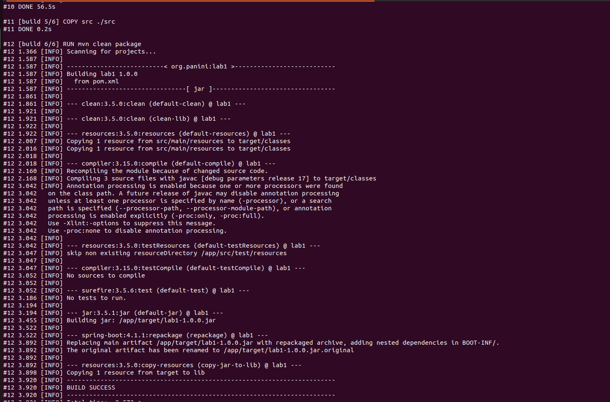
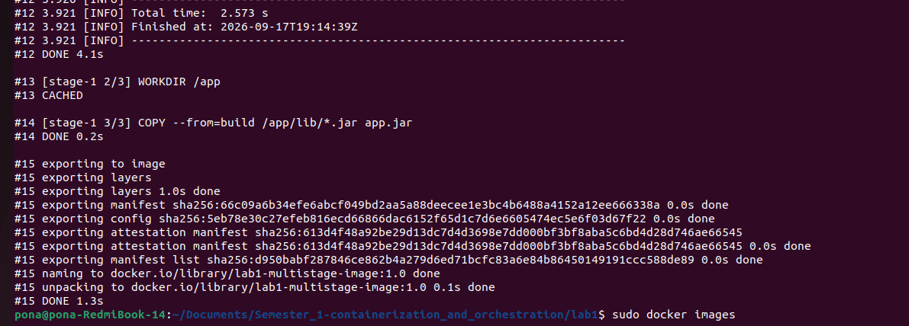
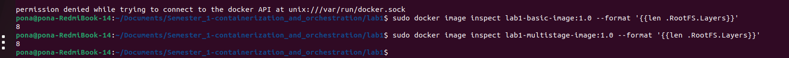
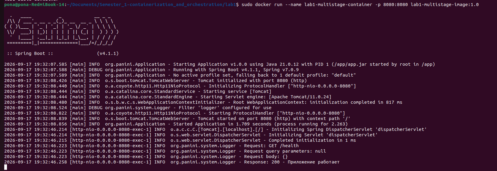
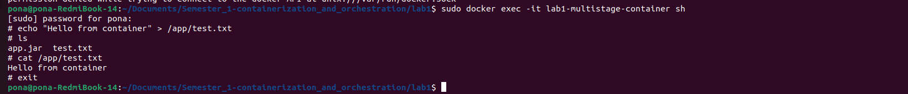
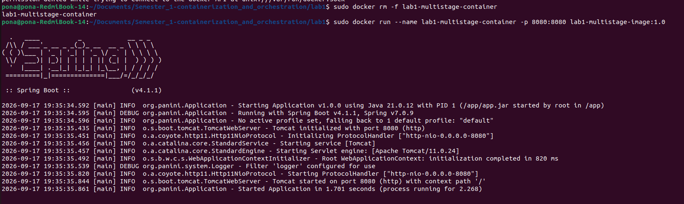

# Отчет по лабораторной работе №1 "Docker"

## Часть 0 - Свой сервис
Язык сервиса - `Java` (см. подробнее версию `jdk`, и версии используемых библиотек в @lab1/pom.xml)

Сервис реализует следующие `endpoints`:
- `GET /health` — возвращает ok;
- `GET /eat?mb=N` — выделяет N мегабайт памяти и держит их;
- `GET /burn` — нагружает одно ядро CPU в бесконечном цикле;

Дополнительные `endpoints,` реализованные для демонстрации результатов:
- (**пункт 4**) `GET /changeTime` - меняет системное время на `19-09-2026 12:00:00`
- (**пункт 6**) `POST /system/execute` - выполняет системную команду внутри среды, где запущено приложение и возвращает результат работы переданной команды

См. реализацию сервиса в @lab1/src.

## Часть 1 - Запуск приложения без изоляций
1. Собираем приложение: `mvn clean package`
2. Переходим в @lab1/bin и запускаем скрипт @lab1/bin/startup.sh: `./startup.sh --server.port=9191`
<details>
  <summary>Результат</summary>

```bash
  .   ____          _            __ _ _
 /\\ / ___'_ __ _ _(_)_ __  __ _ \ \ \ \
( ( )\___ | '_ | '_| | '_ \/ _` | \ \ \ \
 \\/  ___)| |_)| | | | | || (_| |  ) ) ) )
  '  |____| .__|_| |_|_| |_\__, | / / / /
 =========|_|==============|___/=/_/_/_/

:: Spring Boot ::                (v4.1.1)

2026-09-19 13:42:15.918 [main] INFO  org.panini.Application - Starting Application v1.0.0 using Java 21.0.12 with PID 21038 (/home/pona/Documents/Semester_1-containerization_and_orchestration/lab1/lib/lab1-1.0.0.jar started by pona in /home/pona/Documents/Semester_1-containerization_and_orchestration/lab1/bin)
2026-09-19 13:42:15.921 [main] DEBUG org.panini.Application - Running with Spring Boot v4.1.1, Spring v7.0.9
2026-09-19 13:42:15.921 [main] INFO  org.panini.Application - No active profile set, falling back to 1 default profile: "default"
2026-09-19 13:42:16.666 [main] INFO  o.s.boot.tomcat.TomcatWebServer - Tomcat initialized with port 9191 (http)
2026-09-19 13:42:16.678 [main] INFO  o.a.coyote.http11.Http11NioProtocol - Initializing ProtocolHandler ["http-nio-0.0.0.0-9191"]
2026-09-19 13:42:16.681 [main] INFO  o.a.catalina.core.StandardService - Starting service [Tomcat]
2026-09-19 13:42:16.681 [main] INFO  o.a.catalina.core.StandardEngine - Starting Servlet engine: [Apache Tomcat/11.0.24]
2026-09-19 13:42:16.713 [main] INFO  o.s.b.w.c.s.WebApplicationContextInitializer - Root WebApplicationContext: initialization completed in 735 ms
2026-09-19 13:42:16.754 [main] DEBUG org.panini.system.Logger - Filter 'logger' configured for use
2026-09-19 13:42:17.006 [main] INFO  o.a.coyote.http11.Http11NioProtocol - Starting ProtocolHandler ["http-nio-0.0.0.0-9191"]
2026-09-19 13:42:17.018 [main] INFO  o.s.boot.tomcat.TomcatWebServer - Tomcat started on port 9191 (http) with context path '/'
2026-09-19 13:42:17.030 [main] INFO  org.panini.Application - Started Application in 1.542 seconds (process running for 2.086)
```
</details>

3. Вызываем `curl 'http://localhost:9191/health'` и получаем ответ: `Приложение работает`
<details>
<summary>Результат</summary>


</details>

4. Вызываем `pgrep -af '^java .*lab1-1.0.0.jar'`, получаем PID процесса `21038`
<details>
<summary>Результат</summary>

```bash
21038 java -jar /home/pona/Documents/Semester_1-containerization_and_orchestration/lab1/bin/../lib/lab1-1.0.0.jar --server.port=9191
```
</details>

5. Убьем принудительно данный процесс через `shell`: `sudo kill -9 21038`, приложение завершилось, в логах видим: `Killed`
<details>
<summary>Результат</summary>


</details>

## Часть 4 - Права

### Сброс лишних `Capabilities`
Для демонстрации сброса лишних capabilities воспользуемся функцией `GET /changeTime`, которая меняет системное время на `19-09-2026 12:00:00`.

1. Запустим приложение и проверим, что смена системного времени проходит: `sudo java -jar lib/lab1-1.0.0.jar --server.port=9191`
2. Попробуем сменить системное время: `GET curl 'http://localhost:9191/changeTime'`
<details>
<summary>Результат</summary>


</details>

2. Сбросим соответствующий `capability` и перезапустим приложение: `sudo capsh --drop=cap_sys_time -- -c 'exec java -jar lib/lab1-1.0.0.jar --server.port=9191'`
3. Попробуем сменить системное время: `GET curl 'http://localhost:9191/changeTime'`
<details>
<summary>Результат</summary>


</details>

### Добавление `seccomp`-профилей
Для демонстрации добавления `seccomp`-профилей воспользуемся той же функцией, что и в предыдущем пункте по смене системного времени `GET /changeTime`:

1. Запустим приложение с `seccomp`-профилем: `systemd-run   --user   --unit=lab1-seccomp   -p SystemCallFilter='~clock_settime'   -p SystemCallErrorNumber=EPERM   /bin/bash "$(realpath ./startup.sh)`
<details>
<summary>Результат</summary>

</details>

4. Попробуем открыть `TCP` соединение
<details>
<summary>Результат</summary>

```bash
pona@pona-RedmiBook-14:~/Documents/Semester_1-containerization_and_orchestration/lab1$ curl 'http://localhost:9191/changeTime'
Failed to change system time.
Exit code: 1
date: cannot set date: Operation not permitted
Sat Sep 19 12:00:00 PM +03 2026
```
</details>

`Capabilities` - это набор прав, доступных `root`-пользователю. В эксперименте по смене системного времени представлено, что при запуске приложения из под `root` пользователя, дочерний процесс (запущенное приложение) наследовало его `capabilities` и могло изменять системное время устройства. При удалении `capability` CAP_SYS_TIME приложение как и прежде запускается под `root` пользователем, но с меньшим диапазоном прав, вследствие чего попытка изменить системное время повторно завершилось с ошибкой.

`Seccomp`-профили ограничивают набор доступных процессу **системных вызовов**. Во втором эксперименте запуск приложения производится под `root` пользователем, с правами по смене времени `CAP_SYS_TIME`, но с запретом на системный вызов `clock_settime`, из-за чего смена времени для данного процесса запрещена.

Таким образом, `Capability` - определяют **права** процесса, в то время как `seccomp`-профили определяют набор **запрещенных** системных вызовов. Запрет на выполнение системного вызова **сильнее** `capability`.

## Часть 6 - Образы
См. реализацию одноэтапного `dockerfile` в файле [basic.dockerfile](basic.dockerfile), реализацию `multi-stage` сборки в файле [multistage.dockerfile](multistage.dockerfile).

### Одноэтапный образ
1. Соберем `docker`-образ: `sudo docker build -f basic.dockerfile -t lab1-basic-image:1.0 .`
<details>
<summary>Результат</summary>



</details>

2. Следующим соберем multi-stage` образ: ``sudo docker build -f multistage.dockerfile -t lab1-multistage-image:1.0 .`, можно заметить, что при сборке `multi-stage` образа переиспользовался закэшированный шаг `WORKDIR /app`, остальные слои, так как располагаются выше и отличаются от одноэтапной сборки, берутся не из кэша:
<details>
<summary>Результат</summary>





</details>

3. При повторной сборки `multi-stage` образа можно заметить, что из кэша берутся все слои, так как исходники кода (и `dockerfile`) не менялись:
<details>
<summary>Результат</summary>


</details>

4. Сравним размер и число слоев собранных образов в пунктах 1 и 3:
    * sudo docker images -> размер одинаковый, так как в `nultistage` сборке в образ сохраняется только результат последнего этапа
    * `sudo docker image inspect lab1-basic-image:1.0 --format '{{len .RootFS.Layers}}'` и `sudo docker image inspect lab1-multistage-image:1.0 --format '{{len .RootFS.Layers}}'` - количество слое одинаковое (8), учитываются как собственные слои, так и слои используемых образов `eclipse-temurin:21-jre`
<details>
<summary>Результат</summary>



</details>

5. Запустим контейнер на основе образа `lab1-multistage-image:1.0` и запишем туда файл:
<details>
<summary>Результат</summary>



</details>

6. Пересоздадим контейнер и убедимся, что файл удален, так как при удалении контейнера записываемые в него данные не сохраняются, контейнер пересоздается на основе ранее созданного **нередактируемого** образа:
<details>
<summary>Результат</summary>



</details>

7. Создадим том, запустим контейнер с подключенным томом и затем пересоздадим контейнер:
- `sudo docker volume create lab1-data` - создание тома lab1-data
- `sudo docker run --name lab1-multistage-container -p 8080:8080 -v lab1-data:/data lab1-multistage-image:1.0` - запуск нового контейнера с подключенным томом
- `sudo docker exec lab1-multistage-container   sh -c 'echo "I will survive" > /data/test.txt'` - запись в том файла `test.txt`
- `sudo docker rm -f lab1-multistage-container` - остановка и удаление контейнера
- `sudo docker run --name lab1-multistage-container -p 8080:8080 -v lab1-data:/data lab1-multistage-image:1.0` - запуск нового контейнера с подключением того же тома
- `sudo docker exec lab1-multistage-container cat /data/test.txt` - проверяем, сохранился ли файл:
<details>
<summary>Результат</summary>


</details>

## Часть 7 - Gvisor
Для исследования окружения контейнера реализован endpoint `POST /system/execute`, который запускает shell-команды внутри контейнера.

### Сравнение Gvisor и стандартного контейнера
1. Соберем новый образ с добавленным endpoint-ом: `sudo docker build --progress=plain -f multistage.dockerfile -t lab1-multistage-image:1.1 .`
2. Запустим 2 контейнера с приложением:
  * Контейнер БЕЗ изоляции gvisor будет принимать http-запросы на порту 8080: `sudo docker run --rm --name lab1-container -p 8080:8080 lab1-multistage-image:1.1`
  * Контейнер с изоляцией gvisor будет принимать http-запросы на порту 9090: `sudo docker run --rm --runtime=runsc --name lab1-container-gvisor -p 9090:8080 lab1-multistage-image:1.1`

Выполним команду `uname -a` в каждом из контейнеров: 
```bash
pona@pona-RedmiBook-14:~/Documents/Semester_1-containerization_and_orchestration/lab1$ echo '{"command": "uname -a"}' | curl -X POST http://localhost:8080/system/execute -H "Content-Type: application/json" -d @-
Linux 4499f72d22c5 6.8.0-138-generic #138~22.04.1-Ubuntu SMP PREEMPT_DYNAMIC Fri Aug  7 13:43:15 UTC  x86_64 GNU/Linux

pona@pona-RedmiBook-14:~/Documents/Semester_1-containerization_and_orchestration/lab1$ echo '{"command": "uname -a"}' | curl -X POST http://localhost:9090/system/execute -H "Content-Type: application/json" -d @-
Linux a730ad1bbd44 4.19.0-gvisor #1 SMP Sun Jan 10 15:06:54 PST 2016 x86_64 GNU/Linux
```
Замечаем, что системная информация у контейнеров отличается, несмотря на то, что фактически они запущены на одной машине. Системные вызовы в первом случае выполняются ядром Linux, во втором - виртуализированным Linux-интерфейсом (Sentry), который перехватывает системные вызовы приложения и самостоятельно выполняет их. Таким образом, `Gvisor` выступает в роли **прослойки** между ядром хоста и контейнером и уменьшает поверхность взаимодействия приложения с ядром хоста. Это снижает риск эксплуатации уязвимостей ядра, что может повлечь за собой "побег" процесса из контейнера.

Посмотрим, какие `capabilities` и `seccomp`-профили навешаны на оба контейнера:
```bash
pona@pona-RedmiBook-14:~/Documents/Semester_1-containerization_and_orchestration/lab1$  curl -X POST http://localhost:8080/system/execute \
    -H 'Content-Type: application/json' \
    --data '{"command":"grep -E \"^(Seccomp|Cap)\" /proc/self/status"}'
CapInh:	0000000000000000
CapPrm:	00000000a80425fb
CapEff:	00000000a80425fb
CapBnd:	00000000a80425fb
CapAmb:	0000000000000000
Seccomp:	2
Seccomp_filters:	1

pona@pona-RedmiBook-14:~/Documents/Semester_1-containerization_and_orchestration/lab1$  curl -X POST http://localhost:9090/system/execute \
    -H 'Content-Type: application/json' \
    --data '{"command":"grep -E \"^(Seccomp|Cap)\" /proc/self/status"}'
CapInh:	0000000000000000
CapPrm:	00000000a80405fb
CapEff:	00000000a80405fb
CapBnd:	00000000a80405fb
CapAmb:	0000000000000000
Seccomp:	0
```
Видим, что в обычном Docker-контейнере выставлен режим работы SECCOMP_MODE_FILTER (Seccomp:2), а количество выставленных фильтров на системные вызовы - 1 (Seccomp_filters:1), в то время как в контейнере, запущенном из-под gvisor, выключены seccomp-профили. Отсутствие профилей относится к изоляции относительно Linux-интерфейса (Sentry), а не относительно Linux-ядра. Сам процесс Sentry запускается на хосте с отдельным seccomp-фильтром и ограниченным набором capabilities (PID процесса - 39023):
```bash
pona@pona-RedmiBook-14:~/Documents/Semester_1-containerization_and_orchestration/lab1$ sudo grep -E 'Seccomp' /proc/39023/status
CapInh:	0000000000000000
CapPrm:	000000000008001f
CapEff:	000000000008001f
CapBnd:	000000000008001f
CapAmb:	0000000000000000
Seccomp:	2
Seccomp_filters:	1
```
Сравним процессы, видимые на хосте:
```bash
pona@pona-RedmiBook-14:~/Documents/Semester_1-containerization_and_orchestration/lab1$ sudo docker inspect --format '{{.State.Pid}}' lab1-container
14878
pona@pona-RedmiBook-14:~/Documents/Semester_1-containerization_and_orchestration/lab1$ sudo docker inspect --format '{{.State.Pid}}' lab1-container-gvisor
39023
```
Посмотрим, что представляют из себя эти процессы на хосте:
```bash
pona@pona-RedmiBook-14:~/Documents/Semester_1-containerization_and_orchestration/lab1$ sudo ps -ef | grep -E '[j]ava|[r]unsc'
root       14878   14855  0 12:23 ?        00:00:59 java -jar app.jar
root       39023   38998  2 22:01 ?        00:02:25 runsc-sandbox --root=/var/run/docker/runtime-runc/moby --log=/run/containerd/io.containerd.runtime.v2.task/moby/a730ad1bbd44352a089ccf163704896deab375ceb3153777c97a5c9af4d33d68/log.json --log-format=json --systemd-cgroup=true --log-fd=3 boot --bundle=/run/containerd/io.containerd.runtime.v2.task/moby/a730ad1bbd44352a089ccf163704896deab375ceb3153777c97a5c9af4d33d68 --gofer-mount-confs=lisafs:self,lisafs:none,lisafs:none,lisafs:none --apply-caps=true --setup-root --total-host-memory 16591843328 --cpu-num 8 --cpu-period 100000 --total-memory 16591843328 --io-fds=4 --io-fds=5 --io-fds=6 --io-fds=7 --dev-io-fd=-1 --gofer-filestore-fds=8 --mounts-fd=9 --start-sync-fd=10 --pin-ring-fd=11 --controller-fd=12 --spec-fd=13 --stdio-fds=14 --stdio-fds=15 --stdio-fds=16 a730ad1bbd44352a089ccf163704896deab375ceb3153777c97a5c9af4d33d68
```
Видим, что первый процесс, соответствующий контейнеру без gvisor изоляции, относится к java-приложению, в то время как процесс контейнера `lab1-container-gvisor` относится к запущенному Sentry.

Таким образом, в случае стандартного запуска Docker-контейнера, получаем изоляцию с помощью namespace, cgroups, capabilities и seccomp, **но сами системные вызовы выполняются на общем ядре хоста (предел контейнерной изоляции)**. В случае запуска контейнера под gvisor ядром выступает сам gvisor, самостоятельно обрабатывающий большую часть системных вызовов.