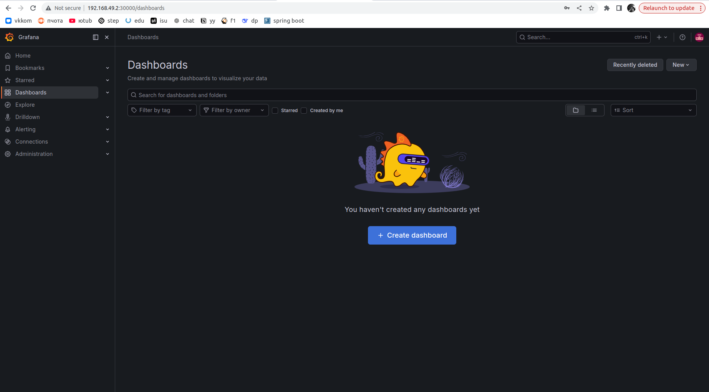
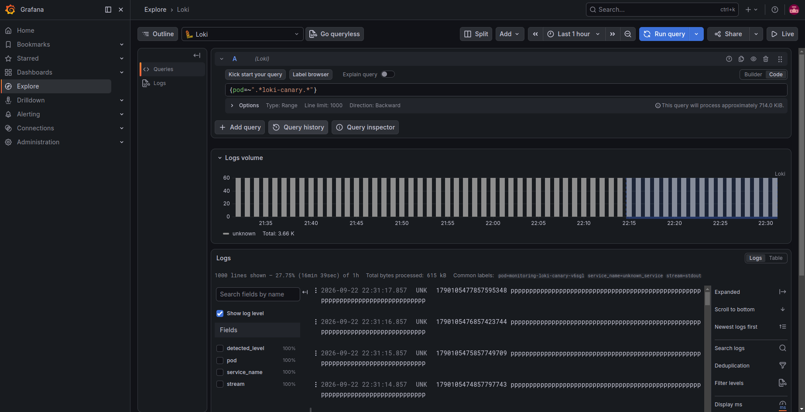
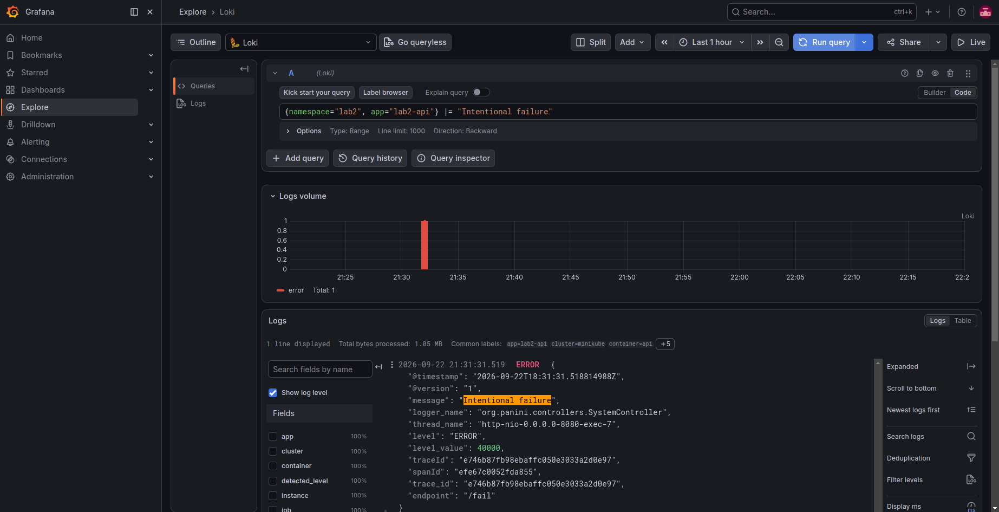
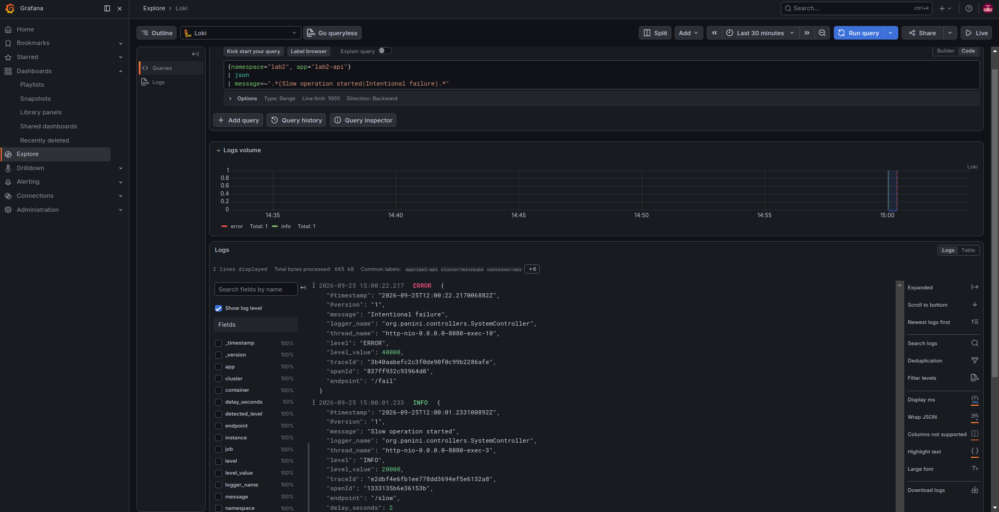
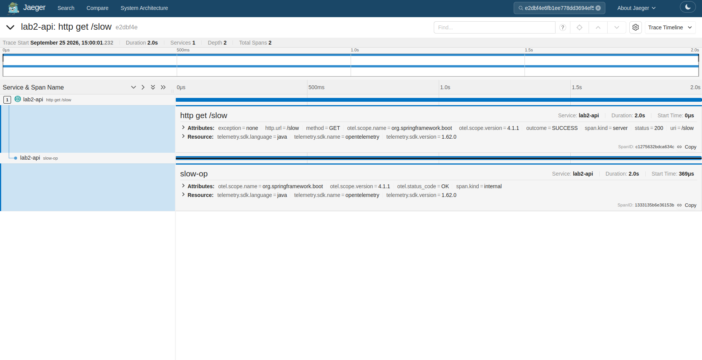
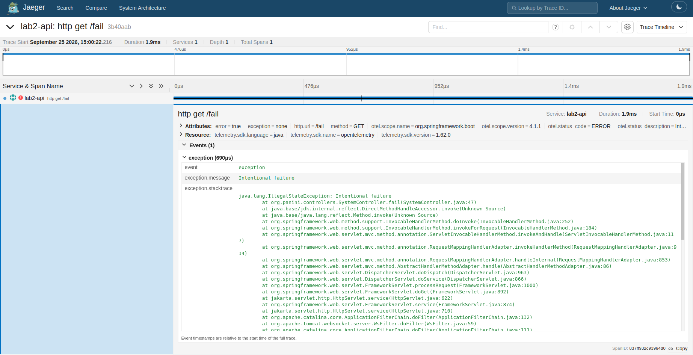
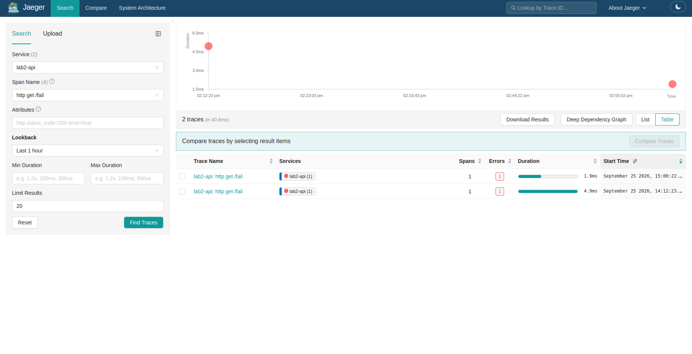
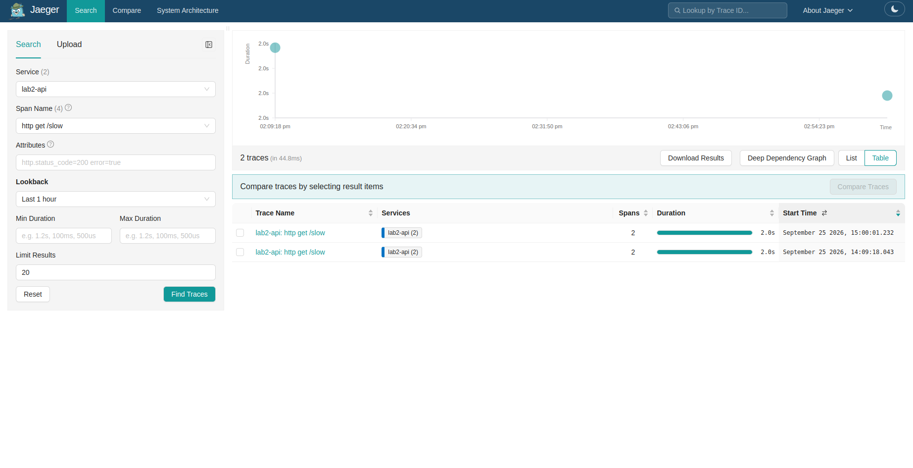

# Лабораторная работа №2 - Мониторинг сервиса: метрики, логи, трейсы

## Часть 0 - Свой сервис

Подготовлен Spring Boot сервис, который используется как основа для дальнейшей настройки мониторинга.

Реализованы HTTP-endpoint'ы:

- `GET /health` - проверка доступности сервиса;
- `GET /fail` - возвращает HTTP 500 и увеличивает счётчик ошибок;
- `GET /slow` - имитирует медленный запрос с задержкой 1–3 секунды;
- `GET /load` - генерирует дополнительные запросы к сервису для создания нагрузки;
- `GET /metrics` - экспортирует метрики в формате Prometheus.

Для сервиса настроены:
- RED-метрики через Micrometer;
- отдельный счётчик ошибок `app_errors_total`;
- structured JSON logs;
- `traceId` и `spanId` для корреляции логов и трейсов;
- OpenTelemetry tracing;
- Dockerfile для сборки и запуска сервиса в контейнере.

Поднимем локальный Kubernetes-кластер с помощью `minikube` и установим приложение через `helm`. В запущщеном контейнере будет работать приложение из [src](src):
1. Запустим кластер: `minikube start --driver=docker --cpus=4 --memory=6144`
<details>
<summary>Результат</summary>

```bash
😄  minikube v1.39.0 on Ubuntu 22.04
✨  Using the docker driver based on user configuration
📌  Using Docker driver with root privileges
👍  Starting "minikube" primary control-plane node in "minikube" cluster
🚜  Pulling base image v0.0.51 ...
💾  Downloading Kubernetes v1.37.0 preload ...
    > preloaded-images-k8s-v18-v1...:  347.58 MiB / 347.58 MiB  100.00% 2.44 Miк
    > gcr.io/k8s-minikube/kicbase:  507.60 MiB / 507.61 MiB  100.00% 2.92 MiB p
🔥  Creating docker container (CPUs=4, Memory=6144MB) ...
❗  Local proxy ignored: not passing HTTP_PROXY=http://127.0.0.1:10809/ to docker env.
❗  Local proxy ignored: not passing HTTPS_PROXY=http://127.0.0.1:10809/ to docker env.
❗  Local proxy ignored: not passing HTTP_PROXY=http://127.0.0.1:10809/ to docker env.
❗  Local proxy ignored: not passing HTTPS_PROXY=http://127.0.0.1:10809/ to docker env.
🌐  Found network options:
    ▪ HTTP_PROXY=http://127.0.0.1:10809/
❗  You appear to be using a proxy, but your NO_PROXY environment does not include the minikube IP (192.168.49.2).
📘  Please see https://minikube.sigs.k8s.io/docs/handbook/vpn_and_proxy/ for more details
    ▪ HTTPS_PROXY=http://127.0.0.1:10809/
    ▪ NO_PROXY=localhost,127.0.0.0/8,::1
    ▪ HTTP_PROXY=http://127.0.0.1:10809/
    ▪ HTTPS_PROXY=http://127.0.0.1:10809/
    ▪ NO_PROXY=localhost,127.0.0.0/8,::1
❗  Failing to connect to https://registry.k8s.io/ from inside the minikube container
💡  To pull new external images, you may need to configure a proxy: https://minikube.sigs.k8s.io/docs/reference/networking/proxy/
📦  Preparing Kubernetes v1.37.0 on containerd 2.3.4 ...
    ▪ env NO_PROXY=localhost,127.0.0.0/8,::1
🔗  Configuring CNI (Container Networking Interface) ...
🔎  Verifying Kubernetes components...
    ▪ Using image gcr.io/k8s-minikube/storage-provisioner:v5
🌟  Enabled addons: storage-provisioner, default-storageclass
🏄  Done! kubectl is now configured to use "minikube" cluster and "default" namespace by default
```
</details>

2. Проверим статус кластера:
<details>
<summary>Результат</summary>

```bash
pona@pona-RedmiBook-14:~/Documents/Semester_1-containerization_and_orchestration/lab2$ minikube status
minikube
type: Control Plane
host: Running
kubelet: Running
apiserver: Running
kubeconfig: Configured
```
</details>

3. Проверим статус запущенных нод и подов:
<details>
<summary>Результат</summary>

```bash
pona@pona-RedmiBook-14:~/Documents/Semester_1-containerization_and_orchestration/lab2$ kubectl get nodes
NAME       STATUS   ROLES           AGE   VERSION
minikube   Ready    control-plane   56m   v1.37.0
pona@pona-RedmiBook-14:~/Documents/Semester_1-containerization_and_orchestration/lab2$ kubectl get pods -A
NAMESPACE     NAME                               READY   STATUS    RESTARTS   AGE
kube-system   coredns-559f6c778d-tmkhc           1/1     Running   0          56m
kube-system   etcd-minikube                      1/1     Running   0          56m
kube-system   kindnet-7k54d                      1/1     Running   0          56m
kube-system   kube-apiserver-minikube            1/1     Running   0          56m
kube-system   kube-controller-manager-minikube   1/1     Running   0          56m
kube-system   kube-proxy-qfpmd                   1/1     Running   0          56m
kube-system   kube-scheduler-minikube            1/1     Running   0          56m
kube-system   storage-provisioner                1/1     Running   0          56m
```
</details>

4. Соберем docker-образ сервиса: `cd lab2 && docker build -f Dockerfile -t lab2-api:1.0 .`
5. Импортируем docker-образ в список доступных образов `minikube`: `minikube image load lab2-api:1.0`
6. Развернем контейнер из образа, созданного в предыдущих пунктах, и проверим работоспособность сервиса:
<details>
<summary>Результат</summary>

```bash
pona@pona-RedmiBook-14:~/Documents/Semester_1-containerization_and_orchestration/lab2$ helm upgrade --install api ./install     --namespace lab2     --create-namespace
Release "api" does not exist. Installing it now.
NAME: api
LAST DEPLOYED: Sun Sep 20 20:58:37 2026
NAMESPACE: lab2
STATUS: deployed
REVISION: 1
TEST SUITE: None
pona@pona-RedmiBook-14:~/Documents/Semester_1-containerization_and_orchestration/lab2$  kubectl get service api -n lab2
NAME   TYPE       CLUSTER-IP     EXTERNAL-IP   PORT(S)          AGE
api    NodePort   10.108.72.20   <none>        8080:30080/TCP   13m
pona@pona-RedmiBook-14:~/Documents/Semester_1-containerization_and_orchestration/lab2$ curl "http://$(minikube ip):30080/health"
ok
```
</details>

## Часть 1 - Метрики (Prometheus + Grafana)
Развернем Grafana отдельно от приложения `api` в namespace `monitoring`. Для приложения и системы наблюдаемости будут использованы независимые `helm`-релизы:
- релиз `api`, расположенный в namespace `lab2`, управляет приложением
- релиз `monitoring`, развернутый в namespace `monitoring`, управляет компонентами для обеспечения наблюдаемости приложений

Данное разделение позволяет обновлять и удалять приложение `api` независимо от системы мониторинга.

К уже установленному релизу `api` в том же кластере установим observability-релиз. Предварительно необходимо локально в директории [observability](observability) создать файл `grafana-secret.values.yaml` по аналогии с `grafana-secret.values.example.yaml` для настройки параметров авторизации в Grafana.

**Примечание: если данный файл не будет создан, то дашборд Grafana будет доступен без окна аутентификации, в таком случае при установке helm-релиза ниже необходимо убрать опцию `--values ./observability/grafana-secret.values.yaml`.**
<details>
<summary>Результат</summary>

```bash
pona@pona-RedmiBook-14:~/Documents/Semester_1-containerization_and_orchestration/lab2$ helm upgrade --install monitoring ./observability --namespace monitoring --create-namespace --values ./observability/grafana-secret.values.yaml --wait --timeout 10m
Release "monitoring" has been upgraded. Happy Helming!
NAME: monitoring
LAST DEPLOYED: Sun Sep 20 23:48:19 2026
NAMESPACE: monitoring
STATUS: deployed
REVISION: 2
TEST SUITE: None

pona@pona-RedmiBook-14:~/Documents/Semester_1-containerization_and_orchestration/lab2$ kubectl get pod,service -n monitoring
NAME                                      READY   STATUS    RESTARTS   AGE
pod/monitoring-grafana-79778f445b-fv98f   1/1     Running   0          65s

NAME                         TYPE       CLUSTER-IP    EXTERNAL-IP   PORT(S)        AGE
service/monitoring-grafana   NodePort   10.105.1.88   <none>        80:30000/TCP   10m

pona@pona-RedmiBook-14:~/Documents/Semester_1-containerization_and_orchestration/lab2$ echo "http://$(minikube ip):30000"
http://192.168.49.2:30000
```
</details>

Перейдем по выведенной ссылке, введем логин/пароль, заданный в `grafana-secret.values.yaml`:
<details>
<summary>Результат</summary>


</details>

## Часть 2 - Логи (Loki + Grafana)
Подключим хранилище логов Loki и агент Grafana Alloy для обнаружения и сбора логов с Pod-ов как зависимости Helm chart `monitoring`. Схема взаимодействия компонентов следующая:
1. Запущенное приложение `api` пишет JSON-логи в stdout/stderr контейнера
2. Container runtime сохраняет логи приложения на ноде
3. Kubelet предоставляет доступ к сохраненным на ноде логам через Kubernetes API
4. Агент Grafana Alloy собирает логи с подов с меткой logs.collect=true, читая их через Kubernetes API и отправляет прочитанные записи в Loki

Проверим, что приложение пишет логи с помощью kubectl: `kubectl get pods -A`
<details>
<summary>Результат</summary>

```bash
pona@pona-RedmiBook-14:~/Documents/Semester_1-containerization_and_orchestration/lab2$ kubectl get pods -A
NAMESPACE     NAME                                  READY   STATUS    RESTARTS        AGE
kube-system   coredns-559f6c778d-tmkhc              1/1     Running   1 (9m4s ago)    47h
kube-system   etcd-minikube                         1/1     Running   1 (9m4s ago)    47h
kube-system   kindnet-7k54d                         1/1     Running   1 (9m4s ago)    47h
kube-system   kube-apiserver-minikube               1/1     Running   1 (9m4s ago)    47h
kube-system   kube-controller-manager-minikube      1/1     Running   1 (9m4s ago)    47h
kube-system   kube-proxy-qfpmd                      1/1     Running   1 (9m4s ago)    47h
kube-system   kube-scheduler-minikube               1/1     Running   1 (9m4s ago)    47h
kube-system   storage-provisioner                   1/1     Running   2 (8m48s ago)   47h
lab2          api-75bcffb478-wl2xs                  1/1     Running   1 (9m4s ago)    46h
monitoring    monitoring-grafana-79778f445b-fv98f   1/1     Running   1 (9m4s ago)    43h

pona@pona-RedmiBook-14:~/Documents/Semester_1-containerization_and_orchestration/lab2$ kubectl logs -f -n lab2 api-75bcffb478-wl2xs
{"@timestamp":"2026-09-22T16:05:46.067576187Z","@version":"1","message":"Starting Application v1.0.0 using Java 21.0.12 with PID 1 (/app/app.jar started by appuser in /app)","logger_name":"org.panini.Application","thread_name":"main","level":"INFO","level_value":20000,"tags":["COMMONS-LOGGING"]}
{"@timestamp":"2026-09-22T16:05:46.082788069Z","@version":"1","message":"No active profile set, falling back to 1 default profile: \"default\"","logger_name":"org.panini.Application","thread_name":"main","level":"INFO","level_value":20000,"tags":["COMMONS-LOGGING"]}
{"@timestamp":"2026-09-22T16:05:47.534850517Z","@version":"1","message":"Tomcat initialized with port 8080 (http)","logger_name":"org.springframework.boot.tomcat.TomcatWebServer","thread_name":"main","level":"INFO","level_value":20000,"tags":["COMMONS-LOGGING"]}
{"@timestamp":"2026-09-22T16:05:47.551044624Z","@version":"1","message":"Starting service [Tomcat]","logger_name":"org.apache.catalina.core.StandardService","thread_name":"main","level":"INFO","level_value":20000}
{"@timestamp":"2026-09-22T16:05:47.551570034Z","@version":"1","message":"Starting Servlet engine: [Apache Tomcat/11.0.24]","logger_name":"org.apache.catalina.core.StandardEngine","thread_name":"main","level":"INFO","level_value":20000}
{"@timestamp":"2026-09-22T16:05:47.578750076Z","@version":"1","message":"Root WebApplicationContext: initialization completed in 1417 ms","logger_name":"org.springframework.boot.web.context.servlet.WebApplicationContextInitializer","thread_name":"main","level":"INFO","level_value":20000,"tags":["COMMONS-LOGGING"]}
{"@timestamp":"2026-09-22T16:05:48.753252935Z","@version":"1","message":"Exposing 1 endpoint beneath base path ''","logger_name":"org.springframework.boot.actuate.endpoint.web.EndpointLinksResolver","thread_name":"main","level":"INFO","level_value":20000,"tags":["COMMONS-LOGGING"]}
{"@timestamp":"2026-09-22T16:05:48.834539914Z","@version":"1","message":"Tomcat started on port 8080 (http) with context path '/'","logger_name":"org.springframework.boot.tomcat.TomcatWebServer","thread_name":"main","level":"INFO","level_value":20000,"tags":["COMMONS-LOGGING"]}
{"@timestamp":"2026-09-22T16:05:48.849767025Z","@version":"1","message":"Started Application in 3.447 seconds (process running for 4.395)","logger_name":"org.panini.Application","thread_name":"main","level":"INFO","level_value":20000,"tags":["COMMONS-LOGGING"]}
{"@timestamp":"2026-09-22T16:05:49.907911058Z","@version":"1","message":"Initializing Spring DispatcherServlet 'dispatcherServlet'","logger_name":"org.apache.catalina.core.ContainerBase.[Tomcat].[localhost].[/]","thread_name":"http-nio-0.0.0.0-8080-exec-1","level":"INFO","level_value":20000}
{"@timestamp":"2026-09-22T16:05:49.914128329Z","@version":"1","message":"Initializing Servlet 'dispatcherServlet'","logger_name":"org.springframework.web.servlet.DispatcherServlet","thread_name":"http-nio-0.0.0.0-8080-exec-1","level":"INFO","level_value":20000,"tags":["COMMONS-LOGGING"]}
{"@timestamp":"2026-09-22T16:05:49.915824161Z","@version":"1","message":"Completed initialization in 1 ms","logger_name":"org.springframework.web.servlet.DispatcherServlet","thread_name":"http-nio-0.0.0.0-8080-exec-1","level":"INFO","level_value":20000,"tags":["COMMONS-LOGGING"]}
{"@timestamp":"2026-09-22T16:05:49.982331051Z","@version":"1","message":"Health request","logger_name":"org.panini.controllers.SystemController","thread_name":"http-nio-0.0.0.0-8080-exec-1","level":"INFO","level_value":20000,"traceId":"6e7e5fd7dfb34ae4fd9ad9b6f5c0850c","spanId":"13cfbafbfdbb7995","endpoint":"/health"}
```
</details>

Видим, что логи приложения успешно пишутся в stdout Pod. Добавим в Helm-релиз мониторинга установку Loki - хранилища логов и Grafana Alloy - агента сборщика логов:
1. Обновим репозитории:
  * `helm repo update grafana-community`
  * `helm repo add grafana https://grafana.github.io/helm-charts`
  * `helm repo update grafana`
<details>
<summary>Результат</summary>

```bash
pona@pona-RedmiBook-14:~/Documents/Semester_1-containerization_and_orchestration/lab2$ helm repo update grafana-community
Hang tight while we grab the latest from your chart repositories...
...Successfully got an update from the "grafana-community" chart repository
Update Complete. ⎈Happy Helming!⎈
pona@pona-RedmiBook-14:~/Documents/Semester_1-containerization_and_orchestration/lab2$ helm repo add grafana https://grafana.github.io/helm-charts
"grafana" has been added to your repositories
pona@pona-RedmiBook-14:~/Documents/Semester_1-containerization_and_orchestration/lab2$ helm repo update grafana
Hang tight while we grab the latest from your chart repositories...
...Successfully got an update from the "grafana" chart repository
Update Complete. ⎈Happy Helming!⎈
```
</details>

2. Добавим зависимости Loki и Grafana Alloy в [lab2/observability/Chart.yaml](observability/Chart.yaml):
```yaml
dependencies:
  - name: loki
    version: "18.13.4"
    repository: https://grafana-community.github.io/helm-charts
    condition: loki.enabled

  - name: alloy
    version: "1.12.1"
    repository: https://grafana.github.io/helm-charts
    condition: alloy.enabled
```

3. Скачаем указанные зависимости:
   * `helm dependency update ./observability`
   * `helm dependency list ./observability`
<details>
<summary>Результат</summary>

```bash
pona@pona-RedmiBook-14:~/Documents/Semester_1-containerization_and_orchestration/lab2$ helm dependency update ./observability
Hang tight while we grab the latest from your chart repositories...
...Successfully got an update from the "grafana-community" chart repository
...Successfully got an update from the "grafana" chart repository
Update Complete. ⎈Happy Helming!⎈
Saving 3 charts
Downloading grafana from repo https://grafana-community.github.io/helm-charts
Downloading loki from repo https://grafana-community.github.io/helm-charts
Downloading alloy from repo https://grafana.github.io/helm-charts
Deleting outdated charts
pona@pona-RedmiBook-14:~/Documents/Semester_1-containerization_and_orchestration/lab2$ helm dependency list ./observability
NAME   	VERSION	REPOSITORY                                     	STATUS
grafana	12.8.0 	https://grafana-community.github.io/helm-charts	ok    
loki   	18.13.4	https://grafana-community.github.io/helm-charts	ok    
alloy  	1.12.1 	https://grafana.github.io/helm-charts          	ok
```
</details>

4. Настроим в [lab2/observability/values.yaml](observability/values.yaml) Loki и Grafana Alloy
5. После добавления label `logs.collect="true"` необходимо обновить релиз приложения `helm upgrade --install api ./install --namespace lab2 --create-namespace`:
<details>
<summary>Результат</summary>

```bash
pona@pona-RedmiBook-14:~/Documents/Semester_1-containerization_and_orchestration/lab2$ helm upgrade --install api ./install \
      --namespace lab2 \
      --create-namespace
Release "api" has been upgraded. Happy Helming!
NAME: api
LAST DEPLOYED: Tue Sep 22 21:24:23 2026
NAMESPACE: lab2
STATUS: deployed
REVISION: 4
TEST SUITE: None
```
</details>

6. Обновим Helm-релиз `monitoring` и проверим доступность записи и чтения в Loki:
   * `helm upgrade --install monitoring ./observability \
    --namespace monitoring \
    --values ./observability/grafana-secret.values.yaml \
    --wait \
    --timeout 10m`
   * `helm test monitoring -n monitoring --logs`
<details>
<summary>Результат</summary>

```bash
pona@pona-RedmiBook-14:~/Documents/Semester_1-containerization_and_orchestration/lab2$ helm upgrade --install monitoring ./observability \
    --namespace monitoring \
    --values ./observability/grafana-secret.values.yaml \
    --wait \
    --timeout 10m
Release "monitoring" has been upgraded. Happy Helming!
NAME: monitoring
LAST DEPLOYED: Tue Sep 22 21:29:13 2026
NAMESPACE: monitoring
STATUS: deployed
REVISION: 6
pona@pona-RedmiBook-14:~/Documents/Semester_1-containerization_and_orchestration/lab2$ helm test monitoring -n monitoring --logs
NAME: monitoring
LAST DEPLOYED: Tue Sep 22 21:29:13 2026
NAMESPACE: monitoring
STATUS: deployed
REVISION: 6
TEST SUITE:     loki-helm-test
Last Started:   Tue Sep 22 22:33:24 2026
Last Completed: Tue Sep 22 22:33:28 2026
Phase:          Succeeded

POD LOGS: loki-helm-test
=== RUN   TestCanary
=== RUN   TestCanary/Canary_should_have_entries
    canary_test.go:155: loki_canary_entries_total => 7551
=== RUN   TestCanary/Canary_should_not_have_missed_any_entries
    canary_test.go:155: loki_canary_missing_entries_total => 0
--- PASS: TestCanary (0.00s)
    --- PASS: TestCanary/Canary_should_have_entries (0.00s)
    --- PASS: TestCanary/Canary_should_not_have_missed_any_entries (0.00s)
PASS
```

</details>

7. Проверим статус запущенных Pod-ов и DaemonSet-ов Helm-релиза `monitoring`:
   * `kubectl get pods -n monitoring`
   * `kubectl get daemonset monitoring-alloy -n monitoring`
<details>
<summary>Результат</summary>

```bash
pona@pona-RedmiBook-14:~/Documents/Semester_1-containerization_and_orchestration/lab2$ kubectl get pods -n monitoring
NAME                                       READY   STATUS    RESTARTS   AGE
monitoring-alloy-lfp5k                     1/1     Running   0          29s
monitoring-grafana-8649bd9b8f-rmlvm        1/1     Running   0          58m
monitoring-loki-0                          2/2     Running   0          83m
monitoring-loki-canary-v6sgl               1/1     Running   0          62m
monitoring-loki-gateway-6c6495f86b-9bmzd   2/2     Running   0          83m

pona@pona-RedmiBook-14:~/Documents/Semester_1-containerization_and_orchestration/lab2$   kubectl get daemonset monitoring-alloy -n monitoring
NAME               DESIRED   CURRENT   READY   UP-TO-DATE   AVAILABLE   NODE SELECTOR   AGE
monitoring-alloy   1         1         1       1            1           <none>          84m
```
</details>

8. Откроем интерфейс Grafana, вызовем метод `GET /fail` и найдем соответствующую запись об ошибке в Loki:
<details>
<summary>Результат</summary>

```bash
pona@pona-RedmiBook-14:~/Documents/Semester_1-containerization_and_orchestration/lab2$ curl -i "http://$(minikube ip):30080/fail"
HTTP/1.1 500 
Content-Type: text/plain;charset=UTF-8
Content-Length: 21
Date: Tue, 22 Sep 2026 18:31:31 GMT
Connection: close

Internal server error
```

</details>

## Часть 3 - Трейсы (OpenTelemetry + Jaeger)
Подключим зависимость `spring-boot-starter-opentelemetry` для настройки работы с Jaeger. В endpoint-е `GET /slow` обернем медленную часть запроса в отдельный span:
```java
ScopedSpan slowSpan = tracer.startScopedSpan("slow-op");

try {
    log.atInfo()
            .addKeyValue("endpoint", "/slow")
            .addKeyValue("delay_seconds", delaySeconds)
            .log("Slow operation started");

    Thread.sleep(delaySeconds * 1000L);
} catch (InterruptedException exception) {
    slowSpan.error(exception);
    Thread.currentThread().interrupt();
    throw exception;
} finally {
    slowSpan.end();
}
```
В endpoint-е `GET /fail` принудительно переведем span в ошибку:
```java
Span currentSpan = tracer.currentSpan();
if (currentSpan != null) currentSpan.error(failure);
```
Дополнительно в лог не выводим идентификатор traceId, поскольку его проставляет `Spring boot`.

Пересоберем образ приложения и обновим релиз в кластере:
- `docker build --file ./lab2/Dockerfile --tag lab2-api:1.1 ./lab2` - сборка образа
- `minikube image load lab2-api:1.1` - импорт образа в `minikube`
- `helm upgrade --install api ./lab2/install --namespace lab2 --create-namespace --set-string image.tag=1.1 --wait --timeout 5m` - обновление релиза

<details>
<summary>Результат</summary>

```bash
pona@pona-RedmiBook-14:~/Documents/Semester_1-containerization_and_orchestration$ docker build \
  --file ./lab2/Dockerfile \
  --tag lab2-api:1.1 \
  ./lab2
[+] Building 9.8s (16/16) FINISHED                                                                                       docker:default
 => [internal] load build definition from Dockerfile                                                                               0.1s
 => => transferring dockerfile: 382B                                                                                               0.0s
 => [internal] load metadata for docker.io/library/eclipse-temurin:21-jre-jammy                                                    1.0s
 => [internal] load metadata for docker.io/library/maven:3.9-eclipse-temurin-21                                                    1.3s
 => [internal] load .dockerignore                                                                                                  0.1s
 => => transferring context: 75B                                                                                                   0.0s
 => [build 1/6] FROM docker.io/library/maven:3.9-eclipse-temurin-21@sha256:c2a2c58516d160f43b50f12baa427ca86989e0bc942609e04aff61  0.1s
 => => resolve docker.io/library/maven:3.9-eclipse-temurin-21@sha256:c2a2c58516d160f43b50f12baa427ca86989e0bc942609e04aff61da5d9a  0.1s
 => [stage-1 1/4] FROM docker.io/library/eclipse-temurin:21-jre-jammy@sha256:61d6c7b34d36aee3f45d043101259f97f3c6d428dc2a6f755137  0.1s
 => => resolve docker.io/library/eclipse-temurin:21-jre-jammy@sha256:61d6c7b34d36aee3f45d043101259f97f3c6d428dc2a6f75513789983c5e  0.1s
 => [internal] load build context                                                                                                  0.1s
 => => transferring context: 6.62kB                                                                                                0.0s
 => CACHED [build 2/6] WORKDIR /app                                                                                                0.0s
 => CACHED [build 3/6] COPY pom.xml .                                                                                              0.0s
 => CACHED [build 4/6] RUN mvn dependency:go-offline                                                                               0.0s
 => [build 5/6] COPY src ./src                                                                                                     0.1s
 => [build 6/6] RUN mvn clean package                                                                                              5.4s
 => CACHED [stage-1 2/4] WORKDIR /app                                                                                              0.0s 
 => CACHED [stage-1 3/4] RUN useradd -r -u 10001 appuser                                                                           0.0s 
 => [stage-1 4/4] COPY --from=build /app/target/lab2-1.0.0.jar app.jar                                                             0.3s 
 => exporting to image                                                                                                             1.9s 
 => => exporting layers                                                                                                            1.5s 
 => => exporting manifest sha256:a12ed48a45ae788e30e722ed828a325dee460469074b2b68c3151be7923f4e49                                  0.0s
 => => exporting config sha256:272814c4f87f80dc91de03688d9eb5941d681c43917e68323e72d48b68ba70ff                                    0.0s
 => => exporting attestation manifest sha256:163d2f0ed3e3d7b73ae1eed34ef8d3b81d42f6ec017197a02e2752b68537a9af                      0.1s
 => => exporting manifest list sha256:3784ad2275903086ff5909aea6e8d2559cd33ff09f4f61a15559445ef4053117                             0.0s
 => => naming to docker.io/library/lab2-api:1.1                                                                                    0.0s
 => => unpacking to docker.io/library/lab2-api:1.1                                                                                 0.2s
pona@pona-RedmiBook-14:~/Documents/Semester_1-containerization_and_orchestration$ minikube image load lab2-api:1.1
pona@pona-RedmiBook-14:~/Documents/Semester_1-containerization_and_orchestration$ 
helm upgrade --install api ./lab2/install \
  --namespace lab2 \
  --create-namespace \
  --set-string image.tag=1.1 \
  --wait \
  --timeout 5m
Release "api" has been upgraded. Happy Helming!
NAME: api
LAST DEPLOYED: Fri Sep 25 14:07:08 2026
NAMESPACE: lab2
STATUS: deployed
REVISION: 5
TEST SUITE: None
```
</details>

В параметрах развертывания приложения укажем url, куда будет отправлять запросы OTLP-exporter сервис: `tracing.otlpEndpoint=http://<release>-jaeger.<namespace>.svc.cluster.local:4318`. В случае переименования `namespace` или `release`, в котором разворачивается `observability` стек, необходимо продублировать изменения в параметр `tracing.otlpEndpoint`.

В `monitoring` chart-е добавим новую зависимость `Jaeger`, установка данной зависимости будет определяться параметром `jaeger.enabled`, задаваемым в [observability/values.yaml](observability/values.yaml). Также создадим отдельный NodePort Service для доступа к UI (см. [observability/templates/jaeger-ui-service.yaml](observability/templates/jaeger-ui-service.yaml)), в данной конфигурации `Jaeger` будет доступен на порту `30086`. 

Обновим `Helm`-релиз observability стека:
<details>
<summary>Результат</summary>

```bash
pona@pona-RedmiBook-14:~/Documents/Semester_1-containerization_and_orchestration/lab2$  helm repo add jaegertracing https://jaegertracing.github.io/helm-charts
"jaegertracing" has been added to your repositories
pona@pona-RedmiBook-14:~/Documents/Semester_1-containerization_and_orchestration/lab2$ helm repo update jaegertracing
Hang tight while we grab the latest from your chart repositories...
...Successfully got an update from the "jaegertracing" chart repository
Update Complete. ⎈Happy Helming!⎈
pona@pona-RedmiBook-14:~/Documents/Semester_1-containerization_and_orchestration/lab2$  helm dependency update ./observability
Hang tight while we grab the latest from your chart repositories...
...Successfully got an update from the "jaegertracing" chart repository
...Successfully got an update from the "grafana-community" chart repository
...Successfully got an update from the "grafana" chart repository
Update Complete. ⎈Happy Helming!⎈
Saving 4 charts
Downloading grafana from repo https://grafana-community.github.io/helm-charts
Downloading loki from repo https://grafana-community.github.io/helm-charts
Downloading alloy from repo https://grafana.github.io/helm-charts
Downloading jaeger from repo https://jaegertracing.github.io/helm-charts
Deleting outdated charts

pona@pona-RedmiBook-14:~/Documents/Semester_1-containerization_and_orchestration$ helm upgrade --install monitoring ./lab2/observability \
  --namespace monitoring \
  --create-namespace \
  --values ./lab2/observability/grafana-secret.values.yaml \
  --wait \
  --timeout 10m
Release "monitoring" has been upgraded. Happy Helming!
NAME: monitoring
LAST DEPLOYED: Fri Sep 25 14:05:53 2026
NAMESPACE: monitoring
STATUS: deployed
REVISION: 8
```
</details>

Получим адрес `Grafana` и `Jaeger`:
```bash
pona@pona-RedmiBook-14:~/Documents/Semester_1-containerization_and_orchestration$ echo "http://$(minikube ip):30000"
http://192.168.49.2:30000

pona@pona-RedmiBook-14:~/Documents/Semester_1-containerization_and_orchestration$ echo "http://$(minikube ip):30086"
http://192.168.49.2:30086
```

Откроем `Grafana` и `Jaeger`, вызовем методы `GET /slow`, `GET /fail` и найдем информацию о результатах выполнения запросов в обоих приложениях:
```bash
pona@pona-RedmiBook-14:~/Documents/Semester_1-containerization_and_orchestration$ curl "http://$(minikube ip):30080/slow"
Response delayed by 2 seconds

pona@pona-RedmiBook-14:~/Documents/Semester_1-containerization_and_orchestration$ curl "http://$(minikube ip):30080/fail"
Internal server error
```
Найдем в `Grafana` логи, соответствующие вызову `GET /slow` и `GET /fail` с помощью фильтра `{namespace="lab2", app="lab2-api"} | json | message=~".*(Slow operation started|Intentional failure).*"`:
<details>
<summary>Результат</summary>


</details>

Получаем соответствие для вызова `GET /slow`  `traceId = e2dbf4e6fb1ee778dd3694ef5e6132a8`, для вызова `GET /fail` - `traceId = 3b40aabefc2c3f0de90f0c99b2286afe`. Найдем соответствующие вызовы и их детализацию в `Jaeger` (поиск реализован по traceId в верхней правой части интерфейса):
<details>
<summary>Результат</summary>




</details>

Видим, что все время выполнения запроса `GET /slow` потратилось на span `slow-op`, а span вызова `GET /fail` имеет статус `ERROR` и содержит подробную информацию о возникшем исключении.

Также можем найти в `Jaeger` сводную информацию по всем вызовам `GET /slow` и `GET /fail`:
<details>
<summary>Результат</summary>




</details>


## Часть 4 - Алерты (Alertmanager + Karma)