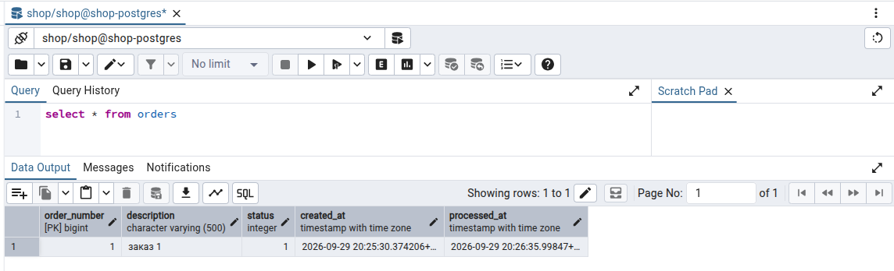
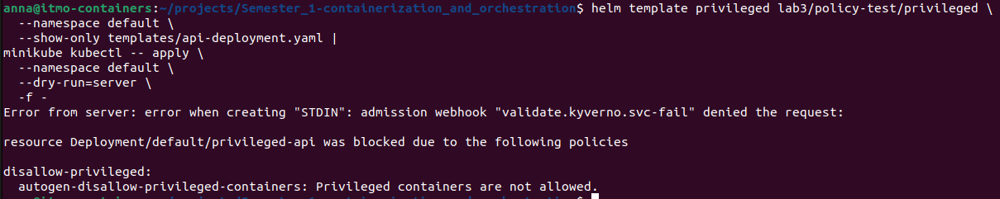
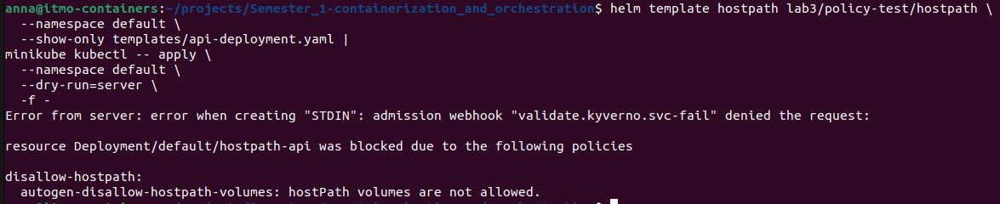
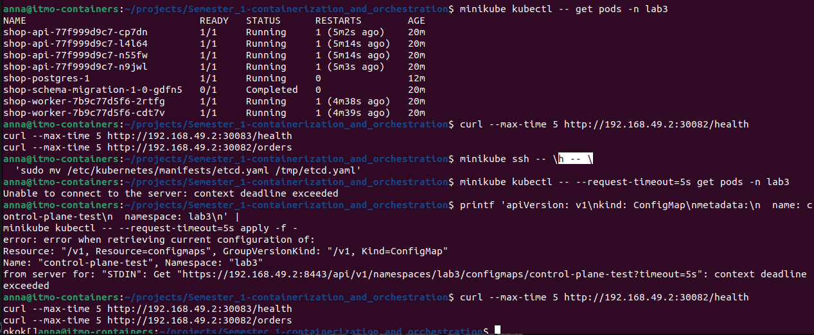
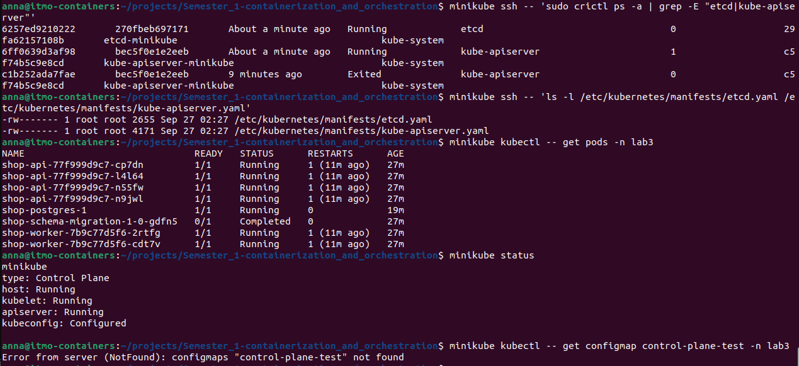
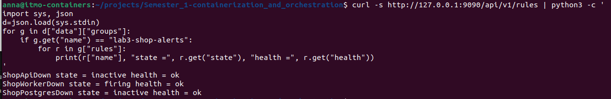
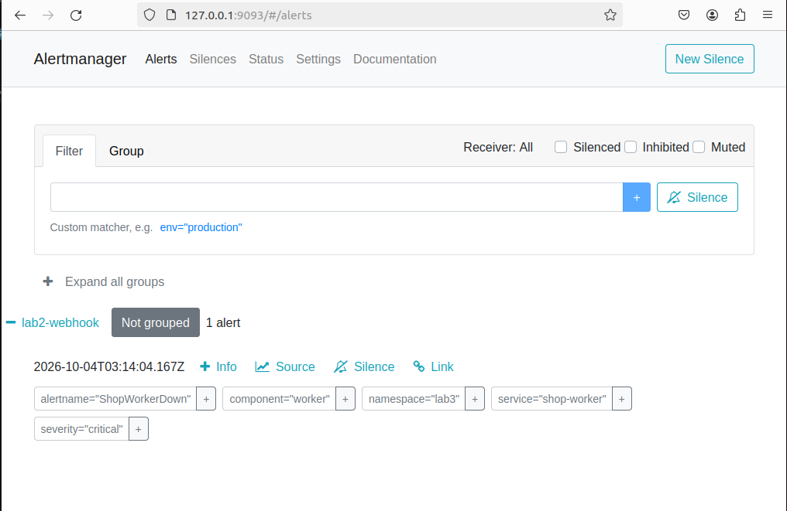
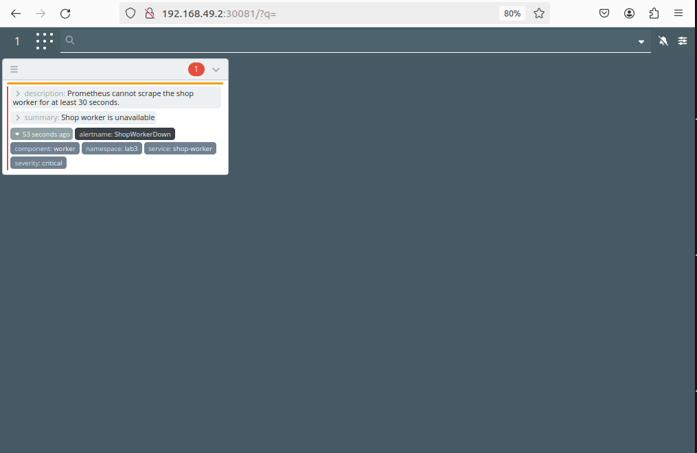

# Лабораторная работа №3 - Собери платформу для shop

## Часть 0 - Сервисы
Реализация сервисов `api` и `worker` представлена соответственно в директориях [api](api) и [worker](worker). Скрипты накатки схемы данных представлены в [migrations](migrations). В директории [install](install) представлены конфигурационные файлы для развертывания PostgreSQL, схемы данных, а также приложений `api` и `worker`.

В сервисе `api` доступны следующие endpoint-ы:
- `GET /health` - возвращает `ok`, но при выставленной переменной окружения `HEALTH_FAIL=true` отвечает 500
- `POST /order` — создает новый заказ в `orders` с переданным `description` 
- `GET /orders` — возвращает список всех существующих заказов: новых, обработанных и прочее

В сервисе `worker` доступны следующие endpoint-ы:
- `GET /health` - возвращает `ok`
- `POST /orders/{orderNumber}/process` - переводит заказ с номером `orderNumber` в статус "обработан"

Схема данных имеет следующее строение:
- таблица `orders` с параметрами:
  * `order_number` - номер заказа
  * `description` - описание заказа
  * `status` - статус заказа: 0 - заказ создан; 1 - заказ обработан
  * `created_at` - дата и время создания заказа
  * `processed_at` - дата и время обработки заказа

Для дальнейшей работы необходимо предустановить в кластер оператор БД `CloudNativePg`:
- `helm repo add cnpg https://cloudnative-pg.github.io/charts` - добавление репозитория
- `helm repo update` - обновление репозитория
- `helm upgrade --install cnpg cnpg/cloudnative-pg --namespace cnpg-system --create-namespace` - установка оператора БД
<details>
<summary>Результат</summary>

```bash
pona@pona-RedmiBook-14:~/Documents/Semester_1-containerization_and_orchestration$ helm repo add cnpg https://cloudnative-pg.github.io/charts
"cnpg" has been added to your repositories
pona@pona-RedmiBook-14:~/Documents/Semester_1-containerization_and_orchestration$ helm repo update
Hang tight while we grab the latest from your chart repositories...
...Successfully got an update from the "jaegertracing" chart repository
...Successfully got an update from the "cnpg" chart repository
...Successfully got an update from the "grafana-community" chart repository
...Successfully got an update from the "grafana" chart repository
...Successfully got an update from the "prometheus-community" chart repository
Update Complete. ⎈Happy Helming!⎈

pona@pona-RedmiBook-14:~/Documents/Semester_1-containerization_and_orchestration$ helm upgrade --install cnpg \ 
  cnpg/cloudnative-pg \
  --namespace cnpg-system \
  --create-namespace
Release "cnpg" does not exist. Installing it now.
NAME: cnpg
LAST DEPLOYED: Sun Sep 27 19:47:56 2026
NAMESPACE: cnpg-system
STATUS: deployed
REVISION: 1
TEST SUITE: None
NOTES:
CloudNativePG operator should be installed in namespace "cnpg-system".
You can now create a PostgreSQL cluster with 3 nodes as follows:

cat <<EOF | kubectl apply -f -
# Example of PostgreSQL cluster
apiVersion: postgresql.cnpg.io/v1
kind: Cluster
metadata:
  name: cluster-example
  
spec:
  instances: 3
  storage:
    size: 1Gi
EOF

kubectl get -A cluster
```
</details>

Для управления структурой схемы данных воспользуемся инструментом Flyway. Миграционные скрипты базы данных хранятся в [migrations/sql](migrations/sql), на основе которых создается отдельный Docker-образ (см. [migrations/Dockerfile](migrations/Dockerfile)). При установке или обновлении Helm-релиза запускается `Job` [install/templates/schema-migration-job.yaml](install/templates/schema-migration-job.yaml), которая в свою очередь запускает `Flyway`, вносящий изменения в структуру базы данных. `Flyway` подключается к `PostgreSQL` по адресу `FLYWAY_URL` с параметрами авторизации из `FLYWAY_USER`/`FLYWAY_PASSWORD`. В `PostgreSQL` создана схема `flyway_schema_history`, в которой хранится информация о примененных скриптах миграции, таким образом `Job` применяет ровно тот набор скриптов, который еще не применен к базе данных.

Соберем docker-образ скриптов миграции схемы и импортируем его в `minikube`:
- `cd lab3 && docker build -f ./migrations/Dockerfile -t lab3-migration:1.0 ./migrations` - собираем docker-образ
- `helm upgrade --install shop ./lab3/install --namespace lab3 --create-namespace --wait --timeout 10m` - обновление образа приложения

<details>
<summary>Результат</summary>

```bash
pona@pona-RedmiBook-14:~/Documents/Semester_1-containerization_and_orchestration/lab3$ docker build -f ./migrations/Dockerfile -t lab3-migration:1.0 ./migrations
[+] Building 131.7s (7/7) FINISHED                                                                                                                  docker:default
 => [internal] load build definition from Dockerfile                                                                                                          0.1s
 => => transferring dockerfile: 128B                                                                                                                          0.0s
 => [internal] load metadata for docker.io/flyway/flyway:13.7-alpine                                                                                          2.6s
 => [internal] load .dockerignore                                                                                                                             0.1s
 => => transferring context: 56B                                                                                                                              0.0s
 => [internal] load build context                                                                                                                             0.1s
 => => transferring context: 458B                                                                                                                             0.0s
 => [1/2] FROM docker.io/flyway/flyway:13.7-alpine@sha256:93e407c40df8a7d46c3c331ee22a79b4778d03ef6fffd49743b85c136f710ea2                                  125.8s
 => => resolve docker.io/flyway/flyway:13.7-alpine@sha256:93e407c40df8a7d46c3c331ee22a79b4778d03ef6fffd49743b85c136f710ea2                                    0.1s
 => => sha256:d44f403c2ecfc6749db0c4ec5819af8cbce9d4a1deeba87608142cdc941b60cb 323.92MB / 323.92MB                                                          123.7s
 => => sha256:6aa5f812d8b635007ddbc0fb94b92f2b7f1ea2252cea5e4941ec06281d587271 96B / 96B                                                                      1.4s
 => => sha256:99cb2eba0fea5b20ec89e3e29867448ba46f562f417f5b6370bea37c3f3d701a 852.37kB / 852.37kB                                                            2.4s
 => => sha256:51c06ae8de15c24740d0ff89711760d6b1005548314337bf6f669c586ce079f3 2.46kB / 2.46kB                                                                2.1s
 => => sha256:ae042fea25ae1b61992570e8acb8e2db0edbe2f6ae17f09ea59d15a858c89851 127B / 127B                                                                    0.7s
 => => sha256:e8a1250704614a551e41ca03d4485964b9783a54f0467ef85d8b2fc340659d7c 62.12MB / 62.12MB                                                             44.1s
 => => sha256:c76ddb39a6b74360783352e38026832cbd501c34a637da62a4b40826ebbc5748 9.50MB / 9.50MB                                                                8.7s
 => => sha256:55afa1ecc21d2bb5e5045f32dafee56272ffd89860bac26f6c32123439af26a4 3.85MB / 3.85MB                                                                5.0s
 => => extracting sha256:55afa1ecc21d2bb5e5045f32dafee56272ffd89860bac26f6c32123439af26a4                                                                     0.1s
 => => extracting sha256:c76ddb39a6b74360783352e38026832cbd501c34a637da62a4b40826ebbc5748                                                                     0.3s
 => => extracting sha256:e8a1250704614a551e41ca03d4485964b9783a54f0467ef85d8b2fc340659d7c                                                                     1.0s
 => => extracting sha256:ae042fea25ae1b61992570e8acb8e2db0edbe2f6ae17f09ea59d15a858c89851                                                                     0.1s
 => => extracting sha256:51c06ae8de15c24740d0ff89711760d6b1005548314337bf6f669c586ce079f3                                                                     0.0s
 => => extracting sha256:99cb2eba0fea5b20ec89e3e29867448ba46f562f417f5b6370bea37c3f3d701a                                                                     0.1s
 => => extracting sha256:6aa5f812d8b635007ddbc0fb94b92f2b7f1ea2252cea5e4941ec06281d587271                                                                     0.0s
 => => extracting sha256:d44f403c2ecfc6749db0c4ec5819af8cbce9d4a1deeba87608142cdc941b60cb                                                                     1.5s
 => [2/2] COPY sql/ /flyway/sql/                                                                                                                              2.3s
 => exporting to image                                                                                                                                        0.6s
 => => exporting layers                                                                                                                                       0.3s
 => => exporting manifest sha256:7c36ac516966286596498551b1ad2b047c21796537ecf7fb3bbb82b17d119f94                                                             0.0s
 => => exporting config sha256:fb2389ccd16b79b93af9d48af07b6729e633df5a54835e9d7f83d72b2391b4cd                                                               0.0s
 => => exporting attestation manifest sha256:0d4ad240c33fb4e1aeb710eadeb25732fa70d96fac13ba356fb5de4c063d221f                                                 0.0s
 => => exporting manifest list sha256:988892ec29a19f8142d0aeecfc6d151cb0eba2bdeb6b29f064d654cd7a8a5d66                                                        0.0s
 => => naming to docker.io/library/lab3-migration:1.0                                                                                                         0.0s
 => => unpacking to docker.io/library/lab3-migration:1.0                                                                                                      0.0s
pona@pona-RedmiBook-14:~/Documents/Semester_1-containerization_and_orchestration/lab3$ minikube image load lab3-migration:1.0
pona@pona-RedmiBook-14:~/Documents/Semester_1-containerization_and_orchestration$ helm upgrade --install shop ./lab3/install \
  --namespace lab3 \
  --create-namespace \
  --wait \
  --timeout 10m
Release "shop" does not exist. Installing it now.
NAME: shop
LAST DEPLOYED: Sun Sep 27 20:46:47 2026
NAMESPACE: lab3
STATUS: deployed
REVISION: 1
TEST SUITE: None
pona@pona-RedmiBook-14:~/Documents/Semester_1-containerization_and_orchestration$ helm list -n lab3
NAME	NAMESPACE	REVISION	UPDATED                                	STATUS  	CHART     	APP VERSION
shop	lab3     	2       	2026-09-27 21:27:02.321763012 +0300 +03	deployed	shop-0.1.0	1.0        
pona@pona-RedmiBook-14:~/Documents/Semester_1-containerization_and_orchestration$ kubectl get cluster,pods,pvc,svc,secrets -n lab3
NAME                                       AGE     INSTANCES   READY   STATUS                     PRIMARY
cluster.postgresql.cnpg.io/shop-postgres   3h13m   1           1       Cluster in healthy state   shop-postgres-1

NAME                                  READY   STATUS      RESTARTS   AGE
pod/shop-postgres-1                   1/1     Running     0          3h11m
pod/shop-schema-migration-1-0-dhfcs   0/1     Completed   0          153m

NAME                                    STATUS   VOLUME                                     CAPACITY   ACCESS MODES   STORAGECLASS   VOLUMEATTRIBUTESCLASS   AGE
persistentvolumeclaim/shop-postgres-1   Bound    pvc-71d6826c-8bcb-4492-8024-25766be5df1b   1Gi        RWO            standard       <unset>                 3h13m

NAME                       TYPE        CLUSTER-IP      EXTERNAL-IP   PORT(S)    AGE
service/shop-postgres-r    ClusterIP   10.110.62.221   <none>        5432/TCP   3h13m
service/shop-postgres-ro   ClusterIP   10.101.26.6     <none>        5432/TCP   3h13m
service/shop-postgres-rw   ClusterIP   10.104.177.2    <none>        5432/TCP   3h13m

NAME                                TYPE                       DATA   AGE
secret/sh.helm.release.v1.shop.v1   helm.sh/release.v1         1      3h13m
secret/sh.helm.release.v1.shop.v2   helm.sh/release.v1         1      153m
secret/shop-postgres-app            kubernetes.io/basic-auth   11     3h13m
secret/shop-postgres-ca             Opaque                     2      3h13m
secret/shop-postgres-replication    kubernetes.io/tls          2      3h13m
secret/shop-postgres-server         kubernetes.io/tls          2      3h13m
```
</details>

Проверим существование таблицы `orders` на схеме `shop`:
```bash
pona@pona-RedmiBook-14:~/Documents/Semester_1-containerization_and_orchestration$ kubectl exec -n lab3 shop-postgres-1 -- \
  psql -d shop -tAc \
  "SELECT to_regclass('public.orders') IS NOT NULL;"
Defaulted container "postgres" out of: postgres, bootstrap-controller (init)
t
```
Таблица успешно создана. Для подключения к базе через PGAdmin получим логин/пароль схемы с помощью команд:
- `kubectl get secret shop-postgres-app --namespace lab3 --output jsonpath='{.data.username}' | base64 --decode`
- `kubectl get secret shop-postgres-app --namespace lab3 --output jsonpath='{.data.password}' | base64 --decode`
- `kubectl port-forward --namespace lab3 service/shop-postgres-rw 5433:5432`

Теперь создадим Deployment и Service конфигурации для приложений `api` и `worker` (см. подробнее [install](install)). Конфигурация Deployment [api-deployment.yaml](install/templates/api-deployment.yaml) приложения `api` и [worker-deployment.yaml](install/templates/worker-deployment.yaml) приложения `worker` содержит секцию `initContainers`; данная секция необходима для проверки окончания проведения миграции схемы данных ДО запуска приложения.

Пусть запросы на реплики `api` будут идти на порт `30082`, запросы на реплики `worker` - на порт `30083`.

Соберем docker-образы `api` и `worker`, импортируем их в `minikube` и обновим релиз:
<details>
<summary>Результат</summary>


```bash
pona@pona-RedmiBook-14:~/Documents/Semester_1-containerization_and_orchestration$ 
docker build \
  --file lab3/api/Dockerfile \
  --tag lab3-api:1.0 \
  lab3/api
[+] Building 168.5s (16/16) FINISHED                                                                                docker:default
 => [internal] load build definition from Dockerfile                                                                          0.1s
 => => transferring dockerfile: 406B                                                                                          0.0s
 => [internal] load metadata for docker.io/library/eclipse-temurin:21-jre-jammy                                               1.8s
 => [internal] load metadata for docker.io/library/maven:3.9-eclipse-temurin-21                                               1.8s
 => [internal] load .dockerignore                                                                                             0.1s
 => => transferring context: 59B                                                                                              0.0s
 => [build 1/6] FROM docker.io/library/maven:3.9-eclipse-temurin-21@sha256:99e61abcff91a9b1333463bd8451fb18495d6eba9250ac66a  0.1s
 => => resolve docker.io/library/maven:3.9-eclipse-temurin-21@sha256:99e61abcff91a9b1333463bd8451fb18495d6eba9250ac66a338b51  0.1s
 => [internal] load build context                                                                                             0.1s
 => => transferring context: 7.82kB                                                                                           0.0s
 => [stage-1 1/4] FROM docker.io/library/eclipse-temurin:21-jre-jammy@sha256:e9aaf73145bbd1f9f6ec7f6867dd75a44f34b1a6c32a813  0.1s
 => => resolve docker.io/library/eclipse-temurin:21-jre-jammy@sha256:e9aaf73145bbd1f9f6ec7f6867dd75a44f34b1a6c32a813504bf412  0.1s
 => CACHED [build 2/6] WORKDIR /app                                                                                           0.0s
 => [build 3/6] COPY pom.xml .                                                                                                0.1s
 => [build 4/6] RUN mvn dependency:go-offline                                                                               158.8s
 => [build 5/6] COPY src ./src                                                                                                0.2s 
 => [build 6/6] RUN mvn clean package -DskipTests                                                                             4.2s 
 => CACHED [stage-1 2/4] WORKDIR /app                                                                                         0.0s 
 => CACHED [stage-1 3/4] RUN useradd --system --uid 10001 appuser                                                             0.0s 
 => [stage-1 4/4] COPY --from=build /app/target/lab3-api-1.0.0.jar app.jar                                                    0.4s 
 => exporting to image                                                                                                        2.3s 
 => => exporting layers                                                                                                       1.7s 
 => => exporting manifest sha256:8170bec052d0e372759318c14bcb6a364c632d77616a365d8585bd34e4ce17fe                             0.0s
 => => exporting config sha256:9374a8419d4a850aa1b3f06118224929179ce2b78bb3b585b8b9c0a6243a8cf5                               0.0s
 => => exporting attestation manifest sha256:8ee0f6ee7b9cdce9bbe4f37b337f1fc5cc73c97c18ea5b0f4479aeab0c3ac537                 0.1s
 => => exporting manifest list sha256:c555d91ea80edaef8ed98fab6bd0f79a3b7c17977f535823e8e802637b76c6aa                        0.0s
 => => naming to docker.io/library/lab3-api:1.0                                                                               0.0s
 => => unpacking to docker.io/library/lab3-api:1.0                                                                            0.3s
pona@pona-RedmiBook-14:~/Documents/Semester_1-containerization_and_orchestration$ docker build \
  --file lab3/worker/Dockerfile \
  --tag lab3-worker:1.0 \
  lab3/worker
[+] Building 210.3s (16/16) FINISHED                                                                                docker:default
 => [internal] load build definition from Dockerfile                                                                          0.1s
 => => transferring dockerfile: 397B                                                                                          0.0s
 => [internal] load metadata for docker.io/library/eclipse-temurin:21-jre-jammy                                               1.0s
 => [internal] load metadata for docker.io/library/maven:3.9-eclipse-temurin-21                                               0.9s
 => [internal] load .dockerignore                                                                                             0.1s
 => => transferring context: 59B                                                                                              0.0s
 => [build 1/6] FROM docker.io/library/maven:3.9-eclipse-temurin-21@sha256:99e61abcff91a9b1333463bd8451fb18495d6eba9250ac66a  0.1s
 => => resolve docker.io/library/maven:3.9-eclipse-temurin-21@sha256:99e61abcff91a9b1333463bd8451fb18495d6eba9250ac66a338b51  0.1s
 => [stage-1 1/4] FROM docker.io/library/eclipse-temurin:21-jre-jammy@sha256:e9aaf73145bbd1f9f6ec7f6867dd75a44f34b1a6c32a813  0.1s
 => => resolve docker.io/library/eclipse-temurin:21-jre-jammy@sha256:e9aaf73145bbd1f9f6ec7f6867dd75a44f34b1a6c32a813504bf412  0.1s
 => [internal] load build context                                                                                             0.1s
 => => transferring context: 8.11kB                                                                                           0.0s
 => CACHED [build 2/6] WORKDIR /app                                                                                           0.0s
 => [build 3/6] COPY pom.xml .                                                                                                0.6s
 => [build 4/6] RUN mvn dependency:go-offline                                                                               200.8s
 => [build 5/6] COPY src ./src                                                                                                0.2s 
 => [build 6/6] RUN mvn clean package                                                                                         4.3s 
 => CACHED [stage-1 2/4] WORKDIR /app                                                                                         0.0s 
 => CACHED [stage-1 3/4] RUN useradd --system --uid 10001 appuser                                                             0.0s 
 => [stage-1 4/4] COPY --from=build /app/target/lab3-worker-1.0.0.jar app.jar                                                 0.5s 
 => exporting to image                                                                                                        2.1s 
 => => exporting layers                                                                                                       1.7s 
 => => exporting manifest sha256:732cf296c8f1cb8f3550b5a746ff52b70e7bff4fd66f5cdc4aea39a256769835                             0.0s
 => => exporting config sha256:40996619122d4112dacc992e6dd5851361064db4ae803950c0dca591feb39438                               0.0s
 => => exporting attestation manifest sha256:b961eafb7dccfd4a02534557bc581be479c799eaba795c0d5693e4a0da04895f                 0.1s
 => => exporting manifest list sha256:39ca1638d673b9f58f35a800ca0c231dabdcf04afabfa1286509fdcb6534c10b                        0.0s
 => => naming to docker.io/library/lab3-worker:1.0                                                                            0.0s
 => => unpacking to docker.io/library/lab3-worker:1.0                                                                         0.2s
pona@pona-RedmiBook-14:~/Documents/Semester_1-containerization_and_orchestration$ minikube image load lab3-api:1.0
pona@pona-RedmiBook-14:~/Documents/Semester_1-containerization_and_orchestration$ minikube image load lab3-worker:1.0
pona@pona-RedmiBook-14:~/Documents/Semester_1-containerization_and_orchestration$ minikube image load lab3-migration:1.0
pona@pona-RedmiBook-14:~/Documents/Semester_1-containerization_and_orchestration$  helm upgrade --install shop ./lab3/install \
  --namespace lab3 \
  --create-namespace \
  --wait \
  --wait-for-jobs \
  --timeout 10m
Release "shop" has been upgraded. Happy Helming!
NAME: shop
LAST DEPLOYED: Tue Sep 29 23:06:29 2026
NAMESPACE: lab3
STATUS: deployed
REVISION: 3
TEST SUITE: None
```
</details>

Проверим статус Pod-ов и сервисов, а также отправим запрос `GET /health` и проверим работоспособность приложения:
<details>
<summary>Результат</summary>

```bash
pona@pona-RedmiBook-14:~/Documents/Semester_1-containerization_and_orchestration$ kubectl get clusters,pods,jobs,services,pvc -n lab3
NAME                                       AGE    INSTANCES   READY   STATUS                     PRIMARY
cluster.postgresql.cnpg.io/shop-postgres   2d2h   1           1       Cluster in healthy state   shop-postgres-1

NAME                                  READY   STATUS      RESTARTS      AGE
pod/shop-api-59746975c8-4m4x6         1/1     Running     0             47s
pod/shop-api-59746975c8-9wqgq         1/1     Running     0             47s
pod/shop-api-59746975c8-sfgw5         1/1     Running     0             47s
pod/shop-postgres-1                   1/1     Running     1 (12m ago)   2d2h
pod/shop-schema-migration-1-0-dhfcs   0/1     Completed   0             2d1h
pod/shop-worker-848c4d6668-gmnp6      1/1     Running     0             47s
pod/shop-worker-848c4d6668-zkftd      1/1     Running     0             47s

NAME                                  STATUS     COMPLETIONS   DURATION   AGE
job.batch/shop-schema-migration-1-0   Complete   1/1           13s        2d1h

NAME                       TYPE        CLUSTER-IP      EXTERNAL-IP   PORT(S)          AGE
service/shop-api           NodePort    10.105.6.87     <none>        8080:30082/TCP   47s
service/shop-postgres-r    ClusterIP   10.110.62.221   <none>        5432/TCP         2d2h
service/shop-postgres-ro   ClusterIP   10.101.26.6     <none>        5432/TCP         2d2h
service/shop-postgres-rw   ClusterIP   10.104.177.2    <none>        5432/TCP         2d2h
service/shop-worker        NodePort    10.111.198.83   <none>        8080:30083/TCP   47s

NAME                                    STATUS   VOLUME                                     CAPACITY   ACCESS MODES   STORAGECLASS   VOLUMEATTRIBUTESCLASS   AGE
persistentvolumeclaim/shop-postgres-1   Bound    pvc-71d6826c-8bcb-4492-8024-25766be5df1b   1Gi        RWO            standard       <unset>                 2d2h
pona@pona-RedmiBook-14:~/Documents/Semester_1-containerization_and_orchestration$ minikube service shop-api --namespace lab3 --url
http://192.168.49.2:30082
pona@pona-RedmiBook-14:~/Documents/Semester_1-containerization_and_orchestration$ curl http://192.168.49.2:30082/health
ok
pona@pona-RedmiBook-14:~/Documents/Semester_1-containerization_and_orchestration$ curl http://192.168.49.2:30083/health
ok
```
</details>

Проверим, что приложение `api` создает заказы, а `worker` корректно их обрабатывает:
- получим все существующие заказы - `curl http://192.168.49.2:30082/orders`
- создадим новый заказ - `curl -X POST http://192.168.49.2:30082/order -H "Content-Type: application/json" -d '{"description": "заказ 1"}'`
- получим список существующих заказов - `curl http://192.168.49.2:30082/orders`
- обработаем созданный заказ - `curl -X POST http://192.168.49.2:30083/orders/1/process`
- получим обновленный список заказов - `curl http://192.168.49.2:30082/orders`

<details>
<summary>Результат</summary>

```bash
pona@pona-RedmiBook-14:~/Documents/Semester_1-containerization_and_orchestration$ curl http://192.168.49.2:30082/orders
[]
pona@pona-RedmiBook-14:~/Documents/Semester_1-containerization_and_orchestration$ curl -X POST http://192.168.49.2:30082/order -H "Content-Type: application/json" -d '{"description": "заказ 1"}'
{"orderNumber":1,"description":"заказ 1","status":0,"createdAt":"2026-09-29T20:25:30.374206Z","processedAt":null}
ona@pona-RedmiBook-14:~/Documents/Semester_1-containerization_and_orchestration$ curl http://192.168.49.2:30082/orders
[{"orderNumber":1,"description":"заказ 1","status":0,"createdAt":"2026-09-29T20:25:30.374206Z","processedAt":null}]
pona@pona-RedmiBook-14:~/Documents/Semester_1-containerization_and_orchestration$ curl -X POST http://192.168.49.2:30083/orders/1/process
{"orderNumber":1,"description":"заказ 1","status":1,"createdAt":"2026-09-29T20:25:30.374206Z","processedAt":"2026-09-29T20:26:35.99847Z"}
pona@pona-RedmiBook-14:~/Documents/Semester_1-containerization_and_orchestration$ curl http://192.168.49.2:30082/orders
[{"orderNumber":1,"description":"заказ 1","status":1,"createdAt":"2026-09-29T20:25:30.374206Z","processedAt":"2026-09-29T20:26:35.99847Z"}]
```


</details>

Таким образом приложение и база данных корректно работают в Kubernetes, можно приступать к основному заданию лабораторной работы.

## Часть 1 - Ограждения на кластер
В качестве движка политик был выбран Kyverno. В отличие от OPA/Gatekeeper, Kyverno позволяет описывать правила в виде Kubernetes-ресурсов YAML и не требует использования отдельного языка Rego. Для локальной лабораторной среды это упрощает создание, проверку и сопровождение политик, сохраняя возможность блокировать некорректные конфигурации на этапе admission. Установим движок в кластер:
- `helm repo add kyverno https://kyverno.github.io/kyverno/  && helm repo update`  - скачивание зависимости
- `helm upgrade --install kyverno kyverno/kyverno --namespace kyverno --create-namespace --wait` - установка движка политик Kyverno в кластер
- `kubectl wait --for=condition=Ready pod --all --namespace kyverno --timeout=180s` - ожидание окончания установки Kyverno в кластер
<details>
<summary>Результат</summary>

```bash
pona@pona-RedmiBook-14:~/Documents/Semester_1-containerization_and_orchestration$ helm repo add kyverno https://kyverno.github.io/kyverno/
"kyverno" has been added to your repositories

pona@pona-RedmiBook-14:~/Documents/Semester_1-containerization_and_orchestration$ helm repo update
Hang tight while we grab the latest from your chart repositories...
...Successfully got an update from the "jaegertracing" chart repository
...Successfully got an update from the "kyverno" chart repository
...Successfully got an update from the "cnpg" chart repository
...Successfully got an update from the "grafana-community" chart repository
...Successfully got an update from the "grafana" chart repository
...Successfully got an update from the "prometheus-community" chart repository
Update Complete. ⎈Happy Helming!⎈

pona@pona-RedmiBook-14:~/Documents/Semester_1-containerization_and_orchestration$ helm upgrade --install kyverno kyverno/kyverno \
  --namespace kyverno \
  --create-namespace \
  --wait
Release "kyverno" does not exist. Installing it now.
NAME: kyverno
LAST DEPLOYED: Thu Oct  1 19:46:02 2026
NAMESPACE: kyverno
STATUS: deployed
REVISION: 1
NOTES:
Chart version: 3.9.1
Kyverno version: v1.19.1

Thank you for installing kyverno! Your release is named kyverno.

The following components have been installed in your cluster:
- CRDs
- Admission controller
- Reports controller
- Cleanup controller
- Background controller


⚠️  WARNING: Setting the admission controller replica count below 2 means Kyverno is not running in high availability mode.


⚠️  WARNING: PolicyExceptions are disabled by default. To enable them, set '--enablePolicyException' to true.
⚠️  WARNING: The legacy kyverno.io policy types are deprecated and will be removed in a future release. Migrate to their policies.kyverno.io replacements:
    - ClusterPolicy / Policy → ValidatingPolicy, MutatingPolicy, GeneratingPolicy, ImageValidatingPolicy (and their namespaced variants)
    - ClusterCleanupPolicy / CleanupPolicy → DeletingPolicy / NamespacedDeletingPolicy
    - PolicyException (kyverno.io) → PolicyException (policies.kyverno.io)
    See https://kyverno.io/docs/guides/migration-to-cel/ for the migration guide.

💡 Note: There is a trade-off when deciding which approach to take regarding Namespace exclusions. Please see the documentation at https://kyverno.io/docs/installation/#security-vs-operability to understand the risks.

pona@pona-RedmiBook-14:~/Documents/Semester_1-containerization_and_orchestration$ kubectl wait --for=condition=Ready pod \
  --all \
  --namespace kyverno \
  --timeout=180s
pod/kyverno-admission-controller-769b8f7647-bllhw condition met
pod/kyverno-background-controller-86d8df7447-2njxx condition met
pod/kyverno-cleanup-controller-86c886ffff-kfxtb condition met
pod/kyverno-reports-controller-57c7978d69-tczz4 condition met
```
</details>

Реализуем следующие политики проверок ресурсов Kubernetes (см. подробнее в [policies](policies)):
- проверка наличия меток в генерируемых Pod-ах Kubernetes ресурсами
- проверка указания ограничений на ресурсы на старт контейнера (`requests`) и на его работу (`limits`)
- проверка наличия `readiness` и `liveness` проб
- запрет запуска контейнеров в привилегированном режиме (`privileged: true`);
- запрет использования томов типа `hostPath`.

Также создадим тестовые примеры, каждый из которых не удовлетворяет одной из созданных политик (см. подробнее в [policy-test](policy-test)). Проверим возможность установки приложения api с помощью конфигураций из [policy-test](policy-test):
- `helm template missing-labels lab3/policy-test/missing-labels --namespace default --show-only templates/api-deployment.yaml | kubectl apply --namespace default --dry-run=server --filename -` - проверка (засчет `--dry-run=server`) установки в кластер приложения `api` с помощью конфигурации без метки `name`
- `helm template missing-resources lab3/policy-test/missing-resources --namespace default --show-only templates/api-deployment.yaml | kubectl apply --namespace default --dry-run=server --filename -` - проверка установки в кластер приложения `api` с помощью конфигурации без ограничения по ресурсам
- `helm template missing-probes lab3/policy-test/missing-probes --namespace default --show-only templates/api-deployment.yaml | kubectl apply --namespace default --dry-run=server --filename -` - проверка установки в кластер приложения `api` с помощью конфигурации без readiness и liveness проб

<details>
<summary>Результат</summary>

```bash
pona@pona-RedmiBook-14:~/Documents/Semester_1-containerization_and_orchestration$ helm template missing-labels \
  lab3/policy-test/missing-labels \
  --namespace default \
  --show-only templates/api-deployment.yaml |
kubectl apply \
  --namespace default \
  --dry-run=server \
  --filename -
deployment.apps/missing-labels-api created (server dry run)
pona@pona-RedmiBook-14:~/Documents/Semester_1-containerization_and_orchestration$ helm template missing-resources \
  lab3/policy-test/missing-resources \
  --namespace default \
  --show-only templates/api-deployment.yaml |
kubectl apply \
  --namespace default \
  --dry-run=server \
  --filename -
deployment.apps/missing-resources-api created (server dry run)
pona@pona-RedmiBook-14:~/Documents/Semester_1-containerization_and_orchestration$ helm template missing-probes \
  lab3/policy-test/missing-probes \
  --namespace default \
  --show-only templates/api-deployment.yaml |
kubectl apply \
  --namespace default \
  --dry-run=server \
  --filename -
deployment.apps/missing-probes-api created (server dry run)
```
</details>

Видим, что с помощью трех конфигураций, не удовлетворяющих кастомным политикам, корректно прошли проверку на возможность установки в кластер. Теперь установим политики из [policies](policies) и повторим эксперимент:
- `kubectl apply --filename lab3/policies` - применяем кастомные политики к кластеру
- `kubectl get clusterpolicy` - проверяем статус установленных политик
- повторяем команды из предыдущего эксперимента

<details>
<summary>Результат</summary>

```bash
anna@itmo-containers:~/projects/Semester_1-containerization_and_orchestration$ minikube kubectl -- get clusterpolicy
Warning: kyverno.io/v1 ClusterPolicy is deprecated and will be removed in a future release; migrate to ValidatingPolicy, MutatingPolicy, GeneratingPolicy or ImageValidatingPolicy (policies.kyverno.io), see https://kyverno.io/docs/guides/migration-to-cel/
NAME                      ADMISSION   BACKGROUND   READY   AGE   MESSAGE
disallow-hostpath         true        true         True    31m   Ready
disallow-privileged       true        true         True    31m   Ready
require-probes            true        true         True    31m   Ready
require-resources         true        true         True    31m   Ready
require-workload-labels   true        true         True    31m   Ready

```
</details>

Видим, что валидация конфигураций завершились со следующими ошибками:
-[ policy-test/missing-labels](policy-test/missing-labels) - `The label app.kubernetes.io/name is required and must not be empty.`
-[ policy-test/missing-resources](policy-test/missing-resources) - `Every container and init container must define CPU and memory requests and limits.`
-[ policy-test/missing-probes](policy-test/missing-probes) - `All containers must have readiness and liveness probes.`

Дополнительно были подготовлены тестовые конфигурации для проверки политик безопасности.

Проверка запрета привилегированных контейнеров:

```bash
helm template privileged lab3/policy-test/privileged \
  --namespace default \
  --show-only templates/api-deployment.yaml |
minikube kubectl -- apply \
  --namespace default \
  --dry-run=server \
  -f -
```

В тестовой конфигурации для контейнера задан параметр:

```yaml
securityContext:
  privileged: true
```

Kyverno отклонил создание Deployment:

```text
resource Deployment/default/privileged-api was blocked due to the following policies

disallow-privileged:
autogen-disallow-privileged-containers: Privileged containers are not allowed.
```



Проверка запрета использования `hostPath`:

```bash
helm template hostpath lab3/policy-test/hostpath \
  --namespace default \
  --show-only templates/api-deployment.yaml |
minikube kubectl -- apply \
  --namespace default \
  --dry-run=server \
  -f -
```

В тестовой конфигурации используется том, предоставляющий контейнеру доступ к директории ноды:

```yaml
volumes:
  - name: host-data
    hostPath:
      path: /tmp
      type: Directory
```

Kyverno также отклонил создание Deployment:

```text
resource Deployment/default/hostpath-api was blocked due to the following policies

disallow-hostpath:
autogen-disallow-hostpath-volumes: hostPath volumes are not allowed.
```



Таким образом созданы следующие политики проверки Kubernetes ресурсов (каждая из политик ниже не влияет на ресурсы, создаваемые в системных namespace, namespace оператора БД, а также мониторинга):
| Policy | Файл конфигурации политики | Описание|
|-----------|----------------------------|----------|
| `missing-labels`  |[01-require-labels.yaml](policies/01-require-labels.yaml)| Правило применяется к создаваемым подам (`containers`) Kubernetes-ресурсами. В конфигурации приложения `shop` влияет поды, создаваемые `Deployment`, а также на поды, создаваемые `Job`.|
| `missing-resources`|[02-require-resources.yaml](policies/02-require-resources.yaml)| Правило применяется к создаваемым подам (`containers`, `initContainers`) Kubernetes ресурсами. В конфигурации приложения `shop` влияет на поды, создаваемые `Deployment`, а также на поды, создаваемые `Job`.|
| `missing-probes`|[03-require-probes.yaml](policies/03-require-probes.yaml)| Правило применяется только к конфигурации `Deployment`. Это сделано для того, чтобы не накладывать ограничение на наличие `readiness` и `liveness` проб для подов, создаваемых с помощью `Job`.|
| `privileged` | [04-disallow-privileged.yaml](policies/04-disallow-privileged.yaml) | Запрещает запуск контейнеров с `securityContext.privileged: true`. Это предотвращает получение контейнером расширенных привилегий относительно Kubernetes-ноды. |
| `hostpath` | [05-disallow-hostpath.yaml](policies/05-disallow-hostpath.yaml) | Запрещает использование томов `hostPath`, предоставляющих Pod прямой доступ к файловой системе ноды. |

Таким образом, кластер защищён пятью admission-политиками. Некорректные конфигурации отклоняются до создания ресурсов, что позволяет не полагаться только на ручную проверку Helm-шаблонов.

## Часть 2 - Чарт api и worker
Описание реализации конфигурации Kubernetes ресурсов приложений `api` и `worker` представлено в части 0. Релиз включает в себя следующие компоненты:
- развертывание базы данных `PostgreSQL` - см. подробнее [install/templates/postgres-cluster.yaml](install/templates/postgres-cluster.yaml)
- проведение миграции схемы данных - `Job`, запускающая скрипты миграции из [migrations/sql](migrations/sql) - см. подробнее [install/templates/schema-migration-job.yaml)](install/templates/schema-migration-job.yaml)
- установка приложения `api` и `worker` с предварительной проверкой окончания проведения миграции схемы (с помощью `initContainers`) - см. подробнее соответственно [install/templates/api-deployment.yaml](install/templates/api-deployment.yaml) и [install/templates/worker-deployment.yaml](install/templates/worker-deployment.yaml)
- конфигурация сетевого взаимодействия `api`,  `worker` - см подробнее соответственно [install/templates/api-service.yaml](install/templates/api-service.yaml) и [install/templates/worker-service.yaml](install/templates/worker-service.yaml)

Поскольку реализация chart, deployment и service для каждой компоненты была реализована ДО внедрения политик проверки конфигурации ресурсов, обновим релиз и проверим, что конфигурация [install](install) соответствует установленным в кластер правилам:
<details>
<summary>Результат</summary>

```bash
pona@pona-RedmiBook-14:~/Documents/Semester_1-containerization_and_orchestration$ helm upgrade --install shop ./lab3/install   --namespace lab3   --create-namespace   --wait   --wait-for-jobs   --timeout 10m
Error: UPGRADE FAILED: cannot patch "shop-api" with kind Deployment: admission webhook "validate.kyverno.svc-fail" denied the request: 

resource Deployment/lab3/shop-api was blocked due to the following policies 

require-resources:
  autogen-require-standard-resources: Every container and init container must define CPU and memory requests and limits.
 && cannot patch "shop-worker" with kind Deployment: admission webhook "validate.kyverno.svc-fail" denied the request: 

resource Deployment/lab3/shop-worker was blocked due to the following policies 

require-resources:
  autogen-require-standard-resources: Every container and init container must define CPU and memory requests and limits.
```
</details>

Сработало предупреждение о необходимости настройки ограничения по потребляемым ресурсам для `initContainers`, добавим их в [api-deployment.yaml](install/templates/api-deployment.yaml) и [worker-deployment.yaml](install/templates/worker-deployment.yaml) и переустановим релиз:
<details>
<summary>Результат</summary>

```bash
pona@pona-RedmiBook-14:~/Documents/Semester_1-containerization_and_orchestration$ helm upgrade --install shop ./lab3/install   --namespace lab3   --create-namespace   --wait   --wait-for-jobs   --timeout 10m
Release "shop" has been upgraded. Happy Helming!
NAME: shop
LAST DEPLOYED: Fri Oct  2 22:16:13 2026
NAMESPACE: lab3
STATUS: deployed
REVISION: 5
TEST SUITE: None
```
</details>

Таким образом, конфигурация приложения удовлетворяет политикам из части 1.

Проверим работу цикла согласования (reconciliation loop), для этого удалим под и убедимся, что control plane его вернул:
<details>
<summary>Результат</summary>

```bash
pona@pona-RedmiBook-14:~/Documents/Semester_1-containerization_and_orchestration$ kubectl get pods -n lab3
NAME                              READY   STATUS      RESTARTS   AGE
shop-api-5f76d99bfd-2x5x9         1/1     Running     0          44m
shop-api-5f76d99bfd-9jwbt         1/1     Running     0          44m
shop-api-5f76d99bfd-b74xf         1/1     Running     0          44m
shop-postgres-1                   1/1     Running     0          44m
shop-schema-migration-1-0-pd8tx   0/1     Completed   0          44m
shop-worker-7b9c77d5f6-bzsfk      1/1     Running     0          44m
shop-worker-7b9c77d5f6-pvv76      1/1     Running     0          44m

pona@pona-RedmiBook-14:~/Documents/Semester_1-containerization_and_orchestration$ kubectl delete pod shop-api-5f76d99bfd-2x5x9 -n lab3
pod "shop-api-5f76d99bfd-2x5x9" deleted from lab3 namespace

pona@pona-RedmiBook-14:~/Documents/Semester_1-containerization_and_orchestration$ kubectl get pods -n lab3
NAME                              READY   STATUS      RESTARTS   AGE
shop-api-5f76d99bfd-8v465         0/1     Init:0/1    0          3s
shop-api-5f76d99bfd-9jwbt         1/1     Running     0          45m
shop-api-5f76d99bfd-b74xf         1/1     Running     0          45m
shop-postgres-1                   1/1     Running     0          45m
shop-schema-migration-1-0-pd8tx   0/1     Completed   0          45m
shop-worker-7b9c77d5f6-bzsfk      1/1     Running     0          45m
shop-worker-7b9c77d5f6-pvv76      1/1     Running     0          45m

pona@pona-RedmiBook-14:~/Documents/Semester_1-containerization_and_orchestration$ kubectl get pods -n lab3
NAME                              READY   STATUS      RESTARTS   AGE
shop-api-5f76d99bfd-8v465         1/1     Running     0          43s
shop-api-5f76d99bfd-9jwbt         1/1     Running     0          46m
shop-api-5f76d99bfd-b74xf         1/1     Running     0          46m
shop-postgres-1                   1/1     Running     0          45m
shop-schema-migration-1-0-pd8tx   0/1     Completed   0          46m
shop-worker-7b9c77d5f6-bzsfk      1/1     Running     0          46m
shop-worker-7b9c77d5f6-pvv76      1/1     Running     0          46m
```
</details>

Видим, что после удаления был создан новый под `api`, который поднялся через некоторое время, по итогу компонент `api` 3 штуки, как указано в [values.yaml](install/values.yaml). Теперь поменяем целевое количество реплик `api` (`.Values.api.instances`) с 3 на 4 и проверим, что был создан новый под:
<details>
<summary>Результат</summary>

```bash
pona@pona-RedmiBook-14:~/Documents/Semester_1-containerization_and_orchestration$ helm upgrade --install shop ./lab3/install   --namespace lab3   --create-namespace   --wait   --wait-for-jobs   --timeout 10m
Release "shop" has been upgraded. Happy Helming!
NAME: shop
LAST DEPLOYED: Fri Oct  2 22:34:27 2026
NAMESPACE: lab3
STATUS: deployed
REVISION: 6
TEST SUITE: None
pona@pona-RedmiBook-14:~/Documents/Semester_1-containerization_and_orchestration$ kubectl get pods -n lab3
NAME                              READY   STATUS      RESTARTS   AGE
shop-api-5f76d99bfd-8v465         1/1     Running     0          4m15s
shop-api-5f76d99bfd-92pz6         0/1     Init:0/1    0          3s
shop-api-5f76d99bfd-9jwbt         1/1     Running     0          49m
shop-api-5f76d99bfd-b74xf         1/1     Running     0          49m
shop-postgres-1                   1/1     Running     0          49m
shop-schema-migration-1-0-pd8tx   0/1     Completed   0          49m
shop-worker-7b9c77d5f6-bzsfk      1/1     Running     0          49m
shop-worker-7b9c77d5f6-pvv76      1/1     Running     0          49m
pona@pona-RedmiBook-14:~/Documents/Semester_1-containerization_and_orchestration$ kubectl get pods -n lab3
NAME                              READY   STATUS      RESTARTS   AGE
shop-api-5f76d99bfd-8v465         1/1     Running     0          5m16s
shop-api-5f76d99bfd-92pz6         1/1     Running     0          64s
shop-api-5f76d99bfd-9jwbt         1/1     Running     0          50m
shop-api-5f76d99bfd-b74xf         1/1     Running     0          50m
shop-postgres-1                   1/1     Running     0          50m
shop-schema-migration-1-0-pd8tx   0/1     Completed   0          50m
shop-worker-7b9c77d5f6-bzsfk      1/1     Running     0          50m
shop-worker-7b9c77d5f6-pvv76      1/1     Running     0          50m
```
</details>

Стоит обратить внимание, что существующие поды не были удалены при обновлении релиза, `control plane` увидел, что целевое состояние системы отличается от фактического и удалил одну из реплик.

Для проверки rolling update соберем новый образ `lab3-api:1.1`, импортируем его в minikube и обновим релиз:
<details>
<summary>Результат</summary>

```bash
pona@pona-RedmiBook-14:~/Documents/Semester_1-containerization_and_orchestration$ docker build \
  --file lab3/api/Dockerfile \
  --tag lab3-api:1.1 \
  lab3/api
[+] Building 22.6s (16/16) FINISHED                                          docker:default
 => [internal] load build definition from Dockerfile                                   0.1s
 => => transferring dockerfile: 406B                                                   0.0s
 => [internal] load metadata for docker.io/library/maven:3.9-eclipse-temurin-21        1.0s
 => [internal] load metadata for docker.io/library/eclipse-temurin:21-jre-jammy        1.9s
 => [internal] load .dockerignore                                                      0.1s
 => => transferring context: 59B                                                       0.0s
 => [build 1/6] FROM docker.io/library/maven:3.9-eclipse-temurin-21@sha256:99e61abcff  0.1s
 => => resolve docker.io/library/maven:3.9-eclipse-temurin-21@sha256:99e61abcff91a9b1  0.1s
 => [internal] load build context                                                      0.1s
 => => transferring context: 7.82kB                                                    0.0s
 => [stage-1 1/4] FROM docker.io/library/eclipse-temurin:21-jre-jammy@sha256:f04fb34  14.0s
 => => resolve docker.io/library/eclipse-temurin:21-jre-jammy@sha256:f04fb34e05314834  0.1s
 => => sha256:e992b94e17ea2591367c150fcb7bd3ee1e5f100c522782a41a7aea8 2.46kB / 2.46kB  0.2s
 => => sha256:246658e744f6dbdade05a9cae0cf7d193e07b240d2a1470a9249f8ab173 158B / 158B  0.3s
 => => sha256:8299b2794a7bf11e0cbae06221c48727bae196cdfa8779aea9be 53.10MB / 53.10MB  12.6s
 => => sha256:04554394ac477b50174eaac591344e0ebed72cda3dee2a3754179 16.11MB / 16.11MB  7.0s
 => => sha256:98c4455a98982b35380ec62f90d5cf0edff02eeb4b3bb18595d8 29.75MB / 29.75MB  10.2s
 => => extracting sha256:98c4455a98982b35380ec62f90d5cf0edff02eeb4b3bb18595d871fdeb0c  0.9s
 => => extracting sha256:04554394ac477b50174eaac591344e0ebed72cda3dee2a3754179f5386f4  0.7s
 => => extracting sha256:8299b2794a7bf11e0cbae06221c48727bae196cdfa8779aea9bebf431dd5  0.8s
 => => extracting sha256:246658e744f6dbdade05a9cae0cf7d193e07b240d2a1470a9249f8ab1739  0.0s
 => => extracting sha256:e992b94e17ea2591367c150fcb7bd3ee1e5f100c522782a41a7aea8e1c2c  0.0s
 => CACHED [build 2/6] WORKDIR /app                                                    0.0s
 => CACHED [build 3/6] COPY pom.xml .                                                  0.0s
 => CACHED [build 4/6] RUN mvn dependency:go-offline                                   0.0s
 => CACHED [build 5/6] COPY src ./src                                                  0.0s
 => CACHED [build 6/6] RUN mvn clean package -DskipTests                               0.0s
 => [stage-1 2/4] WORKDIR /app                                                         2.2s
 => [stage-1 3/4] RUN useradd --system --uid 10001 appuser                             0.6s
 => [stage-1 4/4] COPY --from=build /app/target/lab3-api-1.0.0.jar app.jar             0.5s
 => exporting to image                                                                 2.8s
 => => exporting layers                                                                2.2s
 => => exporting manifest sha256:7103e5aac5ef8959ebf4b595715659bbb8a01105b6f318fd1869  0.0s
 => => exporting config sha256:3bcf06be2ac549d533fdfd8980bb66a0308c1e430fc1ba51ddd572  0.0s
 => => exporting attestation manifest sha256:40397b2c93dad4663bba513ae4a658e39eeedffe  0.1s
 => => exporting manifest list sha256:a000b5522b2815e2fa265c4f8989aafd2ab2577436e0e36  0.0s
 => => naming to docker.io/library/lab3-api:1.1                                        0.0s
 => => unpacking to docker.io/library/lab3-api:1.1                                     0.3s
pona@pona-RedmiBook-14:~/Documents/Semester_1-containerization_and_orchestration$ minikube image load lab3-api:1.1
pona@pona-RedmiBook-14:~/Documents/Semester_1-containerization_and_orchestration$ minikube image ls
registry.k8s.io/pause:3.10.2
registry.k8s.io/kube-state-metrics/kube-state-metrics:v2.20.0
registry.k8s.io/kube-scheduler:v1.37.0
registry.k8s.io/kube-proxy:v1.37.0
registry.k8s.io/kube-controller-manager:v1.37.0
registry.k8s.io/kube-apiserver:v1.37.0
registry.k8s.io/etcd:3.7.0-0
registry.k8s.io/coredns/coredns:v1.14.6
reg.kyverno.io/kyverno/reports-controller:v1.19.1
reg.kyverno.io/kyverno/kyvernopre:v1.19.1
reg.kyverno.io/kyverno/kyverno:v1.19.1
reg.kyverno.io/kyverno/cleanup-controller:v1.19.1
reg.kyverno.io/kyverno/background-controller:v1.19.1
quay.io/prometheus/prometheus:v3.15.0
quay.io/prometheus-operator/prometheus-config-reloader:v0.94.1
quay.io/kiwigrid/k8s-sidecar:2.8.1
ghcr.io/jkroepke/access-log-exporter:0.4.13
ghcr.io/cloudnative-pg/postgresql:18.6-system-trixie
ghcr.io/cloudnative-pg/cloudnative-pg:1.30.1
gcr.io/k8s-minikube/storage-provisioner:v5
docker.io/nginxinc/nginx-unprivileged:1.31-alpine
docker.io/library/lab3-worker:1.0
docker.io/library/lab3-migration:1.0
docker.io/library/lab3-api:1.1
docker.io/library/lab3-api:1.0
docker.io/library/lab2-api:1.1
docker.io/library/lab2-api:1.0
docker.io/library/lab1-multistage-image:1.2
docker.io/kiwigrid/k8s-sidecar:2.11.2
docker.io/kindest/kindnetd:v20260820-69b56db7
docker.io/kindest/kindnetd:v20250512-df8de77b
docker.io/jaegertracing/jaeger:2.21.0
docker.io/grafana/loki:3.7.8
docker.io/grafana/loki-helm-test:latest
docker.io/grafana/loki-canary:3.7.8
docker.io/grafana/grafana:13.1.1
docker.io/grafana/alloy:v1.19.2
```
</details>

Напишем скрипт [curl-ddos.sh](curl-ddos.sh) для отправки запросов `GET /health` на приложение `api` с периодичностью 2 раза в секунду. Пусть так же скрипт результат каждого вызова пишет в лог [curl-ddos.log](curl-ddos.log), где фиксирует время вызова, а также результат выполнения запроса. Запустим скрипт, а затем в отдельном окне запустим обновление релиза:
```bash
pona@pona-RedmiBook-14:~/Documents/Semester_1-containerization_and_orchestration$ ./lab3/curl-ddos.sh
Sending requests to http://192.168.49.2:30082/health once per second.
Writing results to curl-ddos.log. Press Ctrl+C to stop.
curl: (7) Failed to connect to 192.168.49.2 port 30082 after 0 ms: Connection refused
```
Обратим внимание, что запрос, отправленный в `00:06:25.809` был отклонен (`"code": 0`). Проверим, что происходило в это время:
```bash
pona@pona-RedmiBook-14:~/Documents/Semester_1-containerization_and_orchestration$ kubectl get deployment shop-api -n lab3 \
  -o jsonpath='{range .status.conditions[?(@.type=="Progressing")]}{.lastUpdateTime}{"  "}{.reason}{"\n"}{end}'
2026-10-02T21:07:01Z  NewReplicaSetAvailable

pona@pona-RedmiBook-14:~/Documents/Semester_1-containerization_and_orchestration$ kubectl get secret sh.helm.release.v1.shop.v21 -n lab3 \
  -o custom-columns='CREATED:.metadata.creationTimestamp,FINISHED:.metadata.managedFields[*].time'
CREATED                FINISHED
2026-10-02T21:04:53Z   2026-10-02T21:07:01Z
```
Посмотрим также информацию о kubernetes event-ах:
<details>
<summary>Результат</summary>

```bash
pona@pona-RedmiBook-14:~/Documents/Semester_1-containerization_and_orchestration$ kubectl get events -n lab3 \
  --sort-by=.lastTimestamp \
  --no-headers \
  -o custom-columns='TIME:.lastTimestamp,OBJECT:.involvedObject.name,REASON:.reason,MESSAGE:.message' |
awk \
  -v start='2026-10-02T21:04:53Z' \
  -v end='2026-10-02T21:07:01Z' \
  '$1 >= start && $1 <= end' |
rg 'shop-api'
2026-10-02T21:04:53Z   shop-api-77f999d9c7-2f8g7   Pulled              Container image "lab3-migration:1.0" already present on machine and can be accessed by the pod
2026-10-02T21:04:53Z   shop-api-77f999d9c7-2f8g7   Started             Container started
2026-10-02T21:04:53Z   shop-api-77f999d9c7-2f8g7   Scheduled           Successfully assigned lab3/shop-api-77f999d9c7-2f8g7 to minikube
2026-10-02T21:04:53Z   shop-api-77f999d9c7         SuccessfulCreate    Created pod: shop-api-77f999d9c7-2f8g7
2026-10-02T21:04:53Z   shop-api-77f999d9c7-2f8g7   Created             Container created
2026-10-02T21:05:01Z   shop-api-77f999d9c7-2f8g7   Pulled              Container image "lab3-api:1.0" already present on machine and can be accessed by the pod
2026-10-02T21:05:01Z   shop-api-77f999d9c7-2f8g7   Created             Container created
2026-10-02T21:05:01Z   shop-api-77f999d9c7-2f8g7   Started             Container started
2026-10-02T21:05:17Z   shop-api-77f999d9c7-2f8g7   Unhealthy           Readiness probe failed: Get "http://10.244.0.61:8080/health": dial tcp 10.244.0.61:8080: connect: connection refused
2026-10-02T21:05:23Z   shop-api-77f999d9c7-lwtgd   Scheduled           Successfully assigned lab3/shop-api-77f999d9c7-lwtgd to minikube
2026-10-02T21:05:23Z   shop-api-848d67b44b         SuccessfulDelete    Deleted pod: shop-api-848d67b44b-k5ffs
2026-10-02T21:05:23Z   shop-api-848d67b44b-k5ffs   Killing             Stopping container api
2026-10-02T21:05:23Z   shop-api-77f999d9c7         SuccessfulCreate    Created pod: shop-api-77f999d9c7-lwtgd
2026-10-02T21:05:24Z   shop-api-77f999d9c7-lwtgd   Started             Container started
2026-10-02T21:05:24Z   shop-api-77f999d9c7-lwtgd   Created             Container created
2026-10-02T21:05:24Z   shop-api-77f999d9c7-lwtgd   Pulled              Container image "lab3-migration:1.0" already present on machine and can be accessed by the pod
2026-10-02T21:05:24Z   shop-api-848d67b44b-k5ffs   Unhealthy           Readiness probe failed: Get "http://10.244.0.60:8080/health": dial tcp 10.244.0.60:8080: connect: connection refused
2026-10-02T21:05:32Z   shop-api-77f999d9c7-lwtgd   Pulled              Container image "lab3-api:1.0" already present on machine and can be accessed by the pod
2026-10-02T21:05:32Z   shop-api-77f999d9c7-lwtgd   Created             Container created
2026-10-02T21:05:33Z   shop-api-77f999d9c7-lwtgd   Started             Container started
2026-10-02T21:05:48Z   shop-api-77f999d9c7-lwtgd   Unhealthy           Readiness probe failed: Get "http://10.244.0.62:8080/health": dial tcp 10.244.0.62:8080: connect: connection refused
2026-10-02T21:05:54Z   shop-api-848d67b44b-6hcjv   Killing             Stopping container api
2026-10-02T21:05:54Z   shop-api-77f999d9c7-7n29n   Scheduled           Successfully assigned lab3/shop-api-77f999d9c7-7n29n to minikube
2026-10-02T21:05:54Z   shop-api-77f999d9c7         SuccessfulCreate    Created pod: shop-api-77f999d9c7-7n29n
2026-10-02T21:05:54Z   shop-api-848d67b44b         SuccessfulDelete    Deleted pod: shop-api-848d67b44b-6hcjv
2026-10-02T21:05:55Z   shop-api-77f999d9c7-7n29n   Started             Container started
2026-10-02T21:05:55Z   shop-api-77f999d9c7-7n29n   Pulled              Container image "lab3-migration:1.0" already present on machine and can be accessed by the pod
2026-10-02T21:05:55Z   shop-api-77f999d9c7-7n29n   Created             Container created
2026-10-02T21:06:04Z   shop-api-77f999d9c7-7n29n   Started             Container started
2026-10-02T21:06:04Z   shop-api-77f999d9c7-7n29n   Created             Container created
2026-10-02T21:06:04Z   shop-api-77f999d9c7-7n29n   Pulled              Container image "lab3-api:1.0" already present on machine and can be accessed by the pod
2026-10-02T21:06:20Z   shop-api-77f999d9c7-7n29n   Unhealthy           Readiness probe failed: Get "http://10.244.0.63:8080/health": dial tcp 10.244.0.63:8080: connect: connection refused
2026-10-02T21:06:25Z   shop-api-77f999d9c7         SuccessfulCreate    Created pod: shop-api-77f999d9c7-hdlhr
2026-10-02T21:06:25Z   shop-api-848d67b44b-7q59m   Killing             Stopping container api
2026-10-02T21:06:25Z   shop-api-77f999d9c7-hdlhr   Scheduled           Successfully assigned lab3/shop-api-77f999d9c7-hdlhr to minikube
2026-10-02T21:06:25Z   shop-api-848d67b44b         SuccessfulDelete    Deleted pod: shop-api-848d67b44b-7q59m
2026-10-02T21:06:26Z   shop-api-77f999d9c7-hdlhr   Pulled              Container image "lab3-migration:1.0" already present on machine and can be accessed by the pod
2026-10-02T21:06:26Z   shop-api-77f999d9c7-hdlhr   Created             Container created
2026-10-02T21:06:26Z   shop-api-77f999d9c7-hdlhr   Started             Container started
2026-10-02T21:06:35Z   shop-api-77f999d9c7-hdlhr   Pulled              Container image "lab3-api:1.0" already present on machine and can be accessed by the pod
2026-10-02T21:06:35Z   shop-api-77f999d9c7-hdlhr   Created             Container created
2026-10-02T21:06:35Z   shop-api-77f999d9c7-hdlhr   Started             Container started
2026-10-02T21:06:51Z   shop-api-77f999d9c7-hdlhr   Unhealthy           Readiness probe failed: Get "http://10.244.0.64:8080/health": dial tcp 10.244.0.64:8080: connect: connection refused
2026-10-02T21:06:57Z   shop-api-77f999d9c7-hdlhr   Unhealthy           Liveness probe failed: Get "http://10.244.0.64:8080/health": context deadline exceeded (Client.Timeout exceeded while awaiting headers)
2026-10-02T21:06:57Z   shop-api-77f999d9c7-hdlhr   Unhealthy           Readiness probe failed: Get "http://10.244.0.64:8080/health": context deadline exceeded (Client.Timeout exceeded while awaiting headers)
2026-10-02T21:07:01Z   shop-api-848d67b44b         SuccessfulDelete    Deleted pod: shop-api-848d67b44b-shr9s
2026-10-02T21:07:01Z   shop-api-848d67b44b-shr9s   Killing             Stopping container api
2026-10-02T21:07:01Z   shop-api                    ScalingReplicaSet   Scaled down replica set shop-api-848d67b44b from 1 to 0
```
</details>
Таким образом, видим, что релиз обновлялся с `21:04:53Z` по `21:07:01Z`, причем в `21:06:25.809Z` (намеренно вычтем 3 часа, чтобы в одном часовом поясе анализировать даты) был получен ошибочный ответ функции `GET /health`. По логам событий видим, что в этот момент как раз был остановлен контейнер `shop-api-77f999d9c7-hdlhr`. Возможная причина подобного поведения - небольшой интервал между остановкой пода `shop-api-77f999d9c7-hdlhr` и обновлением сетевых настроек `kubernetes`.

Выставим значение `api.health_fail` в [install/values.yaml](install/values.yaml) в значение `true`, обновим релиз, одновременно отправляя запросы на сервис:
<details>
<summary>Результат</summary>

```bash
pona@pona-RedmiBook-14:~/Documents/Semester_1-containerization_and_orchestration$ helm upgrade --install shop ./lab3/install   --namespace lab3   --create-namespace   --wait   --wait-for-jobs   --timeout 2m
Error: UPGRADE FAILED: context deadline exceeded

pona@pona-RedmiBook-14:~/Documents/Semester_1-containerization_and_orchestration$ ./lab3/curl-ddos.sh \ \
  http://192.168.49.2:30082/health \
  lab3/health-fail-rollout.log
Sending requests to http://192.168.49.2:30082/health once per second.
Writing results to lab3/health-fail-rollout.log. Press Ctrl+C to stop.

pona@pona-RedmiBook-14:~/Documents/Semester_1-containerization_and_orchestration$ kubectl get pods -n lab3 \
  -l app.kubernetes.io/name=shop-api \
  --watch
NAME                        READY   STATUS    RESTARTS   AGE
shop-api-848d67b44b-5fnql   1/1     Running   0          4m12s
shop-api-848d67b44b-99xjk   1/1     Running   0          5m14s
shop-api-848d67b44b-hn7zb   1/1     Running   0          5m45s
shop-api-848d67b44b-v6jkk   1/1     Running   0          4m43s
shop-api-56b84dc7c7-b8slw   0/1     Pending   0          0s
shop-api-56b84dc7c7-b8slw   0/1     Pending   0          0s
shop-api-56b84dc7c7-b8slw   0/1     Init:0/1   0          0s
shop-api-56b84dc7c7-b8slw   0/1     Init:0/1   0          0s
shop-api-56b84dc7c7-b8slw   0/1     Init:0/1   0          1s
shop-api-56b84dc7c7-b8slw   0/1     PodInitializing   0          9s
shop-api-56b84dc7c7-b8slw   0/1     Running           0          9s
shop-api-56b84dc7c7-b8slw   0/1     Running           0          50s
shop-api-56b84dc7c7-b8slw   0/1     Running           1 (0s ago)   51s
shop-api-56b84dc7c7-b8slw   0/1     Running           2 (0s ago)   91s
shop-api-56b84dc7c7-b8slw   0/1     Running           3 (0s ago)   2m11s
shop-api-56b84dc7c7-b8slw   0/1     Running           4 (0s ago)   2m51s

pona@pona-RedmiBook-14:~/Documents/Semester_1-containerization_and_orchestration$ kubectl rollout status deployment/shop-api \
  -n lab3 \
  --timeout 30s
Waiting for deployment "shop-api" rollout to finish: 1 out of 4 new replicas have been updated...
error: timed out waiting for the condition

pona@pona-RedmiBook-14:~/Documents/Semester_1-containerization_and_orchestration$ kubectl get deployment shop-api -n lab3
NAME       READY   UP-TO-DATE   AVAILABLE   AGE
shop-api   4/4     1            4           121m

pona@pona-RedmiBook-14:~/Documents/Semester_1-containerization_and_orchestration$ kubectl get replicaset -n lab3 \
  -l app.kubernetes.io/name=shop-api
NAME                  DESIRED   CURRENT   READY   AGE
shop-api-56b84dc7c7   1         1         0       25m
shop-api-5f76d99bfd   0         0         0       121m
shop-api-77f999d9c7   0         0         0       17m
shop-api-848d67b44b   4         4         4       18m
shop-api-97df9df8c    0         0         0       64m
```
</details>

Видим, что обновление релиза и `rollout` сваливаются по timeout, новый под не запускаются, старые поды не удаляются, а запросы к сервису отрабатывают с кодом `200`. Посмотрим подробнее, почему не стартует новый под:
<details>
<summary>Результат</summary>

```bash
pona@pona-RedmiBook-14:~/Documents/Semester_1-containerization_and_orchestration$ kubectl get events -n lab3 \
  --field-selector involvedObject.name=shop-api-56b84dc7c7-b8slw \
  --sort-by=.lastTimestamp
LAST SEEN   TYPE      REASON      OBJECT                          MESSAGE
14m         Normal    Scheduled   pod/shop-api-56b84dc7c7-b8slw   Successfully assigned lab3/shop-api-56b84dc7c7-b8slw to minikube
14m         Normal    Pulled      pod/shop-api-56b84dc7c7-b8slw   Container image "lab3-migration:1.0" already present on machine and can be accessed by the pod
14m         Normal    Created     pod/shop-api-56b84dc7c7-b8slw   Container created
14m         Normal    Started     pod/shop-api-56b84dc7c7-b8slw   Container started
13m         Warning   Unhealthy   pod/shop-api-56b84dc7c7-b8slw   Liveness probe failed: Get "http://10.244.0.52:8080/health": dial tcp 10.244.0.52:8080: connect: connection refused
13m         Warning   Unhealthy   pod/shop-api-56b84dc7c7-b8slw   Liveness probe failed: HTTP probe failed with statuscode: 503
13m         Warning   Unhealthy   pod/shop-api-56b84dc7c7-b8slw   Readiness probe failed: HTTP probe failed with statuscode: 503
11m         Normal    Started     pod/shop-api-56b84dc7c7-b8slw   Container started
11m         Normal    Killing     pod/shop-api-56b84dc7c7-b8slw   Container api failed liveness probe, will be restarted
11m         Normal    Created     pod/shop-api-56b84dc7c7-b8slw   Container created
9m16s       Normal    Pulled      pod/shop-api-56b84dc7c7-b8slw   Container image "lab3-api:1.1" already present on machine and can be accessed by the pod
9m10s       Warning   Unhealthy   pod/shop-api-56b84dc7c7-b8slw   Readiness probe failed: Get "http://10.244.0.52:8080/health": dial tcp 10.244.0.52:8080: connect: connection refused
4m4s        Warning   BackOff     pod/shop-api-56b84dc7c7-b8slw   Back-off restarting failed container api in pod shop-api-56b84dc7c7-b8slw_lab3(86519ee1-a5da-40e0-b3ac-5a7ff367606e)
```
</details>
В выводе видим, что контейнер не стартуер, так как не проходит readiness и liveness пробы. Откатим релиз:
<details>
<summary>Результат</summary>

```bash
pona@pona-RedmiBook-14:~/Documents/Semester_1-containerization_and_orchestration$ helm history shop -n lab3
...
14      	Fri Oct  2 23:31:29 2026	deployed  	shop-0.1.0	1.0        	Upgrade complete
pona@pona-RedmiBook-14:~/Documents/Semester_1-containerization_and_orchestration$ helm rollback shop 14 \
  --namespace lab3 \
  --wait \
  --timeout 10m
Rollback was a success! Happy Helming!
pona@pona-RedmiBook-14:~/Documents/Semester_1-containerization_and_orchestration$ kubectl get pods -n lab3 \
  -l app.kubernetes.io/name=shop-api
NAME                        READY   STATUS    RESTARTS   AGE
shop-api-848d67b44b-5fnql   1/1     Running   0          23m
shop-api-848d67b44b-99xjk   1/1     Running   0          24m
shop-api-848d67b44b-hn7zb   1/1     Running   0          24m
shop-api-848d67b44b-v6jkk   1/1     Running   0          23m
```
</details>
Видим, что приложение вернулось в рабочее состояние.

## Часть 3 - Postgres через оператора
Описание установки оператора БД CloudNativePG приведено в части 0, также как и описание шаблона для поднятия СУБД `PostgreSQL`.

Удалим под с БД, в отдельном окне будем наблюдать за статусом подов, управляемых ресурсов Cluster:
<details>
<summary>Результат</summary>

```bash
pona@pona-RedmiBook-14:~/Documents/Semester_1-containerization_and_orchestration$ kubectl delete pod shop-postgres-1 -n lab3
pod "shop-postgres-1" deleted from lab3 namespace

^Cpona@pona-RedmiBook-14:~/Documents/Semester_1-containerization_and_orchestration$ kubectl get cluster shop-postgres -n lab3 --watch
NAME            AGE    INSTANCES   READY   STATUS                     PRIMARY
shop-postgres   149m   1           1       Cluster in healthy state   shop-postgres-1
shop-postgres   149m   1                   Cluster in healthy state   shop-postgres-1
shop-postgres   149m   1                   Cluster in healthy state   shop-postgres-1
shop-postgres   149m   1                   Waiting for the instances to become active   shop-postgres-1
shop-postgres   149m   1                   Waiting for the instances to become active   shop-postgres-1
shop-postgres   149m   1                   Waiting for the instances to become active   shop-postgres-1
shop-postgres   149m   1                   Waiting for the instances to become active   shop-postgres-1
shop-postgres   149m   1                   Waiting for the instances to become active   shop-postgres-1
shop-postgres   149m   1                   Waiting for the instances to become active   shop-postgres-1
shop-postgres   149m   1                   Waiting for the instances to become active   shop-postgres-1
shop-postgres   149m   1                   Waiting for the instances to become active   shop-postgres-1
shop-postgres   149m   1                   Waiting for the instances to become active   shop-postgres-1
shop-postgres   149m   1                   Waiting for the instances to become active   shop-postgres-1
shop-postgres   149m   1                   Waiting for the instances to become active   shop-postgres-1
shop-postgres   149m   1                   Waiting for the instances to become active   shop-postgres-1
shop-postgres   149m   1                   Waiting for the instances to become active   shop-postgres-1
shop-postgres   149m   1                   Waiting for the instances to become active   shop-postgres-1
shop-postgres   149m   1                   Waiting for the instances to become active   shop-postgres-1
shop-postgres   149m   1                   Waiting for the instances to become active   shop-postgres-1
shop-postgres   149m   1                   Waiting for the instances to become active   shop-postgres-1
shop-postgres   149m   1                   Waiting for the instances to become active   shop-postgres-1
shop-postgres   149m   1                   Waiting for the instances to become active   shop-postgres-1
shop-postgres   149m   1                   Waiting for the instances to become active   shop-postgres-1
shop-postgres   149m   1                   Waiting for the instances to become active   shop-postgres-1
shop-postgres   149m   1                   Waiting for the instances to become active   shop-postgres-1
shop-postgres   149m   1                   Waiting for the instances to become active   shop-postgres-1
shop-postgres   149m   1                   Waiting for the instances to become active   shop-postgres-1
shop-postgres   149m   1                   Waiting for the instances to become active   shop-postgres-1
shop-postgres   149m   1                   Waiting for the instances to become active   shop-postgres-1
shop-postgres   149m   1                   Waiting for the instances to become active   shop-postgres-1
shop-postgres   149m   1                   Waiting for the instances to become active   shop-postgres-1
shop-postgres   149m   1                   Waiting for the instances to become active   shop-postgres-1
shop-postgres   149m   1                   Waiting for the instances to become active   shop-postgres-1
shop-postgres   149m   1                   Waiting for the instances to become active   shop-postgres-1
shop-postgres   149m   1                   Waiting for the instances to become active   shop-postgres-1
shop-postgres   149m   1                   Waiting for the instances to become active   shop-postgres-1
shop-postgres   149m   1                   Waiting for the instances to become active   shop-postgres-1
shop-postgres   149m   1                   Waiting for the instances to become active   shop-postgres-1
shop-postgres   149m   1                   Waiting for the instances to become active   shop-postgres-1
shop-postgres   149m   1                   Waiting for the instances to become active   shop-postgres-1
shop-postgres   149m   1                   Waiting for the instances to become active   shop-postgres-1
shop-postgres   149m   1                   Waiting for the instances to become active   shop-postgres-1
shop-postgres   149m   1                   Waiting for the instances to become active   shop-postgres-1
shop-postgres   149m   1                   Waiting for the instances to become active   shop-postgres-1
shop-postgres   149m   1                   Waiting for the instances to become active   shop-postgres-1
shop-postgres   149m   1                   Waiting for the instances to become active   shop-postgres-1
shop-postgres   149m   1                   Waiting for the instances to become active   shop-postgres-1
shop-postgres   149m   1                   Waiting for the instances to become active   shop-postgres-1
shop-postgres   149m   1                   Waiting for the instances to become active   shop-postgres-1
shop-postgres   149m   1                   Waiting for the instances to become active   shop-postgres-1
shop-postgres   149m   1                   Waiting for the instances to become active   shop-postgres-1
shop-postgres   149m   1                   Waiting for the instances to become active   shop-postgres-1
shop-postgres   149m   1                   Waiting for the instances to become active   shop-postgres-1
shop-postgres   149m   1           1       Waiting for the instances to become active   shop-postgres-1
shop-postgres   149m   1           1       Cluster in healthy state                     shop-postgres-1
```
</details>

Отдельно выполним команду `kubectl get cluster -o yaml`:
<details>
<summary>Результат</summary>

```bash
pona@pona-RedmiBook-14:~/Documents/Semester_1-containerization_and_orchestration$ kubectl get cluster shop-postgres -n lab3 -o yaml
apiVersion: postgresql.cnpg.io/v1
kind: Cluster
metadata:
  annotations:
    meta.helm.sh/release-name: shop
    meta.helm.sh/release-namespace: lab3
  creationTimestamp: "2026-10-02T18:44:53Z"
  generation: 1
  labels:
    app.kubernetes.io/managed-by: Helm
    app.kubernetes.io/name: shop-postgres
    app.kubernetes.io/part-of: shop
  name: shop-postgres
  namespace: lab3
  resourceVersion: "204886"
  uid: 452988da-f686-49fd-b596-c299591a0ea3
spec:
  affinity:
    podAntiAffinityType: preferred
  bootstrap:
    initdb:
      database: shop
      encoding: UTF8
      localeCType: C
      localeCollate: C
      owner: shop
  enablePDB: true
  enableSuperuserAccess: false
  failoverDelay: 0
  imageName: ghcr.io/cloudnative-pg/postgresql:18.6-system-trixie
  inheritedMetadata:
    labels:
      app.kubernetes.io/name: shop-postgres
      app.kubernetes.io/part-of: shop
  instances: 1
  logLevel: info
  maxSyncReplicas: 0
  minSyncReplicas: 0
  monitoring:
    customQueriesConfigMap:
    - key: queries
      name: cnpg-default-monitoring
    disableDefaultQueries: false
    enablePodMonitor: false
  postgresGID: 26
  postgresUID: 26
  postgresql:
    parameters:
      archive_mode: "on"
      archive_timeout: 5min
      dynamic_shared_memory_type: posix
      full_page_writes: "on"
      log_destination: csvlog
      log_directory: /controller/log
      log_filename: postgres
      log_rotation_age: "0"
      log_rotation_size: "0"
      log_truncate_on_rotation: "false"
      logging_collector: "on"
      max_parallel_workers: "32"
      max_replication_slots: "32"
      max_worker_processes: "32"
      shared_memory_type: mmap
      shared_preload_libraries: ""
      ssl_max_protocol_version: TLSv1.3
      ssl_min_protocol_version: TLSv1.3
      wal_keep_size: 512MB
      wal_level: logical
      wal_log_hints: "on"
      wal_receiver_timeout: 5s
      wal_sender_timeout: 5s
    syncReplicaElectionConstraint:
      enabled: false
  primaryUpdateMethod: restart
  primaryUpdateStrategy: unsupervised
  probes:
    liveness:
      isolationCheck:
        connectionTimeout: 1000
        enabled: true
        requestTimeout: 1000
  replicationSlots:
    highAvailability:
      enabled: true
      slotPrefix: _cnpg_
    synchronizeReplicas:
      enabled: true
    updateInterval: 30
  resources:
    limits:
      cpu: 500m
      memory: 512Mi
    requests:
      cpu: 100m
      memory: 256Mi
  smartShutdownTimeout: 180
  startDelay: 3600
  stopDelay: 1800
  storage:
    resizeInUseVolumes: true
    size: 1Gi
    storageClass: standard
  switchoverDelay: 3600
status:
  availableArchitectures:
  - goArch: amd64
    hash: 6d915657dadd72f66b0cdeca4d8f357d00de769bee14d4f6ea8adb501dab80d4
  - goArch: arm64
    hash: 37e47ffea358929899c8fd2b54139307934492108f5a0cde76e491248145fd4d
  certificates:
    clientCASecret: shop-postgres-ca
    expirations:
      shop-postgres-ca: 2026-12-31 18:39:53 +0000 UTC
      shop-postgres-replication: 2026-12-31 18:39:53 +0000 UTC
      shop-postgres-server: 2026-12-31 18:39:53 +0000 UTC
    replicationTLSSecret: shop-postgres-replication
    serverAltDNSNames:
    - shop-postgres-rw
    - shop-postgres-rw.lab3
    - shop-postgres-rw.lab3.svc
    - shop-postgres-rw.lab3.svc.cluster.local
    - shop-postgres-r
    - shop-postgres-r.lab3
    - shop-postgres-r.lab3.svc
    - shop-postgres-r.lab3.svc.cluster.local
    - shop-postgres-ro
    - shop-postgres-ro.lab3
    - shop-postgres-ro.lab3.svc
    - shop-postgres-ro.lab3.svc.cluster.local
    serverCASecret: shop-postgres-ca
    serverTLSSecret: shop-postgres-server
  cloudNativePGCommitHash: 2a35abb46
  cloudNativePGOperatorHash: 6d915657dadd72f66b0cdeca4d8f357d00de769bee14d4f6ea8adb501dab80d4
  conditions:
  - lastTransitionTime: "2026-10-02T18:44:54Z"
    message: Cluster has been bootstrapped
    reason: BootstrapCompleted
    status: "True"
    type: Initialized
  - lastTransitionTime: "2026-10-02T21:14:16Z"
    message: A single, unique system ID was found across reporting instances.
    reason: Unique
    status: "True"
    type: ConsistentSystemID
  - lastTransitionTime: "2026-10-02T21:14:23Z"
    message: Cluster is Ready
    reason: ClusterIsReady
    status: "True"
    type: Ready
  - lastTransitionTime: "2026-10-02T18:45:08Z"
    message: Continuous archiving is working
    reason: ContinuousArchivingSuccess
    status: "True"
    type: ContinuousArchiving
  configMapResourceVersion:
    metrics:
      cnpg-default-monitoring: "166318"
  currentPrimary: shop-postgres-1
  currentPrimaryTimestamp: "2026-10-02T18:45:08.395365Z"
  healthyPVC:
  - shop-postgres-1
  image: ghcr.io/cloudnative-pg/postgresql:18.6-system-trixie
  instanceNames:
  - shop-postgres-1
  instances: 1
  instancesReportedState:
    shop-postgres-1:
      ip: 10.244.0.65
      isPrimary: true
      timeLineID: 1
  instancesStatus:
    healthy:
    - shop-postgres-1
  managedRolesStatus: {}
  operatorCertificateFingerprint: b8e1b2a416d732fd088bba59396d1356d5c2e7eb1437611ba3156f4e948786a8
  pgDataImageInfo:
    image: ghcr.io/cloudnative-pg/postgresql:18.6-system-trixie
    majorVersion: 18
  phase: Cluster in healthy state
  poolerIntegrations:
    pgBouncerIntegration: {}
  pvcCount: 1
  readService: shop-postgres-r
  readyInstances: 1
  secretsResourceVersion:
    applicationSecretVersion: "166283"
    clientCaSecretVersion: "166259"
    replicationSecretVersion: "166276"
    serverCaSecretVersion: "166259"
    serverSecretVersion: "166267"
  selector: cnpg.io/cluster=shop-postgres,cnpg.io/podRole=instance
  switchReplicaClusterStatus: {}
  systemID: "7692143394902208533"
  targetPrimary: shop-postgres-1
  targetPrimaryTimestamp: "2026-10-02T18:44:54.213899Z"
  timelineID: 1
  topology:
    instances:
      shop-postgres-1: {}
    nodesUsed: 1
    successfullyExtracted: true
  writeService: shop-postgres-rw
```
</details>

Видим, что после удаления в итоге запущен 1 экземпляр БД: `spec.instances = status.instances = 1`, `PostgreSQL` работает (`status.readyInstances = 1`), образ из желаемого состояния (spec) и фактического состояния (status) так же совпадают (`imageName: ghcr.io/cloudnative-pg/postgresql:18.6-system-trixie`). Также в параметрах актуального состояния видим, что БД была перезапущена в `21:14:23`:
```bash
lastTransitionTime: "2026-10-02T21:14:23Z"
message: Cluster is Ready
reason: ClusterIsReady
status: "True"
type: Ready
```
Оператор БД CloudNativePG расширяет Kubernetes собственным типом ресурсов Cluster. Тип ресурса регистрируется в etcd, но `kubernetes controller manager` не знает, как управлять данным типом ресурсов. Для этого CloudNativePG реализует собственный контроллер, который наблюдает за объектами с типом `Cluster` и приводит состояние данного объекта к состоянию, описанному в спецификации (spec). Аналогичную задачу решает `kubernetes controller manager`, но только с "базовыми" типами ресурсов, например, `Deployment`, `DaemonSet` и прочее. 

Таким образом, `kubernetes controller manager` - это часть `kubernetes control plane`, который работает с базовыми типами ресурсов, в то время как CloudNativePG оператор выполняет ту же задачу, но с собственным типом ресурсов - `Cluster`.

## Часть 4 - Падение control plane

Проверим поведение уже запущенного приложения при недоступности `control plane`. Для эксперимента временно остановим `etcd`. В используемом кластере Minikube компоненты control plane запускаются как static Pod-ы, конфигурации которых расположены в `/etc/kubernetes/manifests`.

Перед экспериментом проверим работоспособность компонентов приложения:

```bash
curl --max-time 5 http://192.168.49.2:30082/health
curl --max-time 5 http://192.168.49.2:30083/health
curl --max-time 5 http://192.168.49.2:30082/orders
```

Приложения `api` и `worker` отвечают на запросы, взаимодействие `api` с PostgreSQL также работает.

Для остановки `etcd` временно переместим его manifest из директории static Pod-ов:

```bash
minikube ssh -- \
  'sudo mv /etc/kubernetes/manifests/etcd.yaml /tmp/etcd.yaml'
```

После остановки `etcd` проверим возможность получения текущего состояния кластера:

```bash
minikube kubectl -- --request-timeout=5s get pods -n lab3
```

Команда завершается ошибкой:

```text
Unable to connect to the server: context deadline exceeded
```

Также попробуем изменить состояние кластера и создать новый `ConfigMap`:

```bash
printf 'apiVersion: v1\nkind: ConfigMap\nmetadata:\n  name: control-plane-test\n  namespace: lab3\n' |
minikube kubectl -- --request-timeout=5s apply -f -
```

Запрос также завершается по timeout, поскольку `kube-apiserver` не может получить и сохранить состояние Kubernetes без доступного `etcd`.

При этом повторно отправим запросы непосредственно к уже работающим приложениям:

```bash
curl --max-time 5 http://192.168.49.2:30082/health
curl --max-time 5 http://192.168.49.2:30083/health
curl --max-time 5 http://192.168.49.2:30082/orders
```

Получаем успешные ответы:

```text
ok
ok
[]
```

Таким образом, недоступность control plane не останавливает уже запущенные контейнеры. `api`, `worker`, сетевое взаимодействие между компонентами и PostgreSQL продолжают работать, однако получить или изменить желаемое состояние кластера через Kubernetes API невозможно.



После завершения эксперимента вернём manifest `etcd`:

```bash
minikube ssh -- \
  'sudo mv /tmp/etcd.yaml /etc/kubernetes/manifests/etcd.yaml'
```

После восстановления проверим состояние кластера:

```bash
minikube status
minikube kubectl -- get pods -n lab3
```

Control plane снова доступен, а все компоненты приложения находятся в рабочем состоянии.

Дополнительно проверим, был ли создан `ConfigMap`, отправленный во время недоступности control plane:

```bash
minikube kubectl -- get configmap control-plane-test -n lab3
```

Получаем:

```text
Error from server (NotFound): configmaps "control-plane-test" not found
```

Следовательно, операция изменения состояния кластера во время отказа `etcd` действительно не была выполнена.



## Часть 5 - Мониторинг

Для мониторинга приложения используется стек, развёрнутый в лабораторной работе №2. Повторное развёртывание Prometheus, Grafana, Alertmanager и Karma не выполнялось.

В существующем стеке используется standalone Prometheus без Prometheus Operator. Поэтому в текущем кластере отсутствуют CRD `ServiceMonitor` и `PrometheusRule`.

Для обеспечения совместимости Helm-chart дополнен шаблонами:

- `templates/servicemonitor.yaml`;
- `templates/prometheusrule.yaml`.

Их создание управляется параметром:

```yaml
monitoring:
  prometheusOperator:
    enabled: false
```

При использовании Prometheus Operator параметр может быть включён. В текущем окружении сбор метрик реализован средствами существующего Prometheus из лабораторной работы №2.

### Сбор метрик

Сервисы `api` и `worker` предоставляют Prometheus-метрики через endpoint `/metrics`.

Работоспособность endpoint была проверена непосредственно:

```bash
curl -i --max-time 5 http://192.168.49.2:30082/metrics
curl -i --max-time 5 http://192.168.49.2:30083/metrics
```

Оба сервиса возвращают `HTTP 200` и метрики в формате Prometheus.

В шаблоны Service для `api` и `worker` добавлены аннотации:

```yaml
annotations:
  prometheus.io/scrape: "true"
  prometheus.io/path: "/metrics"
  prometheus.io/port: "8080"
```

Существующий Prometheus использует Kubernetes service discovery и автоматически обнаруживает сервисы с аннотацией `prometheus.io/scrape=true`.

Проверим наличие обоих target:

```promql
up{namespace="lab3"}
```

В результате Prometheus обнаруживает:

```text
service="shop-api"     value=1
service="shop-worker"  value=1
```

Значение `1` означает, что Prometheus успешно получает метрики обоих сервисов.

### Правила алертинга

Для приложения настроены три критических алерта.

#### ShopApiDown

Алерт срабатывает, если Prometheus не может получать метрики `shop-api` в течение 30 секунд либо target полностью отсутствует:

```promql
(up{namespace="lab3", service="shop-api"} == 0)
or
absent(up{namespace="lab3", service="shop-api"})
```

Недоступность API является критическим состоянием, поскольку клиенты не могут получать список заказов и создавать новые заказы.

#### ShopWorkerDown

Алерт контролирует доступность сервиса обработки заказов:

```promql
(up{namespace="lab3", service="shop-worker"} == 0)
or
absent(up{namespace="lab3", service="shop-worker"})
```

Порог также составляет 30 секунд. При недоступности `worker` новые заказы могут продолжать создаваться через API, однако их обработка прекращается.

#### ShopPostgresDown

Состояние PostgreSQL определяется по метрике `kube-state-metrics`:

```promql
(
  max(
    kube_pod_container_status_ready{
      namespace="lab3",
      container="postgres"
    }
  ) < 1
)
or
absent(
  kube_pod_container_status_ready{
    namespace="lab3",
    container="postgres"
  }
)
```

Алерт срабатывает, если контейнер PostgreSQL не находится в состоянии `Ready` в течение 30 секунд или соответствующая метрика отсутствует.

Недоступность базы данных является критической, поскольку `api` и `worker` зависят от PostgreSQL для хранения и обработки заказов.

### Проверка алертинга

Для проверки работы правил временно уменьшим количество реплик `shop-worker` до нуля:

```bash
minikube kubectl -- scale deployment shop-worker \
  -n lab3 \
  --replicas=0
```

После исчезновения target Prometheus состояние правила изменяется последовательно:

```text
ShopWorkerDown state = inactive health = ok
ShopWorkerDown state = pending health = ok
ShopWorkerDown state = firing health = ok
```

При этом два остальных правила остаются неактивными:

```text
ShopApiDown state = inactive health = ok
ShopWorkerDown state = firing health = ok
ShopPostgresDown state = inactive health = ok
```



После перехода правила в состояние `firing` Prometheus передаёт алерт существующему Alertmanager из лабораторной работы №2.

В Alertmanager отображается активный алерт `ShopWorkerDown` с метками:

```text
component="worker"
namespace="lab3"
service="shop-worker"
severity="critical"
```



Karma, подключённая к Alertmanager, также отображает активный критический алерт:



Таким образом проверена полная цепочка обработки события:

```text
shop-worker
    ↓
Prometheus
    ↓
Alert rule
    ↓
Alertmanager
    ↓
Karma
```

После завершения проверки `worker` был восстановлен:

```bash
minikube kubectl -- scale deployment shop-worker \
  -n lab3 \
  --replicas=1
```

После восстановления сервиса правило `ShopWorkerDown` вернулось в состояние `inactive`.

### Совместимость с Prometheus Operator

Несмотря на то что текущий стек лабораторной работы №2 использует standalone Prometheus, Helm-chart содержит требуемые шаблоны `ServiceMonitor` и `PrometheusRule`.

Проверим их генерацию без установки ресурсов в кластер:

```bash
helm template shop lab3/install \
  -n lab3 \
  --set monitoring.prometheusOperator.enabled=true \
  | grep -E 'kind: (ServiceMonitor|PrometheusRule)'
```

Получаем:

```text
kind: PrometheusRule
kind: ServiceMonitor
```

Также итоговый Helm-chart успешно проходит проверку:

```text
1 chart(s) linted, 0 chart(s) failed
```

Таким образом, мониторинг приложения интегрирован с существующим стеком лабораторной работы №2, Prometheus получает метрики `api` и `worker`, настроены три критических алерта, а срабатывание одного из них подтверждено в Prometheus, Alertmanager и Karma.