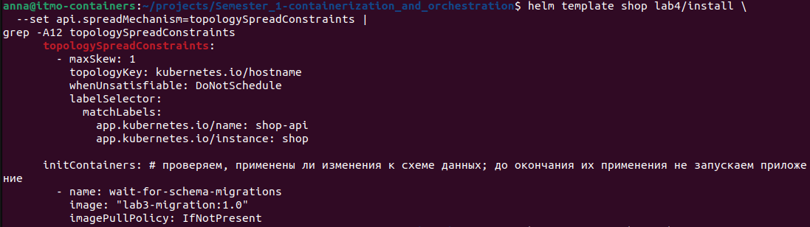
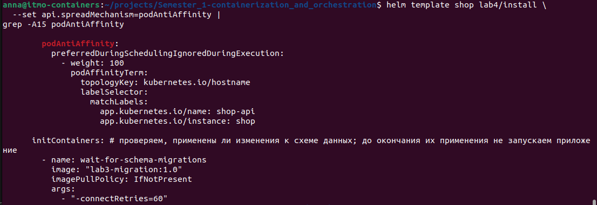
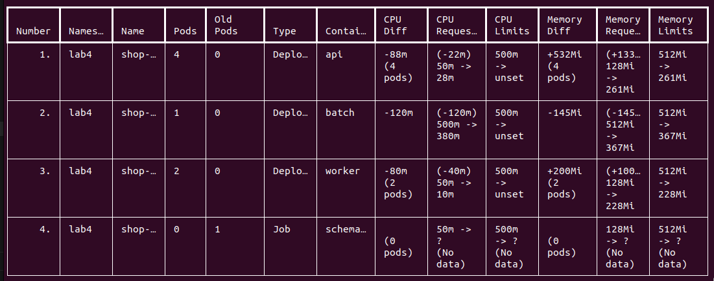
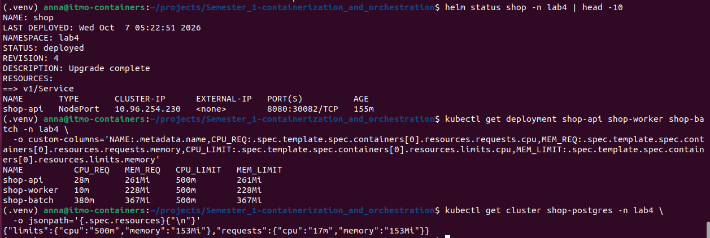
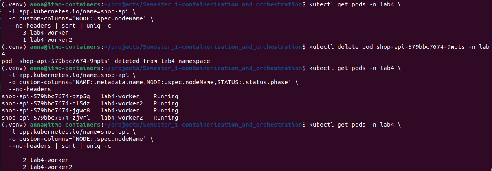
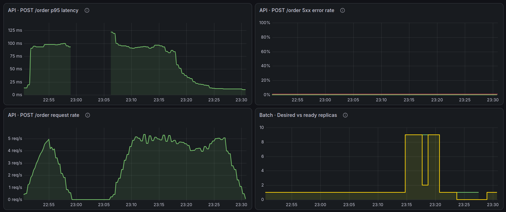

# Лабораторная работа №4 - SLA критического пути под перегрузкой

## Часть 0 - Сервис batch
Создадим сервис `batch` для моделирования работы компоненты аналитики. Нагрузка сервиса настраивается через параметры окружения:
- `BATCH_CPU_THREADS` - количество занимаемых ядер
- `BATCH_MEMORY_MEGABYTES` - количество удерживаемых Мегабайт

## Часть 1 - Выбор механизма разнесения

Для размещения реплик `api` по разным нодам добавим возможность выбора между двумя механизмами Kubernetes:

- `topologySpreadConstraints`
- `podAntiAffinity`

Выбор механизма задается в `values.yaml`:

```yaml
api:
  spreadMechanism: topologySpreadConstraints
```

В качестве основного механизма выберем `topologySpreadConstraints`.

В лабораторной используются 4 реплики `api` и 2 worker-ноды. `topologySpreadConstraints` позволяет равномерно распределять несколько реплик между ограниченным количеством нод. При четырех репликах ожидаемое распределение между двумя worker-нодами составляет `2 + 2`.

Для `api` зададим следующие параметры:

```yaml
topologySpreadConstraints:
  - maxSkew: 1
    topologyKey: kubernetes.io/hostname
    whenUnsatisfiable: DoNotSchedule
    labelSelector:
      matchLabels:
        app.kubernetes.io/name: shop-api
        app.kubernetes.io/instance: {{ .Release.Name }}
```

`topologyKey: kubernetes.io/hostname` означает, что доменом распределения является отдельная нода Kubernetes.

`maxSkew: 1` ограничивает максимальную разницу в количестве подходящих Pod-ов между нодами единицей.

`whenUnsatisfiable: DoNotSchedule` запрещает размещение нового Pod-а, если его запуск нарушит заданное ограничение распределения.

В качестве альтернативы поддерживается `podAntiAffinity`:

```yaml
affinity:
  podAntiAffinity:
    preferredDuringSchedulingIgnoredDuringExecution:
      - weight: 100
        podAffinityTerm:
          topologyKey: kubernetes.io/hostname
          labelSelector:
            matchLabels:
              app.kubernetes.io/name: shop-api
              app.kubernetes.io/instance: {{ .Release.Name }}
```

Для `podAntiAffinity` используется мягкое правило `preferredDuringSchedulingIgnoredDuringExecution`. Строгий вариант `requiredDuringSchedulingIgnoredDuringExecution` в данном случае не подходит: при 4 репликах `api` и только 2 worker-нодах Kubernetes смог бы разместить не более одной подходящей реплики на каждой ноде, а остальные Pod-ы остались бы в состоянии `Pending`.

Проверим корректность Helm-chart:

```bash
helm lint lab4/install
```

Результат:

```text
1 chart(s) linted, 0 chart(s) failed
```

Проверим рендеринг основного механизма:

```bash
helm template shop lab4/install \
  --set api.spreadMechanism=topologySpreadConstraints |
grep -A12 topologySpreadConstraints
```

Helm формирует блок `topologySpreadConstraints` с `maxSkew: 1` и `topologyKey: kubernetes.io/hostname`.



Также проверим переключение на альтернативный механизм:

```bash
helm template shop lab4/install \
  --set api.spreadMechanism=podAntiAffinity |
grep -A15 podAntiAffinity
```

При изменении значения параметра Helm формирует блок `podAntiAffinity`.



Таким образом, Helm-chart поддерживает оба механизма разнесения, а в качестве основного выбран `topologySpreadConstraints`, поскольку он позволяет равномерно распределить все реплики `api` между небольшим количеством worker-нод.

## Часть 2 - Тесная площадка
Создадим кластер на 3 ноды (см. конфигурацию кластера в [kind.yaml](kind.yaml)):
- нода, на которой будет расположен `control plane` - защитим ее `taint = lab4-control-plane` для того, чтобы на нее не ставились поды приложения
- 2 ноды, на которые будем ставить поды приложения `shop`

Также предустановим в кластер оператор БД CloudNativePG, поскольку в предыдущих лабораторных он устанавливался в `minikube`:
<details>
<summary>Результат</summary>

```bash
pona@pona-RedmiBook-14:~/Documents/Semester_1-containerization_and_orchestration$ curl -Lo kind https://kind.sigs.k8s.io/dl/v0.33.0/kind-linux-amd64
  % Total    % Received % Xferd  Average Speed   Time    Time     Time  Current
                                 Dload  Upload   Total   Spent    Left  Speed
100    97  100    97    0     0    441      0 --:--:-- --:--:-- --:--:--   442
  0     0    0     0    0     0      0      0 --:--:-- --:--:-- --:--:--     0
100 10.0M  100 10.0M    0     0   895k      0  0:00:11  0:00:11 --:--:--  915k
pona@pona-RedmiBook-14:~/Documents/Semester_1-containerization_and_orchestration$ chmod +x kind
pona@pona-RedmiBook-14:~/Documents/Semester_1-containerization_and_orchestration$ sudo mv kind /usr/local/bin/kind
pona@pona-RedmiBook-14:~/Documents/Semester_1-containerization_and_orchestration$ kind version
kind v0.33.0 go1.26.7 linux/amd64
pona@pona-RedmiBook-14:~/Documents/Semester_1-containerization_and_orchestration/lab4$ env \
  -u HTTP_PROXY \
  -u HTTPS_PROXY \
  -u ALL_PROXY \
  -u http_proxy \
  -u https_proxy \
  -u all_proxy \
  -u NO_PROXY \
  -u no_proxy \
  kind create cluster \
    --name lab4 \
    --config ./kind.yaml \
    --wait 5m
Creating cluster "lab4" ...
 ✓ Ensuring node image (kindest/node:v1.37.0) 🖼️
 ✓ Preparing nodes 📦 📦 📦  
 ✓ Writing configuration 📜 
 ✓ Starting control-plane 🕹️ 
 ✓ Installing CNI 🔌 
 ✓ Installing StorageClass 💾 
 ✓ Joining worker nodes 🚜 
 ✓ Waiting ≤ 5m0s for control-plane = Ready ⏳ 
 • Ready after 6s 💚
Set kubectl context to "kind-lab4"
You can now use your cluster with:

kubectl cluster-info --context kind-lab4

Not sure what to do next? 😅  Check out https://kind.sigs.k8s.io/docs/user/quick-start/
pona@pona-RedmiBook-14:~/Documents/Semester_1-containerization_and_orchestration/lab4$ docker inspect lab4-control-plane \
  --format '{{range .Config.Env}}{{println .}}{{end}}' |
  grep -i proxy
HTTP_PROXY=
HTTPS_PROXY=
NO_PROXY=
pona@pona-RedmiBook-14:~/Documents/Semester_1-containerization_and_orchestration/lab4$ kubectl taint node lab4-control-plane \
  node-role.kubernetes.io/control-plane=:NoSchedule \
  --overwrite
node/lab4-control-plane modified
pona@pona-RedmiBook-14:~/Documents/Semester_1-containerization_and_orchestration/lab4$ kubectl get node lab4-control-plane \
  -o jsonpath='{.spec.taints}{"\n"}'
[{"effect":"NoSchedule","key":"node-role.kubernetes.io/control-plane"}]
pona@pona-RedmiBook-14:~/Documents/Semester_1-containerization_and_orchestration/lab4$ helm upgrade --install cnpg \
  cnpg/cloudnative-pg \
  --namespace cnpg-system \
  --create-namespace \
  --wait \
  --timeout 5m
Release "cnpg" does not exist. Installing it now.
NAME: cnpg
LAST DEPLOYED: Tue Oct  6 00:35:39 2026
NAMESPACE: cnpg-system
STATUS: deployed
REVISION: 1
TEST SUITE: None
NOTES:
CloudNativePG operator should be installed in namespace "cnpg-system".
You can now create a PostgreSQL cluster with 3 nodes as follows:

cat <<EOF | kubectl apply -f -
# Example of PostgreSQL cluster
apiVersion: postgresql.cnpg.io/v1
kind: Cluster
metadata:
  name: cluster-example
  
spec:
  instances: 3
  storage:
    size: 1Gi
EOF

kubectl get -A cluster
pona@pona-RedmiBook-14:~/Documents/Semester_1-containerization_and_orchestration/lab4$ kubectl get pods -n cnpg-system
NAME                                   READY   STATUS    RESTARTS   AGE
cnpg-cloudnative-pg-7b5f5d7b65-9zxv7   1/1     Running   0          26s
```
</details>

Соберем docker-образ `batch` и добавим его в чарт `shop` (конфигурацию `batch` см. [install/templates/batch-deployment.yaml](install/templates/batch-deployment.yaml)):
<details>
<summary>Результат</summary>

```bash
pona@pona-RedmiBook-14:~/Documents/Semester_1-containerization_and_orchestration$ cd lab4 && docker build -f ./batch/Dockerfile -t lab4-batch:1.0 ./batch
[+] Building 80.8s (16/16) FINISHED                              docker:default
 => [internal] load build definition from Dockerfile                       0.1s
 => => transferring dockerfile: 408B                                       0.0s
 => [internal] load metadata for docker.io/library/maven:3.9-eclipse-temu  1.2s
 => [internal] load metadata for docker.io/library/eclipse-temurin:21-jre  1.2s
 => [internal] load .dockerignore                                          0.1s
 => => transferring context: 59B                                           0.0s
 => [build 1/6] FROM docker.io/library/maven:3.9-eclipse-temurin-21@sha25  0.1s
 => => resolve docker.io/library/maven:3.9-eclipse-temurin-21@sha256:99e6  0.1s
 => [stage-1 1/4] FROM docker.io/library/eclipse-temurin:21-jre-jammy@sha  0.1s
 => => resolve docker.io/library/eclipse-temurin:21-jre-jammy@sha256:f04f  0.1s
 => [internal] load build context                                          0.1s
 => => transferring context: 7.12kB                                        0.0s
 => CACHED [stage-1 2/4] WORKDIR /app                                      0.0s
 => CACHED [stage-1 3/4] RUN useradd --system --uid 10001 appuser          0.0s
 => CACHED [build 2/6] WORKDIR /app                                        0.0s
 => [build 3/6] COPY pom.xml .                                             0.1s
 => [build 4/6] RUN mvn dependency:go-offline                             71.9s
 => [build 5/6] COPY src ./src                                             0.2s 
 => [build 6/6] RUN mvn clean package -DskipTests                          4.6s 
 => [stage-1 4/4] COPY --from=build /app/target/lab4-batch-1.0.0.jar app.  0.3s 
 => exporting to image                                                     1.7s 
 => => exporting layers                                                    1.3s 
 => => exporting manifest sha256:62f64b9bd5ae711e1f9b2552ca1f48ae695b2d1b  0.0s
 => => exporting config sha256:d81ea57c01dc54999309f5f0fca16b346538b9af73  0.0s
 => => exporting attestation manifest sha256:36e6093a5248ad6b0af0b0fcd421  0.1s
 => => exporting manifest list sha256:abc13e5e5a1572c2b15e3a8a4cc40711348  0.0s
 => => naming to docker.io/library/lab4-batch:1.0                          0.0s
 => => unpacking to docker.io/library/lab4-batch:1.0                       0.2s
```
</details>

Импортируем в kind образы для `shop` и установим приложение в кластер:
```bash
pona@pona-RedmiBook-14:~/Documents/Semester_1-containerization_and_orchestration/lab4$ docker image save \
  --platform linux/amd64 \
  --output /tmp/shop-images.tar \
  lab3-api:1.0 \
  lab3-worker:1.0 \
  lab3-migration:1.0 \
  lab4-batch:1.0
pona@pona-RedmiBook-14:~/Documents/Semester_1-containerization_and_orchestration/lab4$ kind load image-archive \
  /tmp/shop-images.tar \
  --name lab4
```

## Часть 3 - Нагрузочное тестирование и подбор ресурсов с KRR

Для получения рекомендаций по ресурсам была создана нагрузка на критический путь приложения через `POST /order`.

Для генерации нагрузки использовался `hey`:
```bash
hey \
  -z 5m \
  -c 5 \
  -q 1 \
  -m POST \
  -T application/json \
  -d '{"description":"load-test"}' \
  http://127.0.0.1:8080/order
```

В течение 5 минут было получено около 5 запросов в секунду. Успешно обработано 1485 запросов со статусом `201`.

Для сбора метрик был развернут Prometheus. Проверено наличие метрик CPU и памяти контейнеров в namespace `lab4`.

KRR запускался с использованием Prometheus:
```bash
python krr.py simple \
  -c kind-lab4 \
  -n lab4 \
  -p http://127.0.0.1:9090 \
  --history-duration 1 \
  --timeframe-duration 5 \
  --points-required 3
```

Поскольку Prometheus был развернут непосредственно перед экспериментом, доступная история метрик была короче заданного часа, поэтому для лабораторного запуска порог `points-required` был уменьшен до 3.

Использовалась стратегия Simple:

- CPU request определяется по 95-му перцентилю использования CPU;
- memory request определяется как максимальное использование памяти + 15%;
- CPU limit стратегия KRR не устанавливает.

Рекомендации KRR:
| Компонент | Исходный CPU request | Новый CPU request | Исходная память | Новая память |
|---|---:|---:|---:|---:|
| API | 50m | 28m | 128Mi | 261Mi |
| Worker | 50m | 10m | 128Mi | 228Mi |
| Batch | 500m | 380m | 512Mi | 367Mi |

По результатам KRR первоначальные оценки ресурсов оказались достаточно консервативными по CPU, но заниженными по памяти для API и Worker. Для API CPU request снизился с 50m до 28m, при этом рекомендуемый объем памяти вырос со 128Mi до 261Mi, что связано с фактическим потреблением приложения под нагрузкой. Для Worker CPU request снизился до минимального значения 10m, однако потребление памяти потребовало увеличения request до 228Mi. Для Batch первоначальные значения 500m CPU и 512Mi памяти оказались завышенными: KRR рекомендовал 380m CPU и 367Mi памяти.

PostgreSQL развернут через CloudNativePG и не определяется KRR как стандартный Deployment/StatefulSet. Поэтому его использование ресурсов было получено непосредственно из Prometheus с применением того же подхода:

- CPU 95-й перцентиль: около 17m;
- максимальная память: около 132.5 MiB;
- с буфером 15%: 153Mi.

Для PostgreSQL были установлены:
- `CPU request: 17m`
- `Memory request: 153Mi`
- `Memory limit: 153Mi`

После получения рекомендаций значения были внесены в `values.yaml` и применены через `helm upgrade --install shop ./lab4/install -n lab4 --wait --wait-for-jobs --timeout 10m`. CPU limits оставлены равными `500m`, поскольку действующие политики Kubernetes требуют наличия limits, а стратегия KRR Simple не формирует рекомендацию для CPU limit.

После обновления были получены следующие значения:
```text
shop-api     CPU request 28m    memory 261Mi    CPU limit 500m
shop-worker  CPU request 10m    memory 228Mi    CPU limit 500m
shop-batch   CPU request 380m   memory 367Mi    CPU limit 500m
shop-postgres CPU request 17m   memory 153Mi    CPU limit 500m
```

Таким образом, исходные приблизительные значения ресурсов были заменены значениями, полученными на основании фактического потребления под нагрузкой.
<details>
<summary>Результат</summary>




</details>

## Часть 4 - Разнесение критического сервиса

Для сервиса `api` применим выбранный в Части 1 механизм `topologySpreadConstraints`.

В качестве топологии используется имя Kubernetes-ноды:
```yaml
topologyKey: kubernetes.io/hostname
```

Проверим размещение реплик `api` по нодам:
```bash
kubectl get pods -n lab4 \
  -l app.kubernetes.io/name=shop-api \
  -o wide
```

Дополнительно подсчитаем количество реплик на каждой worker-ноде:
```bash
kubectl get pods -n lab4 \
  -l app.kubernetes.io/name=shop-api \
  -o custom-columns='NODE:.spec.nodeName' \
  --no-headers | sort | uniq -c
```

В результате четыре реплики `api` распределились между двумя worker-нодами:
```text
2 lab4-worker
2 lab4-worker2
```

Таким образом, критический сервис не размещается целиком на одной ноде. При отказе одной worker-ноды часть реплик `api` продолжит работать на второй ноде, что повышает отказоустойчивость критического пути приложения.

Во время rolling update возможно временное неравномерное распределение уже запущенных Pod-ов. `topologySpreadConstraints` учитывается при планировании новых Pod-ов, но Kubernetes не выполняет автоматический ребаланс уже размещенных реплик. После пересоздания одной из реплик scheduler восстановил равномерное распределение `2 + 2`.
<details>
<summary>Результат</summary>


</details>

## Часть 5 - Приоритеты и гарантии
Создадим 2 Kubernetes ресурса: `priorityClass` и `podDistributionBudget` (см. подробнее соответственно в [install/templates/priority-class.yaml](install/templates/priority-class.yaml) и [install/templates/pod-distribution-budget.yaml](install/templates/pod-distribution-budget.yaml)):
- `priorityClass` выставляет приоритет поду: при нехватке ресурсов на нодах для установки высоко приоритетного пода запускается механизм вытеснения (`preemption`), менее приоритетные ноды останавливаются и заменяются более приоритетными
- `podDistributionBudget` - обратный механизм, позволяет выставлять защиту от постоянного вытеснения при установке более приоритетного пода; в данной работе будет использоваться для настройки минимального количества запущенных подов (Kubernetes не сможет вытеснить последний под `api` или `postgres` вне зависимости от приоритета устанавливаемого пода)

Класс `QoS` назначается Pod-ам `Kubernetes` автоматически на основании настроек CPU и памяти у всех его основных и init-контейнеров:
- чтобы `api` и `postgres` получили класс `Guaranteed`, для каждого их контейнера (и `initContainers`) должны быть указаны равные `requests` и `limits` соответственно по CPU и памяти
- чтобы `batch` получил класс `Burstable` необходимо задать `limits` выше `requests`

Pod-ы класса `Guaranteed` лучше всего защищены при вытеснении, вызванном нехваткой ресурсов на ноде. Pod-ы класса `Burstable` может использовать больше ресурсов, чем указано в `requests` и при нехватке ресурсов на ноде будет одним из кандидатов на вытеснение раньше `Guaranteed` Pod-а. Помимо перечисленных классов есть так же класс `Best Efforts`, для которого не задаются ни `requests`, ни `limits` и он является наименее защищенным классом при вытеснении.

Для `postgres` и `api` выставим уровень приоритета - `shop-critical` (100000); для `batch` - `shop-background` (-1000). Таким образом `batch`, имитирующий работу ночной аналитики, будет иметь более низкий приоритет в отличие от БД и основных приложений `api` и `worker`.

Обновим релиз и посмотрим `QoS` классы приложений:
<details>
<summary>Результат</summary>

```bash
pona@pona-RedmiBook-14:~/Documents/Semester_1-containerization_and_orchestration$ helm upgrade --install shop lab4/install   --namespace lab4   --create-namespace   --kube-context kind-lab4
Release "shop" has been upgraded. Happy Helming!
NAME: shop
LAST DEPLOYED: Wed Oct  7 20:23:45 2026
NAMESPACE: lab4
STATUS: deployed
REVISION: 3
TEST SUITE: None
pona@pona-RedmiBook-14:~/Documents/Semester_1-containerization_and_orchestration$ kubectl get pods   --namespace lab4   --context kind-lab4
NAME                              READY   STATUS      RESTARTS   AGE
shop-api-8c45757b-2fpj2           1/1     Running     0          4m46s
shop-api-8c45757b-95sdm           1/1     Running     0          3m29s
shop-api-8c45757b-b7f8b           1/1     Running     0          5m19s
shop-api-8c45757b-fbn58           1/1     Running     0          4m7s
shop-batch-76486cc9d8-2684r       1/1     Running     0          18m
shop-postgres-1                   1/1     Running     0          16m
shop-schema-migration-1-0-z5tv4   0/1     Completed   0          18m
shop-worker-859b8686d7-bdcwm      1/1     Running     0          18m
shop-worker-859b8686d7-lh75q      1/1     Running     0          18m
pona@pona-RedmiBook-14:~/Documents/Semester_1-containerization_and_orchestration$ kubectl get pods -n lab4 \
  --context kind-lab4 \
  -o custom-columns='NAME:.metadata.name,QOS:.status.qosClass,PRIORITY:.spec.priorityClassName'
NAME                              QOS          PRIORITY
shop-api-8c45757b-2fpj2           Guaranteed   shop-critical
shop-api-8c45757b-95sdm           Guaranteed   shop-critical
shop-api-8c45757b-b7f8b           Guaranteed   shop-critical
shop-api-8c45757b-fbn58           Guaranteed   shop-critical
shop-batch-76486cc9d8-2684r       Burstable    shop-background
shop-postgres-1                   Guaranteed   shop-critical
shop-schema-migration-1-0-z5tv4   Burstable    <none>
shop-worker-859b8686d7-bdcwm      Burstable    <none>
shop-worker-859b8686d7-lh75q      Burstable    <none>
```
</details>

## Часть 6 - Создай нехватку, поймай preemption
Для воссоздания вытеснения подов из кластера при установке новых временно увеличим `batch.resources.requests.cpu=1600m` и `batch.resources.limits.cpu=2000m` (для того, чтобы не запускать слишком много подов). Проверим состояние кластера до обновления:
<details>
<summary>Результат</summary>

```bash
pona@pona-RedmiBook-14:~/Documents/Semester_1-containerization_and_orchestration$ kubectl get pods -n lab4   -l app.kubernetes.io/part-of=shop   --context kind-lab4   -o wide
NAME                              READY   STATUS      RESTARTS   AGE     IP            NODE           NOMINATED NODE   READINESS GATES
shop-api-8c45757b-2fpj2           1/1     Running     0          71m     10.244.1.15   lab4-worker    <none>           <none>
shop-api-8c45757b-95sdm           1/1     Running     0          70m     10.244.1.16   lab4-worker    <none>           <none>
shop-api-8c45757b-b7f8b           1/1     Running     0          72m     10.244.2.10   lab4-worker2   <none>           <none>
shop-api-8c45757b-fbn58           1/1     Running     0          71m     10.244.2.11   lab4-worker2   <none>           <none>
shop-batch-76486cc9d8-2684r       1/1     Running     0          85m     10.244.1.7    lab4-worker    <none>           <none>
shop-postgres-1                   1/1     Running     0          84m     10.244.1.13   lab4-worker    <none>           <none>
shop-schema-migration-1-0-z5tv4   0/1     Completed   0          85m     10.244.1.6    lab4-worker    <none>           <none>
shop-worker-859b8686d7-lh75q      1/1     Running     0          85m     10.244.2.7    lab4-worker2   <none>           <none>
shop-worker-859b8686d7-q2n5f      1/1     Running     0          7m49s   10.244.2.30   lab4-worker2   <none>           <none>
```
</details>

Все поды запущены, ни один не находится в состоянии `Pending`. Выставим `batch.instances=9`, обновим релиз и проверим состояние подов еще раз:
<details>
<summary>Результат</summary>

```bash
pona@pona-RedmiBook-14:~/Documents/Semester_1-containerization_and_orchestration$ kubectl get pods -n lab4   -l app.kubernetes.io/part-of=shop   --context kind-lab4   -o wide
NAME                              READY   STATUS      RESTARTS   AGE     IP            NODE           NOMINATED NODE   READINESS GATES
shop-api-8c45757b-2fpj2           1/1     Running     0          86m     10.244.1.15   lab4-worker    <none>           <none>
shop-api-8c45757b-95sdm           1/1     Running     0          85m     10.244.1.16   lab4-worker    <none>           <none>
shop-api-8c45757b-b7f8b           1/1     Running     0          87m     10.244.2.10   lab4-worker2   <none>           <none>
shop-api-8c45757b-fbn58           1/1     Running     0          86m     10.244.2.11   lab4-worker2   <none>           <none>
shop-batch-7cf9bf4575-5xg9h       1/1     Running     0          96s     10.244.1.43   lab4-worker    <none>           <none>
shop-batch-7cf9bf4575-cf4sf       1/1     Running     0          9m16s   10.244.2.39   lab4-worker2   <none>           <none>
shop-batch-7cf9bf4575-hk627       1/1     Running     0          96s     10.244.1.44   lab4-worker    <none>           <none>
shop-batch-7cf9bf4575-kft5z       1/1     Running     0          96s     10.244.1.42   lab4-worker    <none>           <none>
shop-batch-7cf9bf4575-p2j2l       1/1     Running     0          96s     10.244.2.41   lab4-worker2   <none>           <none>
shop-batch-7cf9bf4575-p8tpg       0/1     Pending     0          96s     <none>        <none>         <none>           <none>
shop-batch-7cf9bf4575-wxxss       1/1     Running     0          96s     10.244.2.42   lab4-worker2   <none>           <none>
shop-batch-7cf9bf4575-z5pg2       1/1     Running     0          96s     10.244.2.40   lab4-worker2   <none>           <none>
shop-batch-7cf9bf4575-zn6gm       1/1     Running     0          96s     10.244.1.45   lab4-worker    <none>           <none>
shop-postgres-1                   1/1     Running     0          98m     10.244.1.13   lab4-worker    <none>           <none>
shop-schema-migration-1-0-z5tv4   0/1     Completed   0          100m    10.244.1.6    lab4-worker    <none>           <none>
shop-worker-859b8686d7-lh75q      1/1     Running     0          100m    10.244.2.7    lab4-worker2   <none>           <none>
shop-worker-859b8686d7-q2n5f      1/1     Running     0          22m     10.244.2.30   lab4-worker2   <none>           <none>
```
</details>

Видим что один под `shop-batch-7cf9bf4575-p8tpg` находится в статусе `Pending`. Проверим ресурсы на каждой из нод:
<details>
<summary>Результат</summary>

```bash
pona@pona-RedmiBook-14:~/Documents/Semester_1-containerization_and_orchestration$ kubectl describe node lab4-worker \
  --context kind-lab4
Name:               lab4-worker
Roles:              <none>
Labels:             beta.kubernetes.io/arch=amd64
                    beta.kubernetes.io/os=linux
                    kubernetes.io/arch=amd64
                    kubernetes.io/hostname=lab4-worker
                    kubernetes.io/os=linux
Annotations:        node.alpha.kubernetes.io/ttl: 0
                    volumes.kubernetes.io/controller-managed-attach-detach: true
CreationTimestamp:  Tue, 06 Oct 2026 00:35:05 +0300
Taints:             <none>
Unschedulable:      false
Lease:
  HolderIdentity:  lab4-worker
  AcquireTime:     <unset>
  RenewTime:       Wed, 07 Oct 2026 21:51:38 +0300
Conditions:
  Type             Status  LastHeartbeatTime                 LastTransitionTime                Reason                       Message
  ----             ------  -----------------                 ------------------                ------                       -------
  MemoryPressure   False   Wed, 07 Oct 2026 21:49:51 +0300   Tue, 06 Oct 2026 00:35:05 +0300   KubeletHasSufficientMemory   kubelet has sufficient memory available
  DiskPressure     False   Wed, 07 Oct 2026 21:49:51 +0300   Tue, 06 Oct 2026 00:35:05 +0300   KubeletHasNoDiskPressure     kubelet has no disk pressure
  PIDPressure      False   Wed, 07 Oct 2026 21:49:51 +0300   Tue, 06 Oct 2026 00:35:05 +0300   KubeletHasSufficientPID      kubelet has sufficient PID available
  Ready            True    Wed, 07 Oct 2026 21:49:51 +0300   Tue, 06 Oct 2026 00:35:19 +0300   KubeletReady                 kubelet is posting ready status
Addresses:
  InternalIP:  172.18.0.3
  Hostname:    lab4-worker
Capacity:
  cpu:                8
  ephemeral-storage:  105089261568
  hugepages-1Gi:      0
  hugepages-2Mi:      0
  memory:             16202976Ki
  pods:               110
Allocatable:
  cpu:                8
  ephemeral-storage:  105089261568
  hugepages-1Gi:      0
  hugepages-2Mi:      0
  memory:             16202976Ki
  pods:               110
System Info:
  Machine ID:                 f23ebc037d6d4b39b135e32a918cc3f9
  System UUID:                b3ca06c8-7843-4cda-a1d5-3c41cb362ed2
  Boot ID:                    5a2ec76f-7339-4d98-8494-37e76f6c5cd2
  Kernel Version:             6.8.0-138-generic
  OS Image:                   Debian GNU/Linux 13 (trixie)
  Operating System:           linux
  Architecture:               amd64
  Container Runtime Version:  containerd://2.3.4
  Kubelet Version:            v1.37.0
PodCIDR:                      10.244.1.0/24
PodCIDRs:                     10.244.1.0/24
ProviderID:                   kind://docker/lab4/lab4-worker
Non-terminated Pods:          (9 in total)
  Namespace                   Name                           CPU Requests  CPU Limits  Memory Requests  Memory Limits  Age
  ---------                   ----                           ------------  ----------  ---------------  -------------  ---
  kube-system                 kindnet-7bkvc                  100m (1%)     0 (0%)      50Mi (0%)        0 (0%)         45h
  kube-system                 kube-proxy-867jr               0 (0%)        0 (0%)      0 (0%)           0 (0%)         45h
  lab4                        shop-api-8c45757b-2fpj2        500m (6%)     500m (6%)   512Mi (3%)       512Mi (3%)     87m
  lab4                        shop-api-8c45757b-95sdm        500m (6%)     500m (6%)   512Mi (3%)       512Mi (3%)     86m
  lab4                        shop-batch-7cf9bf4575-5xg9h    1600m (20%)   2 (25%)     367Mi (2%)       512Mi (3%)     2m12s
  lab4                        shop-batch-7cf9bf4575-hk627    1600m (20%)   2 (25%)     367Mi (2%)       512Mi (3%)     2m12s
  lab4                        shop-batch-7cf9bf4575-kft5z    1600m (20%)   2 (25%)     367Mi (2%)       512Mi (3%)     2m12s
  lab4                        shop-batch-7cf9bf4575-zn6gm    1600m (20%)   2 (25%)     367Mi (2%)       512Mi (3%)     2m12s
  lab4                        shop-postgres-1                17m (0%)      17m (0%)    153Mi (0%)       153Mi (0%)     99m
Allocated resources:
  (Total limits may be over 100 percent, i.e., overcommitted.)
  Resource           Requests      Limits
  --------           --------      ------
  cpu                7517m (93%)   9017m (112%)
  memory             2695Mi (17%)  3225Mi (20%)
  ephemeral-storage  0 (0%)        0 (0%)
  hugepages-1Gi      0 (0%)        0 (0%)
  hugepages-2Mi      0 (0%)        0 (0%)
Events:              <none>
pona@pona-RedmiBook-14:~/Documents/Semester_1-containerization_and_orchestration$ kubectl describe node lab4-worker2   --context kind-lab4
Name:               lab4-worker2
Roles:              <none>
Labels:             beta.kubernetes.io/arch=amd64
                    beta.kubernetes.io/os=linux
                    kubernetes.io/arch=amd64
                    kubernetes.io/hostname=lab4-worker2
                    kubernetes.io/os=linux
Annotations:        node.alpha.kubernetes.io/ttl: 0
                    volumes.kubernetes.io/controller-managed-attach-detach: true
CreationTimestamp:  Tue, 06 Oct 2026 00:35:06 +0300
Taints:             <none>
Unschedulable:      false
Lease:
  HolderIdentity:  lab4-worker2
  AcquireTime:     <unset>
  RenewTime:       Wed, 07 Oct 2026 21:51:57 +0300
Conditions:
  Type             Status  LastHeartbeatTime                 LastTransitionTime                Reason                       Message
  ----             ------  -----------------                 ------------------                ------                       -------
  MemoryPressure   False   Wed, 07 Oct 2026 21:51:14 +0300   Tue, 06 Oct 2026 00:35:06 +0300   KubeletHasSufficientMemory   kubelet has sufficient memory available
  DiskPressure     False   Wed, 07 Oct 2026 21:51:14 +0300   Tue, 06 Oct 2026 00:35:06 +0300   KubeletHasNoDiskPressure     kubelet has no disk pressure
  PIDPressure      False   Wed, 07 Oct 2026 21:51:14 +0300   Tue, 06 Oct 2026 00:35:06 +0300   KubeletHasSufficientPID      kubelet has sufficient PID available
  Ready            True    Wed, 07 Oct 2026 21:51:14 +0300   Tue, 06 Oct 2026 00:35:19 +0300   KubeletReady                 kubelet is posting ready status
Addresses:
  InternalIP:  172.18.0.4
  Hostname:    lab4-worker2
Capacity:
  cpu:                8
  ephemeral-storage:  105089261568
  hugepages-1Gi:      0
  hugepages-2Mi:      0
  memory:             16202976Ki
  pods:               110
Allocatable:
  cpu:                8
  ephemeral-storage:  105089261568
  hugepages-1Gi:      0
  hugepages-2Mi:      0
  memory:             16202976Ki
  pods:               110
System Info:
  Machine ID:                 f9b5a9197a0d40c7a16242fa408bf48d
  System UUID:                dede7c2e-3ce9-4294-8bf6-c42ee7040834
  Boot ID:                    5a2ec76f-7339-4d98-8494-37e76f6c5cd2
  Kernel Version:             6.8.0-138-generic
  OS Image:                   Debian GNU/Linux 13 (trixie)
  Operating System:           linux
  Architecture:               amd64
  Container Runtime Version:  containerd://2.3.4
  Kubelet Version:            v1.37.0
PodCIDR:                      10.244.2.0/24
PodCIDRs:                     10.244.2.0/24
ProviderID:                   kind://docker/lab4/lab4-worker2
Non-terminated Pods:          (11 in total)
  Namespace                   Name                                    CPU Requests  CPU Limits  Memory Requests  Memory Limits  Age
  ---------                   ----                                    ------------  ----------  ---------------  -------------  ---
  cnpg-system                 cnpg-cloudnative-pg-7b5f5d7b65-9zxv7    0 (0%)        0 (0%)      0 (0%)           0 (0%)         45h
  kube-system                 kindnet-4b6lz                           100m (1%)     0 (0%)      50Mi (0%)        0 (0%)         45h
  kube-system                 kube-proxy-lv69t                        0 (0%)        0 (0%)      0 (0%)           0 (0%)         45h
  lab4                        shop-api-8c45757b-b7f8b                 500m (6%)     500m (6%)   512Mi (3%)       512Mi (3%)     88m
  lab4                        shop-api-8c45757b-fbn58                 500m (6%)     500m (6%)   512Mi (3%)       512Mi (3%)     87m
  lab4                        shop-batch-7cf9bf4575-cf4sf             1600m (20%)   2 (25%)     367Mi (2%)       512Mi (3%)     10m
  lab4                        shop-batch-7cf9bf4575-p2j2l             1600m (20%)   2 (25%)     367Mi (2%)       512Mi (3%)     2m32s
  lab4                        shop-batch-7cf9bf4575-wxxss             1600m (20%)   2 (25%)     367Mi (2%)       512Mi (3%)     2m32s
  lab4                        shop-batch-7cf9bf4575-z5pg2             1600m (20%)   2 (25%)     367Mi (2%)       512Mi (3%)     2m32s
  lab4                        shop-worker-859b8686d7-lh75q            50m (0%)      500m (6%)   228Mi (1%)       512Mi (3%)     101m
  lab4                        shop-worker-859b8686d7-q2n5f            50m (0%)      500m (6%)   228Mi (1%)       512Mi (3%)     23m
Allocated resources:
  (Total limits may be over 100 percent, i.e., overcommitted.)
  Resource           Requests      Limits
  --------           --------      ------
  cpu                7600m (95%)   10 (125%)
  memory             2998Mi (18%)  4Gi (25%)
  ephemeral-storage  0 (0%)        0 (0%)
  hugepages-1Gi      0 (0%)        0 (0%)
  hugepages-2Mi      0 (0%)        0 (0%)
Events:              <none>
```
</details>

Видим что на нодах `lab4-worker` и `lab4-worker2` нет места для нового пода `batch` по `requests.cpu`, поэтому он находится в ожидании привязке к ноде.

Добавим в релиз еще 2 инстанса `api`, обновим релиз и проверим состояние подов:
<details>
<summary>Результат</summary>

```bash
pona@pona-Redmpona@pona-RedmiBook-14:~/Documents/Semester_1-containerization_and_orchestration$ kubectl get pods -n lab4   -l app.kubernetes.io/part-of=shop   --context kind-lab4   -o wide
NAME                              READY   STATUS      RESTARTS   AGE    IP            NODE           NOMINATED NODE   READINESS GATES
shop-api-8c45757b-2fpj2           1/1     Running     0          89m    10.244.1.15   lab4-worker    <none>           <none>
shop-api-8c45757b-95sdm           1/1     Running     0          87m    10.244.1.16   lab4-worker    <none>           <none>
shop-api-8c45757b-b7f8b           1/1     Running     0          89m    10.244.2.10   lab4-worker2   <none>           <none>
shop-api-8c45757b-btmm8           1/1     Running     0          59s    10.244.2.43   lab4-worker2   <none>           <none>
shop-api-8c45757b-fbn58           1/1     Running     0          88m    10.244.2.11   lab4-worker2   <none>           <none>
shop-api-8c45757b-pcv5t           1/1     Running     0          59s    10.244.1.48   lab4-worker    <none>           <none>
shop-batch-7cf9bf4575-5xg9h       1/1     Running     0          4m3s   10.244.1.43   lab4-worker    <none>           <none>
shop-batch-7cf9bf4575-7grb8       0/1     Pending     0          59s    <none>        <none>         <none>           <none>
shop-batch-7cf9bf4575-cf4sf       1/1     Running     0          11m    10.244.2.39   lab4-worker2   <none>           <none>
shop-batch-7cf9bf4575-hk627       1/1     Running     0          4m3s   10.244.1.44   lab4-worker    <none>           <none>
shop-batch-7cf9bf4575-kft5z       1/1     Running     0          4m3s   10.244.1.42   lab4-worker    <none>           <none>
shop-batch-7cf9bf4575-p2j2l       1/1     Running     0          4m3s   10.244.2.41   lab4-worker2   <none>           <none>
shop-batch-7cf9bf4575-p8tpg       0/1     Pending     0          4m3s   <none>        <none>         <none>           <none>
shop-batch-7cf9bf4575-wxxss       1/1     Running     0          4m3s   10.244.2.42   lab4-worker2   <none>           <none>
shop-batch-7cf9bf4575-z5pg2       1/1     Running     0          4m3s   10.244.2.40   lab4-worker2   <none>           <none>
shop-postgres-1                   1/1     Running     0          101m   10.244.1.13   lab4-worker    <none>           <none>
shop-schema-migration-1-0-z5tv4   0/1     Completed   0          102m   10.244.1.6    lab4-worker    <none>           <none>
shop-worker-859b8686d7-5t6m5      0/1     Running     0          59s    10.244.1.47   lab4-worker    <none>           <none>
shop-worker-859b8686d7-w992d      0/1     Running     0          59s    10.244.1.46   lab4-worker    <none>           <none>
```
</details>

Таким образом, более приоритетные поды по `priorityClass` `shop-api-8c45757b-btmm8` и `shop-api-8c45757b-pcv5t` вытеснили менее приоритетный `shop-batch-7cf9bf4575-p8tpg`.

## Часть 7 - Давление по памяти, порядок жертв
`OOMkilled` - это ошибка, возникающая в следствии превышения собственных лимитов контейнером; `eviction` возникает в случае, если общее потребление памяти на ноде превышает некоторый предел. То есть у приложения может быть низкий `request.memory` благодаря которому оно будет установлено на ноду без дополнительных ограничений; отсутствующий, либо неоправданно высокий `limit.memory`, благодаря чему приложение сможет потреблять бОльшую часть ресурсов по памяти у ноды, но самих ресурсов ноды для одновременной работы всех приложений, запущенных на ней, будет недостаточно. В таким случае запускается механизм вытеснения: менее приоритетные поды по `Qos` классу вытесняются для стабильной работы `Guaranteed`.

Изменим настройки `batch`:
```yaml
batch:
  resources:
    requests:
      cpu: 380m
      memory: 367Mi
    limits:
      cpu: 500m
      memory: 10Gi # максимально допустимое потребление ресурсов памяти на ноде
  service:
    port: 8080
  batch_cpu_threads: 1
  batch_memory_megabytes: 5632
```
Запустим обновление и одновременно будем наблюдать за следующими событиями:
- состояние подов
- состояние нод

<details>
<summary>Изменение состояния подов</summary>

```bash
pona@pona-RedmiBook-14:~/Documents/Semester_1-containerization_and_orchestration$ kubectl get pods -n lab4 \ \
  --context kind-lab4 \
  -o wide \
  --watch
NAME                              READY   STATUS      RESTARTS   AGE     IP            NODE           NOMINATED NODE   READINESS GATES
shop-api-8c45757b-hpg8g           1/1     Running     0          5m7s    10.244.1.28   lab4-worker2   <none>           <none>
shop-api-8c45757b-l68gf           1/1     Running     0          5m7s    10.244.1.30   lab4-worker2   <none>           <none>
shop-api-8c45757b-wvhkz           1/1     Running     0          5m7s    10.244.2.20   lab4-worker    <none>           <none>
shop-batch-76486cc9d8-qbmhg       1/1     Running     0          5m7s    10.244.2.19   lab4-worker    <none>           <none>
shop-postgres-1                   1/1     Running     0          4m52s   10.244.1.33   lab4-worker2   <none>           <none>
shop-schema-migration-1-0-drzg7   0/1     Completed   0          5m7s    10.244.2.17   lab4-worker    <none>           <none>
shop-worker-859b8686d7-4k52f      1/1     Running     0          5m7s    10.244.1.29   lab4-worker2   <none>           <none>
shop-worker-859b8686d7-sf9v2      1/1     Running     0          5m7s    10.244.2.18   lab4-worker    <none>           <none>
shop-batch-6fd5499fdd-82tdc       0/1     Pending     0          0s      <none>        <none>         <none>           <none>
shop-batch-6fd5499fdd-82tdc       0/1     Pending     0          0s      <none>        lab4-worker    <none>           <none>
shop-batch-6fd5499fdd-82tdc       0/1     ContainerCreating   0          0s      <none>        lab4-worker    <none>           <none>
shop-batch-6fd5499fdd-82tdc       0/1     ContainerCreating   0          0s      <none>        lab4-worker    <none>           <none>
shop-batch-6fd5499fdd-82tdc       0/1     Running             0          1s      10.244.2.21   lab4-worker    <none>           <none>
shop-batch-6fd5499fdd-82tdc       1/1     Running             0          22s     10.244.2.21   lab4-worker    <none>           <none>
shop-batch-6fd5499fdd-82tdc       1/1     Running             0          22s     10.244.2.21   lab4-worker    <none>           <none>
shop-batch-76486cc9d8-qbmhg       1/1     Terminating         0          5m42s   10.244.2.19   lab4-worker    <none>           <none>
shop-batch-76486cc9d8-qbmhg       1/1     Terminating         0          5m42s   10.244.2.19   lab4-worker    <none>           <none>
shop-batch-76486cc9d8-qbmhg       0/1     Error               0          5m42s   10.244.2.19   lab4-worker    <none>           <none>
shop-batch-76486cc9d8-qbmhg       0/1     Error               0          5m43s   10.244.2.19   lab4-worker    <none>           <none>
shop-batch-76486cc9d8-qbmhg       0/1     Error               0          5m43s   10.244.2.19   lab4-worker    <none>           <none>
shop-batch-6fd5499fdd-82tdc       0/1     Error               0          31s     10.244.2.21   lab4-worker    <none>           <none>
shop-batch-6fd5499fdd-wgrdt       0/1     Pending             0          0s      <none>        <none>         <none>           <none>
shop-batch-6fd5499fdd-wgrdt       0/1     Pending             0          0s      <none>        lab4-worker    <none>           <none>
shop-batch-6fd5499fdd-wgrdt       0/1     ContainerCreating   0          0s      <none>        lab4-worker    <none>           <none>
shop-batch-6fd5499fdd-wgrdt       0/1     ContainerCreating   0          0s      <none>        lab4-worker    <none>           <none>
shop-batch-6fd5499fdd-wgrdt       0/1     Running             0          0s      10.244.2.22   lab4-worker    <none>           <none>
shop-batch-6fd5499fdd-wgrdt       1/1     Running             0          26s     10.244.2.22   lab4-worker    <none>           <none>
shop-batch-6fd5499fdd-wgrdt       1/1     Running             0          26s     10.244.2.22   lab4-worker    <none>           <none>
shop-batch-6fd5499fdd-wgrdt       0/1     Error               0          32s     10.244.2.22   lab4-worker    <none>           <none>
shop-batch-6fd5499fdd-xwsbr       0/1     Pending             0          0s      <none>        <none>         <none>           <none>
shop-batch-6fd5499fdd-xwsbr       0/1     Pending             0          0s      <none>        lab4-worker2   <none>           <none>
shop-batch-6fd5499fdd-xwsbr       0/1     ContainerCreating   0          0s      <none>        lab4-worker2   <none>           <none>
shop-batch-6fd5499fdd-xwsbr       0/1     ContainerCreating   0          1s      <none>        lab4-worker2   <none>           <none>
shop-batch-6fd5499fdd-xwsbr       0/1     Running             0          1s      10.244.1.35   lab4-worker2   <none>           <none>
```
</details>

<details>
<summary>Изменение состояния нод</summary>

```bash
pona@pona-RedmiBook-14:~/Documents/Semester_1-containerization_and_orchestration$ kubectl get nodes \
  --context kind-lab4 \
  -o custom-columns='NAME:.metadata.name,READY:.status.conditions[?(@.type=="Ready")].status,MEMORY_PRESSURE:.status.conditions[?(@.type=="MemoryPressure")].status' \
  --watch
NAME                 READY   MEMORY_PRESSURE
lab4-control-plane   True    False
lab4-worker          True    False
lab4-worker2         True    False
lab4-worker          True    True
lab4-worker          True    True
lab4-worker2         True    False
```
</details>

Таким образом, на ноде lab4-worker возникает превышение лимита по памяти, выставленного в [kind.yaml](kind.yaml). В то же время из наблюдаемых подов "страдают" только поды, относящиеся к ночной аналитике - `batch`. Рассмотрим подробнее, почему, к примеру, возникла ошибка на поде `shop-batch-6fd5499fdd-wgrdt`:

<details>
<summary>Жизненный цикл пода shop-batch-6fd5499fdd-wgrdt</summary>

```bash
pona@pona-RedmiBook-14:~/Documents/Semester_1-containerization_and_orchestration$ kubectl describe pod shop-batch-6fd5499fdd-wgrdt \
  -n lab4 \
  --context kind-lab4
Name:                 shop-batch-6fd5499fdd-wgrdt
Namespace:            lab4
Priority:             -1000
Priority Class Name:  shop-background
Service Account:      default
Node:                 lab4-worker/172.18.0.4
Start Time:           Wed, 07 Oct 2026 23:07:08 +0300
Labels:               app.kubernetes.io/instance=shop
                      app.kubernetes.io/name=shop-batch
                      app.kubernetes.io/part-of=shop
                      pod-template-hash=6fd5499fdd
Annotations:          <none>
Status:               Failed
Reason:               Evicted
Message:              The node was low on resource: memory. Threshold quantity: 10Gi, available: 8380220Ki. 
IP:                   10.244.2.22
IPs:
  IP:           10.244.2.22
Controlled By:  ReplicaSet/shop-batch-6fd5499fdd
Containers:
  batch:
    Container ID:   containerd://c6d05f69d9c7d45e47ef3091e1e1af031cf148d60e732d572af395929e3167ec
    Image:          lab4-batch:1.0
    Image ID:       sha256:d81ea57c01dc54999309f5f0fca16b346538b9af7389ec59d20800164341afd1
    Port:           8080/TCP (http)
    Host Port:      0/TCP (http)
    State:          Terminated
      Reason:       Error
      Exit Code:    143
      Started:      Wed, 07 Oct 2026 23:07:08 +0300
      Finished:     Wed, 07 Oct 2026 23:07:40 +0300
    Ready:          False
    Restart Count:  0
    Limits:
      cpu:     500m
      memory:  10Gi
    Requests:
      cpu:      380m
      memory:   367Mi
    Liveness:   http-get http://:http/health delay=15s timeout=1s period=10s successThreshold=1 failureThreshold=3
    Readiness:  http-get http://:http/health delay=5s timeout=1s period=5s successThreshold=1 failureThreshold=3
    Environment:
      BATCH_CPU_THREADS:       1
      BATCH_MEMORY_MEGABYTES:  5632
      JAVA_TOOL_OPTIONS:       -XX:MaxRAMPercentage=70.0
    Mounts:
      /var/run/secrets/kubernetes.io/serviceaccount from kube-api-access-t6l26 (ro)
Conditions:
  Type                        Status
  DisruptionTarget            True 
  PodReadyToStartContainers   False 
  Initialized                 True 
  Ready                       False 
  ContainersReady             False 
  PodScheduled                True 
Volumes:
  kube-api-access-t6l26:
    Type:                    Projected (a volume that contains injected data from multiple sources)
    TokenExpirationSeconds:  3607
    ConfigMapName:           kube-root-ca.crt
    Optional:                false
    DownwardAPI:             true
QoS Class:                   Burstable
Node-Selectors:              <none>
Tolerations:                 node.kubernetes.io/not-ready:NoExecute op=Exists for 300s
                             node.kubernetes.io/unreachable:NoExecute op=Exists for 300s
Events:
  Type     Reason     Age                    From               Message
  ----     ------     ----                   ----               -------
  Normal   Scheduled  2m53s                  default-scheduler  Successfully assigned lab4/shop-batch-6fd5499fdd-wgrdt to lab4-worker
  Normal   Pulled     2m53s                  kubelet            spec.containers{batch}: Container image "lab4-batch:1.0" already present on machine and can be accessed by the pod
  Normal   Created    2m53s                  kubelet            spec.containers{batch}: Container created
  Normal   Started    2m53s                  kubelet            spec.containers{batch}: Container started
  Warning  Unhealthy  2m37s (x3 over 2m47s)  kubelet            spec.containers{batch}: Readiness probe failed: Get "http://10.244.2.22:8080/health": dial tcp 10.244.2.22:8080: connect: connection refused
  Warning  Unhealthy  2m32s                  kubelet            spec.containers{batch}: Liveness probe failed: Get "http://10.244.2.22:8080/health": context deadline exceeded (Client.Timeout exceeded while awaiting headers)
  Warning  Unhealthy  2m31s                  kubelet            spec.containers{batch}: Readiness probe failed: Get "http://10.244.2.22:8080/health": context deadline exceeded (Client.Timeout exceeded while awaiting headers)
  Warning  Evicted    2m22s                  kubelet            The node was low on resource: memory. Threshold quantity: 10Gi, available: 8380220Ki.
  Normal   Killing    2m22s                  kubelet            spec.containers{batch}: Stopping container batch
```
</details>

Видим сообщение - `The node was low on resource: memory. Threshold quantity: 10Gi, available: 8380220Ki.`, таким образом Pod был удален с ноды из-за превышения общего показателя по памяти. Поскольку `batch` имеет самый низкий приоритет и класс обслуживания `Burstable`, он является первым претендентом на удаления с ноды.

## Часть 8 - Докажи SLA под нагрузкой
Для того чтобы под нагрузкой из пунктов 6 и 7 не вытеснился стек мониторига, а также оператор БД, необходимо их установить на ноду `control-plane`, куда не ставятся функциональные компоненты `shop` (см. подробнее параметры конфигурации в [install/monitoring.values.yaml](install/monitoring.values.yaml) и [install/cnpg.values.yaml](install/cnpg.values.yaml)). Обновим релизы мониторинга и оператора БД, подключимся к Grafana и настроим дашборды для наблюдения метрик.
```bash
pona@pona-RedmiBook-14:~/Documents/Semester_1-containerization_and_orchestration$ kubectl port-forward   --namespace monitoring   --context kind-lab4   svc/monitoring-grafana 3000:80
Forwarding from 127.0.0.1:3000 -> 3000
```
Создадим следующие визуализации:
- POST /order p95 latency - доступность `POST /order`
- POST /order 5xx error rate - количество ошибок запроса `POST /order`
- POST /order request rate - нагрузка со стороны запроса `POST /order`
- Batch Desired vs ready replicas - соотношение целевого значения количества подов `batch` и реального количество

В ходе подачи нагрузки будем анализировать работоспособность `POST /order` по показателю `POST /order p95 latency`, остальные метрики, касающиеся `POST /orders` служат для более глубокого понимания, что происходит с системой. Деградацию `batch` будем отслеживать по соотношению целевого количества подов в кластере к реальному количеству. Формулы вышеперечисленных метрик представлены ниже:
<details>
<summary>Формула POST /order p95 latency</summary>

```text
1000 * histogram_quantile(
  0.95,
  sum by (le) (
    rate(http_server_requests_seconds_bucket{
      namespace="lab4",
      service="shop-api",
      uri="/order",
      method="POST",
      status="201"
    }[5m])
  )
)
```
</details>

<details>
<summary>Формула POST /order 5xx error rate</summary>

```text
100 *
(
  sum(rate(http_server_requests_seconds_count{
    namespace="lab4",
    service="shop-api",
    uri="/order",
    method="POST",
    status=~"5.."
  }[5m])) or vector(0)
)
/
clamp_min(
  sum(rate(http_server_requests_seconds_count{
    namespace="lab4",
    service="shop-api",
    uri="/order",
    method="POST"
  }[5m])) or vector(0),
  0.000000001
)
```
</details>

<details>
<summary>Формула POST /order request rate</summary>

```text
sum(rate(http_server_requests_seconds_count{
  namespace="lab4",
  service="shop-api",
  uri="/order",
  method="POST"
}[5m]))
```
</details>

<details>
<summary>Формула Batch Desired vs ready replicas</summary>
Вычисление целевого количества подов:

```text
max(
  last_over_time(kube_deployment_spec_replicas{
    namespace="lab4",
    deployment="shop-batch"
  }[5m])
)
```

Вычисление актуального количества подов:
```text
max(
    kube_deployment_status_replicas_ready{
        namespace="lab4", 
        deployment="shop-batch"
    }
) or vector(0)
```
</details>

Проведем следующий эксперимент:
1. Запустим нагрузку с помощью `helm`:
```bash
pona@pona-RedmiBook-14:~/Documents/Semester_1-containerization_and_orchestration$ NO_PROXY=172.18.0.2 no_proxy=172.18.0.2 \
  hey \
  -z 50m \
  -c 5 \
  -q 1 \
  -m POST \
  -T application/json \
  -d '{"description":"load-test"}' \
  http://172.18.0.2:30082/order
```

2. Увеличим количество подов `batch` таким образом, чтобы перестало хватать ресурсов для установки в кластер: `batch.instances=9`, `batch.resources.requests.memory=1600m`, `batch.resources.requests.memory=2000m`
3. Понаблюдаем и увеличим количество подов `api`: `api.instances=5`
4. Спустя некоторое время вернем настройки к изначальным и воспроизведем опыт из части 7: увеличим лимиты (чтобы не словить OOMKilled) и потребление памяти: `batch.resources.limits.memory=10Gi`, `batch.batch_memory_megabytes=5632`
5. Построим вышеперечисленные графики в grafana и сформируем SLA

Результаты мониторинга представлены ниже; данные, снятые до 23:00 - тестовые, эксперимент данного пункта проводился после 23:00:



Можно заметить, что latency 95% запросов на протяжении всего эксперимента не увеличивается: ни в случае вытеснения подов `batch` из-за eviction (часть 7), ни при попытке запросить у кластера больше ресурсов, чем тот может предоставить (часть 6). Можно сформулировать следующий SLA: 95% запросов обрабатываются более чем за 200m.

Также видим, что количество подов `batch` не всегда соответствует желаемому значению.
